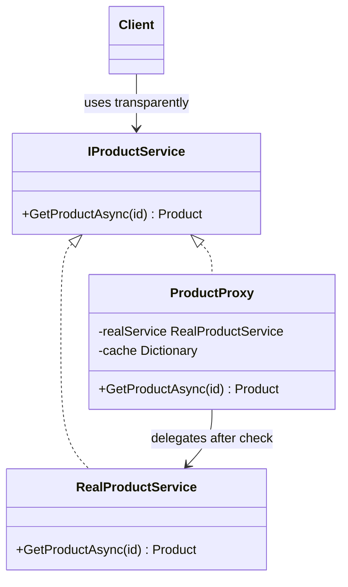

A proxy stands between a client and another object while exposing the same contract. It can delay expensive work, return a cached result, or reject an unauthorized call before the real object runs. The client depends on the subject interface and does not need a separate calling path for those controls.

That transparency is also the pattern's sharp edge. Access policy and hidden cost move behind an ordinary method call, so proxy behavior must stay observable. Common forms include a **virtual proxy** that defers creation, a **caching proxy** that reuses results, and a **protection proxy** that authorizes access.



> [!NOTE] Proxy vs Decorator
> Both patterns wrap the same interface, but their intent differs. A proxy controls access by deferring, caching, or authorizing a call. A [[Software Architecture/Patterns/Design Patterns/Structural/Decorator|decorator]] attaches another responsibility to an object. Mixing both concerns in one wrapper makes ordering and failure behavior harder to reason about.

# Problem

`ProductService` loads full product details on every request, even when a catalog view needs only a summary:

```csharp
public class ProductService(IProductRepository repository)
{
    // ⚠️ Loads everything on every call — 500ms per product
    public async Task<Product> GetProductAsync(Guid productId)
    {
        var product = await repository.GetByIdAsync(productId);
        // ⚠️ Always loads expensive related data, even for list views
        product.HighResImages = await repository.GetImagesAsync(productId);
        product.Reviews = await repository.GetReviewsAsync(productId);
        product.RelatedProducts = await repository.GetRelatedAsync(productId);
        return product;
    }
}

// ⚠️ Catalog page loads 20 products × 500ms = 10 seconds
// ⚠️ No caching — same product fetched repeatedly across requests
```

A "recently viewed" panel that loads 10 products would add roughly five seconds because every lookup pulls the expensive related data.

# Solution

These examples show three proxy boundaries: one product instance for deferred loading, then service-level wrappers for caching and authorization.

```csharp
using System.Collections.Immutable;

public sealed record ProductSnapshot(Guid Id, string Name, decimal Price);

public interface IProductService
{
    Task<ProductSnapshot> GetProductAsync(Guid productId);
    Task<ImmutableArray<ProductSnapshot>> GetCatalogAsync(int page, int pageSize);
}

public interface IProductDetails
{
    Task<Product> GetSummaryAsync();
    Task<Product> GetWithHighResImagesAsync();
}

// Real subject
public class ProductService(IProductRepository repository) : IProductService
{
    public async Task<ProductSnapshot> GetProductAsync(Guid productId)
    {
        var product = await repository.GetSummaryAsync(productId);
        return new ProductSnapshot(product.Id, product.Name, product.Price);
    }

    public async Task<ImmutableArray<ProductSnapshot>> GetCatalogAsync(int page, int pageSize)
    {
        var products = await repository.GetCatalogAsync(page, pageSize);
        return products
            .Select(product => new ProductSnapshot(product.Id, product.Name, product.Price))
            .ToImmutableArray();
    }
}

// Real subject — both operations load the complete product
public class ProductDetails(Guid productId, IProductRepository repository) : IProductDetails
{
    private Product? _product;

    public async Task<Product> GetSummaryAsync() =>
        _product ??= await repository.GetFullProductAsync(productId);

    public Task<Product> GetWithHighResImagesAsync() => GetSummaryAsync();
}

// Virtual Proxy — represents one product and defers its expensive images
public class LazyProductProxy(Guid productId, IProductRepository repository) : IProductDetails
{
    private Product? _product;
    private bool _imagesLoaded;

    public async Task<Product> GetSummaryAsync() =>
        _product ??= await repository.GetSummaryAsync(productId);

    public async Task<Product> GetWithHighResImagesAsync()
    {
        var product = await GetSummaryAsync();
        if (!_imagesLoaded)
        {
            product.HighResImages = await repository.GetImagesAsync(productId);
            _imagesLoaded = true; // ✅ subsequent calls use cached images
        }

        return product;
    }
}

// Caching Proxy — memoizes results to avoid repeated DB calls
public class CachingProductProxy(IProductService inner, IMemoryCache cache) : IProductService
{
    public async Task<ProductSnapshot> GetProductAsync(Guid productId)
    {
        var cacheKey = $"product:{productId}";

        // ✅ Return cached result if available
        if (cache.TryGetValue(cacheKey, out ProductSnapshot? cached))
            return cached!;

        var product = await inner.GetProductAsync(productId);

        // ✅ Cache for 5 minutes — product details change infrequently
        cache.Set(cacheKey, product, TimeSpan.FromMinutes(5));
        return product;
    }

    public async Task<ImmutableArray<ProductSnapshot>> GetCatalogAsync(int page, int pageSize)
    {
        var cacheKey = $"catalog:{page}:{pageSize}";
        if (cache.TryGetValue(cacheKey, out ImmutableArray<ProductSnapshot> cached))
            return cached;

        var result = await inner.GetCatalogAsync(page, pageSize);
        cache.Set(cacheKey, result, TimeSpan.FromMinutes(1));
        return result;
    }
}

// Protection Proxy — checks authorization before forwarding
public class AuthorizedProductProxy(IProductService inner, IAuthorizationService auth, IHttpContextAccessor ctx)
    : IProductService
{
    public async Task<ProductSnapshot> GetProductAsync(Guid productId)
    {
        // ✅ The policy can evaluate the request-visible product ID before retrieval
        var result = await auth.AuthorizeAsync(ctx.HttpContext!.User, productId, "ViewProduct");
        if (!result.Succeeded)
            throw new UnauthorizedAccessException("Product access denied");

        return await inner.GetProductAsync(productId);
    }

    public Task<ImmutableArray<ProductSnapshot>> GetCatalogAsync(int page, int pageSize) =>
        inner.GetCatalogAsync(page, pageSize);
}

// DI: compose proxies — caching wraps the real service, auth wraps caching
builder.Services.AddScoped<ProductService>();
builder.Services.AddScoped<IProductService>(sp =>
    new AuthorizedProductProxy(
        new CachingProductProxy(sp.GetRequiredService<ProductService>(), sp.GetRequiredService<IMemoryCache>()),
        sp.GetRequiredService<IAuthorizationService>(),
        sp.GetRequiredService<IHttpContextAccessor>()));
```

Another access policy, such as rate limiting, can be added as one more `IProductService` implementation. The service itself remains focused on product retrieval.

The process cache stores detached immutable snapshots, including an immutable catalog collection. It must not expose mutable EF-tracked entities across requests. The TTL defines freshness; write paths still need explicit invalidation when that window is too stale.

# Common .NET Examples

**EF Core lazy-loading proxies.** `UseLazyLoadingProxies()` creates derived entity proxies. Reading an unloaded, overridable navigation property can then trigger a database query. This is convenient, and it makes I/O easy to miss in an ordinary property access.

**`System.Reflection.DispatchProxy`.** `DispatchProxy.Create<T, TProxy>()` creates a runtime-generated type that implements `T` and derives from `TProxy`. It is useful for interface interception when a handwritten wrapper would be repetitive, though dynamic code generation limits ahead-of-time compilation scenarios.

**Castle DynamicProxy.** Castle can proxy interfaces and classes at runtime, with interception limited to virtual members for class proxies. Frameworks use that mechanism for concerns such as lazy loading and test doubles.

# Pitfalls

**Hidden latency.** A caching proxy can disguise a slow service until the cache is cold. Cache-hit ratio and miss latency need separate telemetry. Otherwise the underlying bottleneck stays invisible.

**Order-dependent policy.** If caching wraps authorization, a cache hit can bypass the authorization check. Authorization normally belongs outside caching so every call is checked before an authorized result is reused.

**Lazy-loading N+1 queries.** Loading 100 orders and then reading `order.Customer` can issue 100 additional queries. Known access paths are better expressed explicitly with `Include()` or projection.

# Tradeoffs

| Concern | Proxy | Direct access |
|---|---|---|
| Lazy loading | Defers cost to first access | Pays cost upfront or never |
| Caching | Transparent to callers | Callers must manage cache keys |
| Auth enforcement | Centralized, consistent | Scattered across callers |
| Debugging | Extra indirection, harder to trace | Direct call, easy to trace |
| Stale data (caching) | Risk of serving outdated results | Always fresh |

A proxy earns its indirection when access must remain transparent and one policy applies across callers. Caching fits repeated reads of slowly changing data. Virtual proxies fit expensive objects that may never be needed, while protection proxies centralize an access decision. Deep wrapper chains are a warning sign because their order becomes part of the behavior.

# Questions

> [!QUESTION]- What's the difference between a Proxy and a Decorator in terms of intent?
> A proxy stands in for the subject to control access to it. A decorator attaches another responsibility while preserving the component contract. Their class diagrams can look identical, so the design intent and the wrapper's reason for existing settle the classification.

# References

- [Proxy — refactoring.guru](https://refactoring.guru/design-patterns/proxy)
- [Proxy Pattern — Christopher Okhravi](https://www.youtube.com/watch?v=NwaabHqPHeM\&list=PLrhzvIcii6GNjpARdnO4ueTUAVR9eMBpc\&index=10)
- [Lazy loading related data — EF Core lazy-loading proxy in production use](https://learn.microsoft.com/en-us/ef/core/querying/related-data/lazy)
