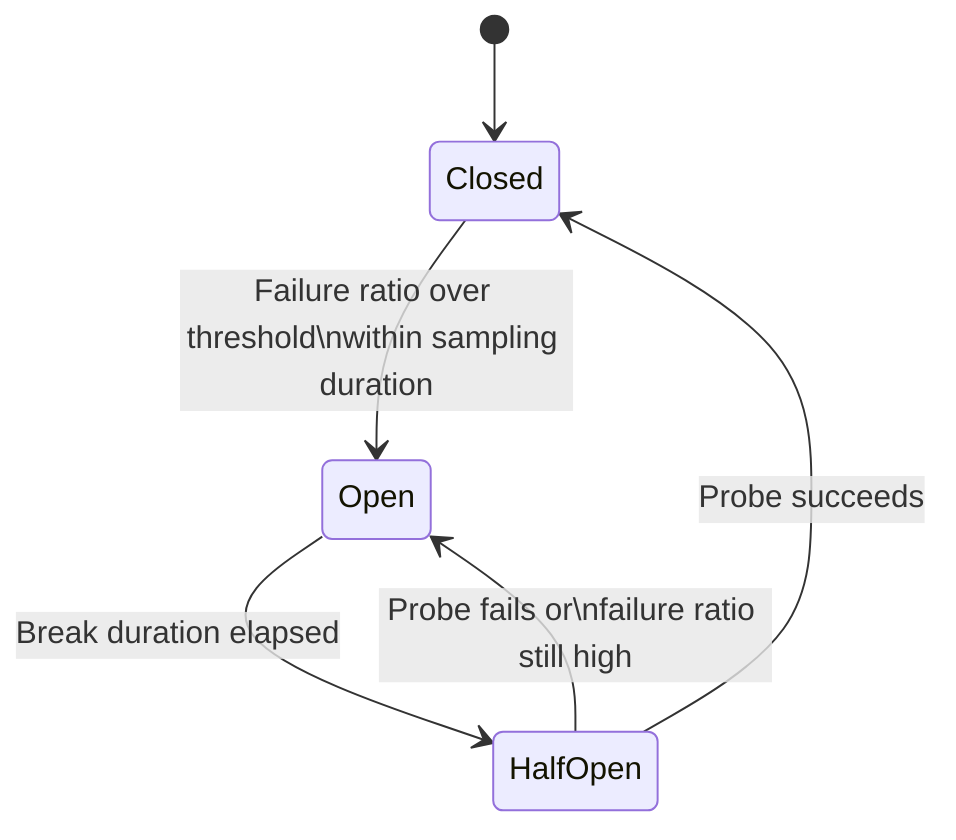

# Intro

The Circuit Breaker pattern stops your service from repeatedly calling a dependency that is already failing, so your system fails fast instead of failing slowly. It matters in distributed systems because it prevents cascading failures: without a breaker, threads, sockets, and retries pile up until healthy parts of the system also degrade. You reach for it when calling external services such as payment providers, LLM APIs, and remote databases where latency spikes and partial outages are normal. In senior .NET systems, a circuit breaker is usually part of a resilience stack with [[Retry and Timeout Patterns|retry and timeout]] and fallback, not a standalone feature.

## Mechanism

### State model

- `Closed`: normal mode; calls flow through and failures are measured over a sampling window.
- `Open`: fast-fail mode; calls are rejected immediately for a break duration.
- `Half-Open`: probe mode; a probe call is allowed to test whether the dependency has recovered.



### How transitions are decided

- The breaker evaluates a rolling or fixed sampling window.
- It opens only after `MinimumThroughput` is met, which avoids opening on tiny traffic samples.
- It compares observed failures against `FailureRatio` (for example `0.25` means 25 percent failures).
- Once open, it stays open for `BreakDuration`, then transitions to half-open for controlled probes.

If you set thresholds too low, the breaker chatters (opens and closes too often). If you set them too high, you discover failures too late and still waste resources on doomed calls.

### What should count as a failure

For interview depth, explicitly separate expected client errors from server-side dependency failure:

- Usually count: timeouts, network exceptions, HTTP `5xx`, and throttling (`429`) when your client cannot absorb it safely.
- Usually do not count: business/validation `4xx` like `400` or `404`, because these are often caller mistakes, not provider instability.
- Make this explicit via `ShouldHandle` so the breaker reflects dependency health, not consumer input quality.

## C# Example with Polly v8 in ASP.NET Core

### Register an ASP.NET Core HttpClient resilience handler

This example uses the .NET HTTP resilience handler (`AddResilienceHandler`) with Polly v8 strategy options and tracks breaker state changes for telemetry.

```csharp
using Microsoft.Extensions.DependencyInjection;
using Microsoft.Extensions.Http.Resilience;
using Microsoft.Extensions.Logging;
using Polly;
using Polly.CircuitBreaker;
using Polly.Fallback;
using Polly.Retry;
using Polly.Timeout;

var builder = WebApplication.CreateBuilder(args);

builder.Services.AddHttpClient<LlmGateway>(client =>
{
    client.BaseAddress = new Uri("https://api.openai.com/");
    client.Timeout = Timeout.InfiniteTimeSpan;
})
.AddResilienceHandler("llm-api", (pipelineBuilder, context) =>
{
    var logger = context.ServiceProvider.GetRequiredService<ILogger<LlmGateway>>();

    // Outermost: fallback runs after inner resilience logic decides the call failed.
    pipelineBuilder.AddFallback(new FallbackStrategyOptions<HttpResponseMessage>
    {
        ShouldHandle = new PredicateBuilder<HttpResponseMessage>()
            .Handle<BrokenCircuitException>()
            .HandleResult(r => (int)r.StatusCode >= 500),
        FallbackAction = _ => Outcome.FromResultAsValueTask(
            new HttpResponseMessage(System.Net.HttpStatusCode.OK)
            {
                Content = new StringContent("{\"answer\":\"Provider unavailable. Serving cached response.\"}")
            })
    });

    // Retry wraps the breaker so retry attempts still flow through breaker checks.
    pipelineBuilder.AddRetry(new RetryStrategyOptions<HttpResponseMessage>
    {
        MaxRetryAttempts = 2,
        Delay = TimeSpan.FromMilliseconds(250),
        BackoffType = DelayBackoffType.Exponential,
        UseJitter = true,
        ShouldHandle = new PredicateBuilder<HttpResponseMessage>()
            .Handle<HttpRequestException>()
            .Handle<TimeoutRejectedException>()
            .HandleResult(r => (int)r.StatusCode == 429 || (int)r.StatusCode >= 500)
    });

    // Breaker trips on sustained dependency instability.
    pipelineBuilder.AddCircuitBreaker(new CircuitBreakerStrategyOptions<HttpResponseMessage>
    {
        FailureRatio = 0.25,
        MinimumThroughput = 20,
        SamplingDuration = TimeSpan.FromSeconds(30),
        BreakDuration = TimeSpan.FromSeconds(45),
        ShouldHandle = new PredicateBuilder<HttpResponseMessage>()
            .Handle<HttpRequestException>()
            .Handle<TimeoutRejectedException>()
            .HandleResult(r => (int)r.StatusCode == 429 || (int)r.StatusCode >= 500),
        OnOpened = args =>
        {
            logger.LogWarning(
                "Circuit opened for LLM API. Break duration: {BreakDuration}",
                args.BreakDuration);
            return default;
        },
        OnHalfOpened = _ =>
        {
            logger.LogInformation("Circuit half-open for LLM API. Sending probe requests.");
            return default;
        },
        OnClosed = _ =>
        {
            logger.LogInformation("Circuit closed for LLM API. Normal traffic restored.");
            return default;
        }
    });

    // Innermost: timeout is per attempt.
    pipelineBuilder.AddTimeout(new TimeoutStrategyOptions
    {
        Timeout = TimeSpan.FromSeconds(10)
    });
});

var app = builder.Build();
app.Run();
```

### Use the resilient HttpClient in an LLM gateway

```csharp
public sealed class LlmGateway
{
    private readonly HttpClient _httpClient;

    public LlmGateway(HttpClient httpClient)
    {
        _httpClient = httpClient;
    }

    public Task<HttpResponseMessage> CompleteAsync(HttpRequestMessage request, CancellationToken ct)
    {
        // Resilience handler is attached to this HttpClient instance.
        return _httpClient.SendAsync(request, ct);
    }
}
```

## Integration with Other Resilience Patterns

For real production systems and AI provider calls, stack strategies deliberately:

Apply stack order as outermost to innermost:

1. `Fallback` outermost: final degraded path after inner strategies fail.
2. `Retry` next: absorb short transient failures.
3. `Circuit Breaker` next: fast-fail when sustained instability is detected.
4. `Timeout` innermost: bound each attempt.

Interview nuance: teams often say "retry inside breaker" to mean retries must contribute to breaker decisions. In Polly's outer-to-inner execution model, that behavior is achieved by placing retry outside and breaker inside, so every retry attempt still passes through breaker evaluation.

## Pitfalls

### 1) Breaking too aggressively on expected errors

- What goes wrong: breaker opens on user-caused `4xx` responses and blocks healthy dependency traffic.
- Why it happens: failure predicates are too broad and treat all non-success status codes as infrastructure failures.
- Mitigation: define `ShouldHandle` around transient/infrastructure failure classes only, and review real response distribution in telemetry.

### 2) Not distinguishing transient vs permanent failures

- What goes wrong: permanent failures keep being retried and sampled as if they were recoverable.
- Why it happens: no taxonomy for failure types and no contract for retryability.
- Mitigation: classify errors by retryability and idempotency; retry only transient classes and let permanent failures fail fast.

### 3) Assuming one instance protects the whole fleet

- What goes wrong: one pod opens its breaker but other pods continue hammering the same unhealthy dependency.
- Why it happens: breaker state is process-local by default.
- Mitigation: combine per-instance breakers with global controls such as rate limits, bulkheads, provider-side quotas, and fleet-level monitoring.

### 4) Half-open allows too many probes

- What goes wrong: when break duration expires, many instances probe at once and create a thundering herd.
- Why it happens: synchronized timers and unconstrained probe concurrency.
- Mitigation: keep probe traffic low, jitter recovery timing, and cap downstream concurrency.

## Tradeoffs

| Choice | Benefit | Cost | Use when |
|---|---|---|---|
| Aggressive thresholds (opens quickly) | Protects resources early | More false opens, degraded UX | Dependency is expensive and failure blast radius is high |
| Conservative thresholds (opens slowly) | Fewer false positives | Slower protection during outage | Occasional noise is acceptable but hard failures are rare |
| Per-instance breakers only | Simple implementation | No fleet-wide coordination | Small deployments and low concurrency |
| Add centralized protection layers | Better global control | More operational complexity | High-scale multi-instance services |

## Questions

> [!QUESTION]- Why is retry placement relative to circuit breaker important?
>
> - Retry should execute inside the same resilience pipeline before breaker decisions.
> - Outer retries around an already open breaker create extra pressure and useless attempts.
> - Proper ordering gives cleaner failure accounting and earlier protection.
> - In Polly's outer-to-inner model this means placing retry _outside_ the breaker, so each failed retry still passes through breaker evaluation and counts toward tripping it.

> [!QUESTION]- How do you avoid a half-open thundering herd in Kubernetes-scale deployments?
>
> - Limit probe concurrency and keep half-open trial volume small.
> - Add jitter to retry and recovery timing.
> - Use global controls (rate limits, queueing, bulkheads) so per-pod recovery does not synchronize spikes.
> - Watch fleet-wide metrics, not only single-instance breaker events.
> - The core trap: breaker state is process-local, so per-pod recovery must be coordinated with fleet-level controls or every pod probes in lockstep.

> [!QUESTION]- Which failures should trip the breaker, and which should not?
>
> - Trip on dependency-health signals: timeouts, connection failures, HTTP `5xx`, and `429` when the client cannot absorb it.
> - Do not trip on caller-side `4xx` like `400`/`404` — those reflect bad input, not an unhealthy dependency.
> - Encode this in `ShouldHandle` so the breaker measures the dependency, not your users' mistakes.
> - Get it wrong and the breaker opens on validation errors, blocking healthy traffic to a perfectly good dependency.

## References

- [Polly docs - Circuit breaker strategy (v8)](https://www.pollydocs.org/strategies/circuit-breaker.html)
- [Polly docs - Resilience pipelines](https://www.pollydocs.org/pipelines/index.html)
- [Microsoft Learn - Build resilient apps with .NET and Polly](https://learn.microsoft.com/dotnet/architecture/microservices/implement-resilient-applications/implement-http-call-retries-exponential-backoff-polly)
- [Microsoft Learn - .NET HTTP resilience](https://learn.microsoft.com/dotnet/core/resilience/http-resilience)
- [Martin Fowler - Circuit Breaker pattern](https://martinfowler.com/bliki/CircuitBreaker.html)
- [Release It! by Michael T. Nygard](https://pragprog.com/titles/mnee2/release-it-second-edition/)
- [Netflix Tech Blog - Hystrix introducing latency and fault tolerance](https://netflixtechblog.com/announcing-hystrix-for-resilience-engineering-6c1234ec73f)
