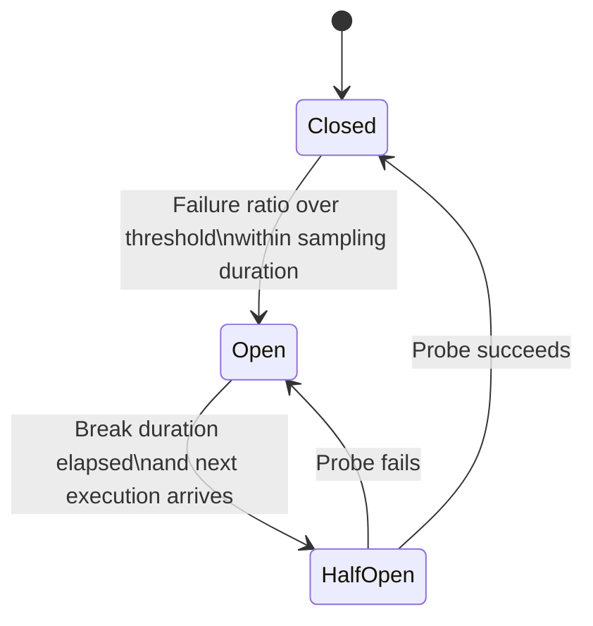

A circuit breaker stops calls to a dependency after recent failures cross a threshold. While open, it rejects work immediately instead of spending caller capacity on requests that are likely to time out. This contains sustained failure and gives the dependency time to recover.

The breaker belongs at a remote-call boundary where latency spikes and partial outages are expected. It normally works with [[Software Architecture/Patterns/Resilience Patterns/Retry and Timeout Patterns|retry and timeout]] policies. Retries handle brief faults. The breaker handles evidence that the fault is lasting.

# How the Breaker Opens and Recovers

## State Model

- `Closed`: normal mode. Calls flow through and failures are measured over a sampling window.
- `Open`: fast-fail mode. Calls are rejected during the break duration.
- `Half-Open`: after that duration, the next execution becomes a recovery probe.


```mermaid
stateDiagram-v2
    [*] --> Closed
    Closed --> Open: Failure ratio over threshold\nwithin sampling duration
    Open --> HalfOpen: Break duration elapsed\nand next execution arrives
    HalfOpen --> Closed: Probe succeeds
    HalfOpen --> Open: Probe fails
```

## How Transitions Are Decided

- The breaker evaluates failures within a sampling window.
- `MinimumThroughput` prevents a tiny sample from opening the circuit.
- `FailureRatio` sets the failure threshold. `0.25` means 25 percent.
- After `BreakDuration`, the next execution enters half-open as a controlled probe. Success closes the circuit. Failure opens it again.

Thresholds set the balance. A low threshold chatters and rejects healthy traffic. A high threshold reacts late, after failed calls have already consumed capacity.

## What Should Count as a Failure

The failure predicate should represent dependency health:

- Usually count timeouts, network exceptions, HTTP `5xx`, and throttling (`429`) that the caller cannot absorb safely.
- Usually exclude validation and business `4xx` responses such as `400` or `404`. They describe the request rather than provider stability.
- Encode the boundary in `ShouldHandle`. Otherwise bad input can open a circuit around a healthy dependency.

# C# Example with Polly V8 in ASP.NET Core

## Register an ASP.NET Core HttpClient Resilience Handler

This `AddResilienceHandler` pipeline uses Polly v8 options and records breaker state changes for telemetry.

```csharp
using Microsoft.Extensions.DependencyInjection;
using Microsoft.Extensions.Http.Resilience;
using Microsoft.Extensions.Logging;
using Polly;
using Polly.CircuitBreaker;
using Polly.Fallback;
using Polly.Retry;
using Polly.Timeout;

var builder = WebApplication.CreateBuilder(args);

builder.Services.AddHttpClient<LlmGateway>(client =>
{
    client.BaseAddress = new Uri("https://api.openai.com/");
    client.Timeout = Timeout.InfiniteTimeSpan;
})
.AddResilienceHandler("llm-api", (pipelineBuilder, context) =>
{
    var logger = context.ServiceProvider.GetRequiredService<ILogger<LlmGateway>>();

    // Outermost: fallback runs after inner resilience logic decides the call failed.
    pipelineBuilder.AddFallback(new FallbackStrategyOptions<HttpResponseMessage>
    {
        ShouldHandle = new PredicateBuilder<HttpResponseMessage>()
            .Handle<BrokenCircuitException>()
            .HandleResult(r => (int)r.StatusCode >= 500),
        FallbackAction = _ => Outcome.FromResultAsValueTask(
            new HttpResponseMessage(System.Net.HttpStatusCode.ServiceUnavailable)
            {
                Content = new StringContent("{\"error\":\"Provider unavailable.\"}")
            })
    });

    // Retry wraps the breaker so safe retry attempts still flow through breaker checks.
    var retryOptions = new HttpRetryStrategyOptions
    {
        MaxRetryAttempts = 2,
        Delay = TimeSpan.FromMilliseconds(250),
        BackoffType = DelayBackoffType.Exponential,
        UseJitter = true,
        ShouldHandle = new PredicateBuilder<HttpResponseMessage>()
            .Handle<HttpRequestException>()
            .Handle<TimeoutRejectedException>()
            .HandleResult(r => (int)r.StatusCode == 429 || (int)r.StatusCode >= 500)
    };
    retryOptions.DisableForUnsafeHttpMethods();
    pipelineBuilder.AddRetry(retryOptions);

    // Breaker trips on sustained dependency instability.
    pipelineBuilder.AddCircuitBreaker(new CircuitBreakerStrategyOptions<HttpResponseMessage>
    {
        FailureRatio = 0.25,
        MinimumThroughput = 20,
        SamplingDuration = TimeSpan.FromSeconds(30),
        BreakDuration = TimeSpan.FromSeconds(45),
        ShouldHandle = new PredicateBuilder<HttpResponseMessage>()
            .Handle<HttpRequestException>()
            .Handle<TimeoutRejectedException>()
            .HandleResult(r => (int)r.StatusCode == 429 || (int)r.StatusCode >= 500),
        OnOpened = args =>
        {
            logger.LogWarning(
                "Circuit opened for LLM API. Break duration: {BreakDuration}",
                args.BreakDuration);
            return default;
        },
        OnHalfOpened = _ =>
        {
            logger.LogInformation("Circuit half-open for LLM API. Sending probe requests.");
            return default;
        },
        OnClosed = _ =>
        {
            logger.LogInformation("Circuit closed for LLM API. Normal traffic restored.");
            return default;
        }
    });

    // Innermost: timeout is per attempt.
    pipelineBuilder.AddTimeout(new TimeoutStrategyOptions
    {
        Timeout = TimeSpan.FromSeconds(10)
    });
});

var app = builder.Build();
app.Run();
```

## Use the Resilient HttpClient in an LLM Gateway

```csharp
public sealed class LlmGateway
{
    private readonly HttpClient _httpClient;

    public LlmGateway(HttpClient httpClient)
    {
        _httpClient = httpClient;
    }

    public Task<HttpResponseMessage> CompleteAsync(HttpRequestMessage request, CancellationToken ct)
    {
        // Resilience handler is attached to this HttpClient instance.
        return _httpClient.SendAsync(request, ct);
    }
}
```

# Integration with Other Resilience Patterns

Pipeline order changes which failures each strategy observes. From outermost to innermost:

1. `Fallback` outermost: normalize an open circuit or final `5xx` response to `503`.
2. `Retry` next: absorb short transient failures.
3. `Circuit Breaker` next: fast-fail when sustained instability is detected.
4. `Timeout` innermost: bound each attempt.

Placing retry outside the breaker makes every attempt pass through breaker evaluation. The retry predicate must exclude `BrokenCircuitException`. An open circuit is a stop signal, not a transient failure worth retrying.

The fallback is deliberately narrow. It converts `BrokenCircuitException` and final `5xx` responses to `503 Service Unavailable`. Exhausted transport and timeout exceptions still propagate.

The HTTP retry options exclude `POST`, `PATCH`, `PUT`, `DELETE`, and `CONNECT`. A completion `POST` is retried only when the provider offers a server-enforced idempotency or deduplication key and the client supplies it; the breaker can still observe a failed unsafe request without automatically replaying it.

# Pitfalls

## Breaking on Expected Errors

Broad failure predicates count user-caused `4xx` responses and block healthy dependency traffic. `ShouldHandle` should cover only agreed dependency-failure classes, backed by the real response distribution in telemetry.

## Treating Permanent Failures as Transient

Permanent failures waste retry attempts and distort breaker samples. Error contracts need explicit retryability, and unsafe operations need an idempotency guarantee before any retry.

## Confusing One Breaker with Fleet Protection

Breaker state is normally process-local. One pod can open while every other pod keeps calling the same dependency. Fleet protection still needs shared limits or provider-side quotas, plus fleet-level telemetry.

## Releasing Too Many Half-Open Probes

Synchronized instances can all probe when their break durations expire. Low probe concurrency and jittered recovery timing reduce that thundering herd.

# Tradeoffs

| Choice | Benefit | Cost | Use when |
|---|---|---|---|
| Aggressive thresholds (opens quickly) | Protects resources early | More false opens, degraded UX | Dependency is expensive and failure blast radius is high |
| Conservative thresholds (opens slowly) | Fewer false positives | Slower protection during outage | Occasional noise is acceptable but hard failures are rare |
| Per-instance breakers only | Simple implementation | No fleet-wide coordination | Small deployments and low concurrency |
| Add centralized protection layers | Better global control | More operational complexity | High-scale multi-instance services |

# References

- [Polly circuit breaker strategy](https://www.pollydocs.org/strategies/circuit-breaker.html)
- [Circuit Breaker pattern](https://learn.microsoft.com/en-us/azure/architecture/patterns/circuit-breaker)
