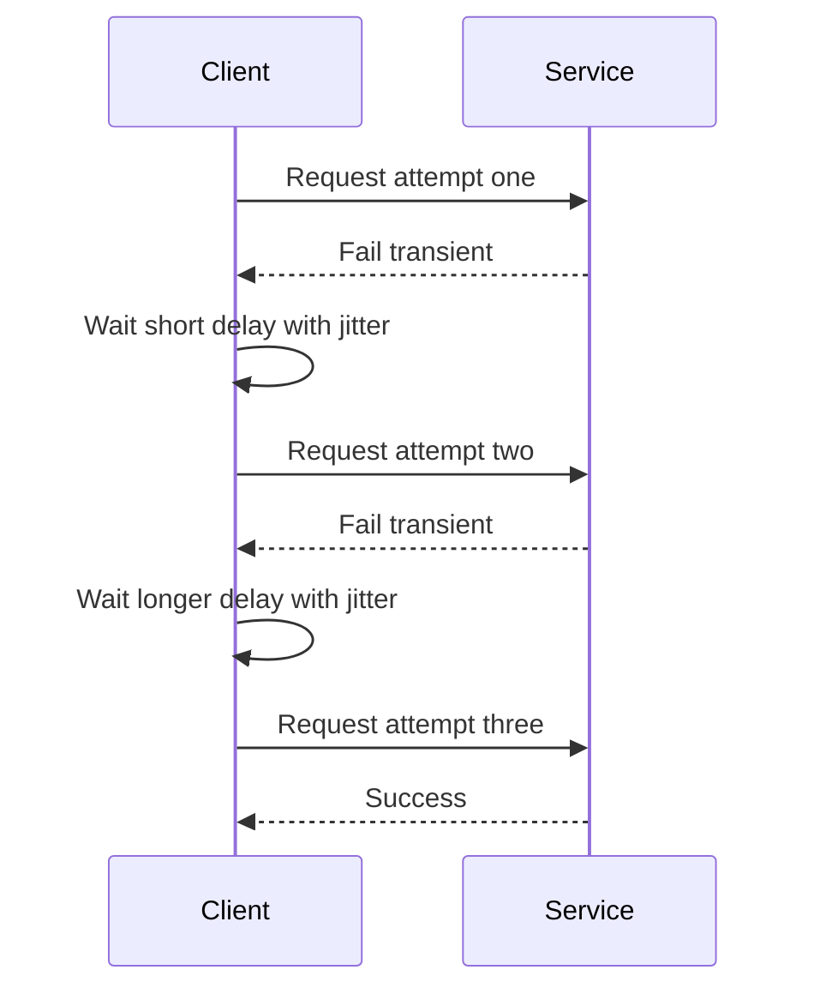

# Intro

Retry and timeout patterns are defensive reliability strategies for outbound calls: retry re-attempts operations that fail for transient reasons, and timeout bounds how long you wait before treating the attempt as failed. They matter because distributed systems regularly see short network loss, DNS hiccups, brief overload, and cold-start latency spikes that are recoverable seconds later. Without retry, you fail fast on recoverable faults; without timeout, a single hung dependency can hold connection pool slots and request capacity until upstream latency collapses. Reach for both patterns on most request response external dependency boundaries such as HTTP APIs, message brokers, databases, and cache services. For streaming and long-running background flows, use explicit deadline ownership and different timeout and retry budgets. In modern .NET, the standard implementation is Polly v8 through `Microsoft.Extensions.Http.Resilience`.

# Retry mechanism

## Retry strategies

- `Immediate retry`: run the next attempt with no delay; useful only for very short transient blips.
- `Fixed delay`: wait the same interval each time; simple and predictable, but can still synchronize clients.
- `Exponential backoff`: increase wait duration after each failure to reduce pressure on an unhealthy dependency.
- `Exponential backoff with jitter`: add randomization to each delay so clients do not retry in lockstep.

Linear or exponential labels describe how the base delay grows between attempts; jitter describes how randomness is applied around that base. A fixed one-second delay randomized to `0.8`, `1.1`, and `1.3` seconds is fixed backoff with jitter, not linear backoff. Exponential backoff with jitter is the normal fleet-safe default, but every strategy still needs a maximum attempt count, maximum delay, and total deadline.

## Why jitter matters

If 10,000 clients all fail at the same time and all retry at exactly 200 ms, then 400 ms, then 800 ms, they create synchronized request spikes that prolong outage recovery. Jitter decorrelates retry timing, turning one synchronized storm into a spread-out arrival pattern that gives the downstream service room to recover.

## Exponential backoff formula

Use this as a conceptual model for exponential backoff:

```text
delay grows exponentially from a base value and jitter randomizes each attempt
```

Polly v8 exponential retry with `UseJitter = true` uses a decorrelated jitter approach, so treat the formula as intuition and verify exact delay behavior in the Polly retry docs. In practice, keep `baseDelay` small, cap max delay, and cap max attempts to stay within your latency SLO.

## Max retry attempts

Cap retries on user-facing request paths. For long-running background workers, indefinite retries can be acceptable only when combined with cancellation support, max-delay caps, and monitoring that can stop unhealthy loops.

## What to retry

Retry only when the operation is replayable and the failure is plausibly transient. Connection resets, temporary DNS failures, and a per-attempt timeout can qualify, but an uncertain timeout means the server may already have completed the work.

## HTTP retry policy

HTTP method semantics and application behavior decide whether another attempt is safe:

- `GET`, `HEAD`, `OPTIONS`, and `TRACE` are defined as safe and idempotent. Retry only when the API actually honors those semantics and the response body can be replayed or reacquired.
- `PUT` and `DELETE` are idempotent by specification, but a retry can still repeat logging, billing, or other incorrectly attached side effects. Verify the concrete endpoint.
- `POST` and `PATCH` are not idempotent by default. Retry them only with an idempotency key or another server-side deduplication contract whose retention exceeds the retry window.
- `408 Request Timeout` can be retried on a new connection when the request is replayable. `425 Too Early` can be retried after avoiding early data. `429 Too Many Requests` should respect `Retry-After` and the caller's deadline.
- `502 Bad Gateway`, `503 Service Unavailable`, and `504 Gateway Timeout` often represent transient gateway or availability failures, but retry only within a bounded budget; respect `Retry-After` on `503`.
- Treat `500 Internal Server Error` as endpoint-specific. A deterministic server bug will not improve on retry. Do not retry `400`, `401`, `403`, `404`, validation failures, or other permanent outcomes unless that API documents a transient meaning.

One layer owns retries for a call path. Propagate the remaining deadline, cap total attempts across hops, and record effective attempts per original request. Otherwise three attempts at two nested services can turn one request into nine downstream calls.

## Retry flow



# Timeout and deadline boundary

[[Timeouts and Deadlines]] owns per-attempt timeouts, overall request deadlines, cancellation propagation, and remaining-budget checks. Retry must reuse the same overall deadline; creating a fresh timeout for every attempt or downstream hop allows the call path to exceed its end-to-end latency budget.

# .NET implementation

[[Polly Retry and Timeout]] contains the focused Polly v8 pipeline, including an outer total timeout, bounded exponential retry with jitter, Retry-After handling, and an inner per-attempt timeout. The policy is demonstrated on a replayable GET; writes still require an end-to-end idempotency contract.

# Integration with other resilience patterns

For production systems, compose retry and timeout with neighboring patterns in a deliberate order from outermost to innermost:

1. `Total timeout` outermost to cap full operation time.
2. `Fallback` after inner strategies fail to provide degraded response.
3. `Retry` to absorb short transient failures.
4. `Circuit Breaker` to fast-fail during sustained instability.
5. `Per-attempt timeout` innermost to cap single attempt duration.

Use this pipeline together with [[Circuit Breaker]] and [[Rate Limiting]] to protect both dependency health and caller latency.

# Pitfalls

## Retrying non idempotent operations

- What goes wrong: duplicate orders or duplicate payments happen when a non-idempotent write is retried after uncertain completion.
- Why it happens: the client cannot distinguish between failed execution and failed response delivery, so a second attempt may repeat a completed write.
- How to avoid it: use idempotency keys for write APIs and retry only operations that are explicitly safe to replay.

## No jitter in backoff

- What goes wrong: all clients retry at the same time and generate a retry storm that extends outage duration.
- Why it happens: deterministic delays synchronize retries across instances and across regions.
- How to avoid it: enable jitter and combine it with exponential backoff and capped attempt count.

## Missing timeout boundary

- What goes wrong: a hung dependency call holds connection slots and request budget for minutes.
- Why it happens: only one timeout layer is configured or no timeout is configured at all.
- How to avoid it: configure both per-attempt timeout and overall timeout then align both with your service latency SLO.

## Retry amplification across layers

- What goes wrong: one user request fans out into many downstream calls for example three retries in service A and three retries in service B can produce nine calls into service C.
- Why it happens: each layer retries independently without a shared retry budget.
- How to avoid it: define retry ownership by layer cap total attempts end to end and propagate deadlines so lower layers stop retrying when budget is exhausted.

# Tradeoffs

| Strategy | Benefit | Cost | Use when |
| --- | --- | --- | --- |
| Immediate retry | Lowest added latency for short glitches | Highest risk of immediate re-pressure on unstable dependency | Failure is likely a one off transport hiccup and dependency is lightly loaded |
| Fixed delay retry | Simple predictable behavior | Can still synchronize clients and recover slowly under heavy contention | You need straightforward behavior and traffic is moderate |
| Exponential backoff with jitter | Best protection against retry storms and downstream overload | Higher implementation complexity and longer tail latency on repeated failures | Dependency instability is common and fleet size is large |
| Per-attempt timeout only | Prevents single attempt hang | Total operation can still run too long across retries | You have no retries and only need per call bound |
| Per-attempt plus overall timeout | Bounds both attempt and end to end latency | Requires careful budget tuning between layers | You run retries or multi-hop calls and have strict SLO targets |

Decision rule: start with exponential backoff plus jitter and dual timeout boundaries then tune attempt count and timeout budgets from observed latency percentiles and downstream error rates.

# Questions

> [!QUESTION]- Why does retry without jitter make outages worse and how does jitter fix it
>
> - Without jitter each client computes nearly identical retry times so failures synchronize into periodic traffic spikes.
> - Those spikes hit while the dependency is already degraded which increases queue depth and recovery time.
> - Jitter randomizes each delay so retries spread over time and reduce synchronized pressure.
> - This improves recovery odds and stabilizes shared infrastructure such as load balancers and connection pools.
> - **Tradeoff** jitter reduces herd effects but increases per request timing variance and makes behavior slightly harder to predict.

> [!QUESTION]- How do you prevent retry amplification in a multi layer microservices system
>
> - Assign retry ownership to one layer per call path usually the edge caller or the service nearest the user boundary.
> - Propagate cancellation tokens and deadlines so downstream services respect the remaining time budget.
> - Keep low retry counts and combine with circuit breaker and rate limits to avoid multiplicative pressure.
> - Measure effective attempts per request in telemetry and alert when fan out exceeds budget.
> - **Tradeoff** centralizing retries improves control and cost but can reduce local autonomy for service teams.

# References

- [Polly docs retry strategy](https://www.pollydocs.org/strategies/retry.html) - Official Polly v8 retry options, backoff types, jitter behavior, and `ShouldHandle` predicates.
- [Polly docs timeout strategy](https://www.pollydocs.org/strategies/timeout.html) - Official Polly v8 timeout behavior, cancellation semantics, and timeout strategy configuration.
- [Microsoft Learn .NET HTTP resilience](https://learn.microsoft.com/dotnet/core/resilience/http-resilience) - `Microsoft.Extensions.Http.Resilience` guidance for composing retry, timeout, circuit breaker, and fallback in `HttpClient` pipelines.
- [Microsoft Learn transient fault handling](https://learn.microsoft.com/azure/architecture/best-practices/transient-faults) - Cloud architecture guidance on identifying transient failures and choosing retry and timeout policies.
- [AWS Architecture Blog Exponential Backoff and Jitter](https://aws.amazon.com/blogs/architecture/exponential-backoff-and-jitter/) - Marc Brooker explanation of why jitter reduces coordinated retries and improves system recovery under contention.
- [How do we retry on failures? -- ByteByteGo backoff overview; the note corrects the visual's fixed-jitter example and anchors selection in retry budgets](https://github.com/ByteByteGoHq/system-design-101/blob/b28380a4710c5ec9638ec037d4168e288f334cba/data/guides/how-do-we-retry-on-failures.md)
- [How to handle web request errors -- ByteByteGo decision flow; the HTTP policy above narrows its unsafe blanket 4xx and 5xx retry branches](https://github.com/ByteByteGoHq/system-design-101/blob/b28380a4710c5ec9638ec037d4168e288f334cba/data/guides/how-to-handle-web-request-error.md)
- [RFC 9110: HTTP Semantics](https://www.rfc-editor.org/rfc/rfc9110) - Primary specification for safe and idempotent methods, status semantics, and `Retry-After`.
- [RFC 6585: Additional HTTP Status Codes](https://www.rfc-editor.org/rfc/rfc6585) - Primary specification for `429 Too Many Requests` and optional `Retry-After` guidance.
- [RFC 8470: Using Early Data in HTTP](https://www.rfc-editor.org/rfc/rfc8470) - Primary specification for `425 Too Early` and retrying without early data.
