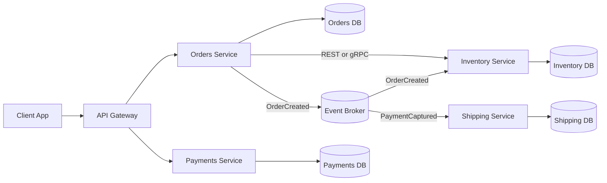

# Intro

Microservices are an architecture style where a system is split into independently deployable services, each aligned to a business capability and owning its own data. They matter because they let teams release changes independently, scale only hot paths, and use technology choices per domain when needed. You usually reach for microservices when team count grows, deployment independence becomes a bottleneck, and domains have different scaling or availability needs. The tradeoff is distributed-systems complexity: network latency, partial failures, eventual consistency, and heavier operational tooling.

## Core principles

- **Boundaries follow business capabilities**: split by bounded contexts like Orders, Inventory, Billing, Shipping.
- **Database per service**: each service owns its schema and persistence model; no cross-service table reads.
- **Communication by contracts**: integrate through versioned APIs/events, avoid shared databases, and keep shared libraries limited to generated contracts or platform primitives.
- **Independent deployment**: each service can ship, roll back, and scale independently.
- **Decentralized governance**: shared platform standards, local team autonomy.



## Communication patterns

**Synchronous calls**

- Use synchronous communication when the caller needs an immediate answer.
- Common options are [[REST]] and [[gRPC]].
- Best for short request-response interactions on the critical path.
- Risk: long synchronous chains amplify latency and failure propagation.

**Asynchronous messaging**

- Use [[Software Architecture/Distributed Systems/Message Queues/Message Queues|Message Queues]] and [[Event-Driven Architecture]] when temporal decoupling matters.
- Best for workflows, retries, burst smoothing, and eventual consistency.
- Publish immutable events like `OrderPlaced` or `InventoryReserved`.
- Make handlers idempotent to survive retries and duplicate delivery.

**Rule of thumb**

- Prefer synchronous for short, local decisions.
- Prefer asynchronous for cross-domain workflows and side effects.
- Avoid deep synchronous chains (`A -> B -> C -> D`) on critical paths.

## .NET implementation notes

**Service boundaries with ASP.NET Core Minimal APIs**

```csharp
using Microsoft.AspNetCore.Diagnostics.HealthChecks;
using Microsoft.Extensions.Diagnostics.HealthChecks;

var builder = WebApplication.CreateBuilder(args);

builder.Services.AddEndpointsApiExplorer();
builder.Services.AddOpenApi();
builder.Services.AddHealthChecks()
    .AddCheck("self", () => HealthCheckResult.Healthy(), tags: new[] { "live" })
    .AddCheck("database", () => HealthCheckResult.Healthy(), tags: new[] { "ready" });

var app = builder.Build();

app.MapGet("/orders/{id:guid}", async (Guid id, IOrderRepository repo) =>
{
    var order = await repo.GetByIdAsync(id);
    return order is null ? Results.NotFound() : Results.Ok(order);
});

app.MapPost("/orders", async (CreateOrderRequest request, IOrderService service) =>
{
    var result = await service.CreateAsync(request);
    return Results.Created($"/orders/{result.OrderId}", result);
});

if (app.Environment.IsDevelopment())
{
    app.MapOpenApi();
}

app.MapHealthChecks("/health/live", new HealthCheckOptions
{
    Predicate = check => check.Tags.Contains("live")
});

app.MapHealthChecks("/health/ready", new HealthCheckOptions
{
    Predicate = check => check.Tags.Contains("live") || check.Tags.Contains("ready")
});

app.Run();
```

- `AddOpenApi`/`MapOpenApi` comes from `Microsoft.AspNetCore.OpenApi`.
- If missing in your service project, add it with:

```bash
dotnet add package Microsoft.AspNetCore.OpenApi
```

- Keep each service API focused on its own bounded context.
- Version contracts intentionally; prefer backward-compatible evolution.
- If `AddOpenApi` is enabled, expose OpenAPI in development only.

**Service discovery**

- In Kubernetes, discovery is usually DNS-based (`inventory-service.default.svc.cluster.local`).
- Outside Kubernetes, use platform-native discovery or a registry.
- Apply timeouts on all outbound calls, retries with jitter only for idempotent operations (or with idempotency keys), and circuit breakers where appropriate.

**Health checks and readiness**

- Keep liveness cheap (process-level signal) and avoid dependency checks there.
- Put dependency checks in readiness so traffic is removed without restarting healthy processes.

```yaml
apiVersion: apps/v1
kind: Deployment
metadata:
  name: orders-service
spec:
  replicas: 3
  selector:
    matchLabels:
      app: orders-service
  template:
    metadata:
      labels:
        app: orders-service
    spec:
      containers:
        - name: orders
          image: myregistry/orders-service:1.0.0
          env:
            - name: ASPNETCORE_HTTP_PORTS
              value: "8080"
          ports:
            - containerPort: 8080
          startupProbe:
            httpGet:
              path: /health/live
              port: 8080
            periodSeconds: 5
            failureThreshold: 12
          livenessProbe:
            httpGet:
              path: /health/live
              port: 8080
          readinessProbe:
            httpGet:
              path: /health/ready
              port: 8080
```

**Containers and orchestration**

- Package each service as its own Docker image.
- Use Kubernetes for scheduling, scaling, rollout, and service discovery.
- Standardize OpenTelemetry, structured logs, and correlation IDs.

## Microservices vs monolith vs modular monolith

| Dimension | [[Monolith Architecture\|Monolith]] | [[Modular Monolith]] | Microservices |
|---|---|---|---|
| Deployments | Single unit | Single unit with strict module boundaries | Independent service deployments |
| Team model | Shared ownership | Team ownership by module | Team ownership by service |
| Data model | Shared database | Shared database with modular access rules | Database per service |
| Runtime calls | In-process | In-process | Network calls |
| Operational complexity | Low | Low to medium | High |
| Best fit | Small team, early product | Growing product, clear domains, limited ops capacity | Large org, high release velocity, independent scaling needs |

[[Monolith Architecture]] is usually the best starting point when boundaries are still evolving and operational maturity is limited.

**Migration path: start monolith, then extract**

1. Start with a modular monolith and enforce boundaries internally.
2. Measure release bottlenecks, scale asymmetry, and team contention.
3. Extract one bounded context with clear API contracts and isolated data ownership.
4. Keep extraction incremental; avoid big-bang rewrites.
5. Repeat only when another boundary has clear business pressure.

## Pitfalls

**1) Distributed monolith**

- **What goes wrong**: services are physically separate but tightly coupled via shared DBs or sync chains.
- **Why it happens**: boundaries follow technical layers, not business capabilities.
- **How to avoid it**: enforce database-per-service and reduce synchronous depth.

**2) Data consistency across services**

- **What goes wrong**: one service commits and another fails, leaving partial business state.
- **Why it happens**: distributed ACID transactions (for example, 2PC) are possible but usually avoided due to coupling, latency, and failure complexity.
- **How to avoid it**: use sagas, compensating actions, outbox pattern, and idempotent consumers.

**3) Operational complexity explosion**

- **What goes wrong**: incidents are hard to debug because logs/metrics/traces are fragmented.
- **Why it happens**: every service adds pipelines, dependencies, and monitoring surfaces.
- **How to avoid it**: standardize deployment templates, telemetry, alerts, and runbooks.

**4) Network is not reliable**

- **What goes wrong**: latency spikes, partial failures, and retry storms hurt end-to-end flow.
- **Why it happens**: network calls are slower and less reliable than in-process calls.
- **How to avoid it**: strict timeouts, bounded retries with jitter, circuit breakers, and backpressure.

## Questions

> [!QUESTION]- Why can microservices lead to distributed data consistency problems, and how do you address them?
>
> - Each service owns its data, so cross-service business actions cannot rely on one ACID transaction.
> - A later step can fail after an earlier local commit, producing partial state.
> - Use sagas with compensating actions across local transactions.
> - Use outbox/inbox and idempotent handlers to survive retries and duplicates.
> - Accept eventual consistency and make process state observable.

> [!QUESTION]- How do you decide between monolith, modular monolith, and microservices for a new product?
>
> - Decide from team size, release pressure, domain volatility, and ops maturity.
> - One team in discovery phase usually benefits most from monolith speed.
> - Clear domains with limited platform capacity often fit modular monolith.
> - Choose microservices when independent deploy/scale constraints are proven.
> - Re-evaluate architecture periodically as constraints change.

## References

- [Microservices Pattern: Microservice Architecture](https://microservices.io/patterns/microservices.html) — core microservices patterns and decomposition guidance.
- [Microservices — Martin Fowler](https://martinfowler.com/articles/microservices.html) — original definition and key characteristics.
- [.NET Microservices: Architecture for Containerized .NET Applications](https://learn.microsoft.com/en-us/dotnet/architecture/microservices/) — official Microsoft .NET guidance.
- [Default ASP.NET Core port changed from 80 to 8080](https://learn.microsoft.com/en-us/dotnet/core/compatibility/containers/8.0/aspnet-port) — container port behavior in modern ASP.NET Core images.
- [Building Microservices (2nd Edition) — Sam Newman](https://samnewman.io/books/building_microservices_2nd_edition/) — practical production lessons on boundaries and migration.
