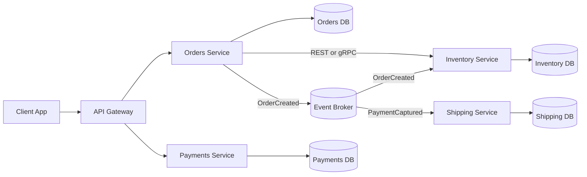

# Intro

Microservices are an architecture style where a system is split into independently deployable services, each aligned to a business capability and owning its own data. They matter because they let teams release changes independently, scale only hot paths, and use technology choices per domain when needed. You usually reach for microservices when team count grows, deployment independence becomes a bottleneck, and domains have different scaling or availability needs. The tradeoff is distributed-systems complexity: network latency, partial failures, eventual consistency, and heavier operational tooling.

## Core principles

- **Boundaries follow business capabilities**: split by bounded contexts like Orders, Inventory, Billing, Shipping.
- **Database per service**: each service owns its schema and persistence model; no cross-service table reads.
- **Communication by contracts**: integrate through versioned APIs/events, avoid shared databases, and keep shared libraries limited to generated contracts or platform primitives.
- **Independent deployment**: each service can ship, roll back, and scale independently.
- **Decentralized governance**: shared platform standards, local team autonomy.

## Communication patterns

**Synchronous calls**

- Use synchronous communication when the caller needs an immediate answer.
- Common options are [[REST]] and [[gRPC]].
- Best for short request-response interactions on the critical path.
- Risk: long synchronous chains amplify latency and failure propagation.

**Asynchronous messaging**

- Use [[Software Architecture/Distributed Systems/Message Queues/Message Queues|Message Queues]] and [[Event-Driven Architecture]] when temporal decoupling matters.
- Best for workflows, retries, burst smoothing, and eventual consistency.
- Publish immutable events like `OrderPlaced` or `InventoryReserved`.
- Make handlers idempotent to survive retries and duplicate delivery.

**Rule of thumb**

- Prefer synchronous for short, local decisions.
- Prefer asynchronous for cross-domain workflows and side effects.
- Avoid deep synchronous chains (`A -> B -> C -> D`) on critical paths.

## Implementation and operations

An independently deployable service can run in a container, virtual machine, managed application platform, or function/container service. Docker and Kubernetes are optional delivery mechanisms, not defining properties of microservices. [[Microservices Operations]] owns the .NET hosting, deployment, health, discovery, telemetry, rollback, and Kubernetes guidance.

## Microservices vs monolith vs modular monolith

| Dimension | [[Monolith Architecture\|Monolith]] | [[Modular Monolith]] | Microservices |
|---|---|---|---|
| Deployments | Single unit | Single unit with strict module boundaries | Independent service deployments |
| Team model | Shared ownership | Team ownership by module | Team ownership by service |
| Data model | Shared database | Shared database with modular access rules | Database per service |
| Runtime calls | In-process | In-process | Network calls |
| Operational complexity | Low | Low to medium | High |
| Best fit | Small team, early product | Growing product, clear domains, limited ops capacity | Large org, high release velocity, independent scaling needs |

[[Monolith Architecture]] is usually the best starting point when boundaries are still evolving and operational maturity is limited.

## Migration boundary

[[Microservices Migration]] owns the staged extraction path, data cutover, rollback gates, and evidence required to prove delivery independence. The action visuals remain here as provenance for the historical Airbnb case.

![[Assets/System Design 101/b9f01827e4bd9750c1373fc521401b109579dc9ea8ad15ec341d2cc393c70e1a.png]]

Airbnb's multi-year evolution supports incremental extraction under measured organizational and scaling pressure, not a fixed service-count target.

![[Assets/System Design 101/e02d3f2aec1fc038ce099b7ff1093637040adf8f701e7cb6585bd6b805c05754.jpg]]

Later use of both microservices and larger macroservices reinforces that service size follows ownership and change coupling.

## Boundaries and delivery independence

A service boundary is credible only when one team can change, test, deploy, roll back, and operate it without a lockstep release. Shared writable tables, paired deployments, or a mandatory long synchronous chain produce a distributed monolith even when processes run separately.

![[Assets/System Design 101/3d6ca99f3ca6f859b57019017474ce9cef54b0d9a9c3cd7d9c100db2ed4bd707.png]]

This capability map is a menu, not a mandatory topology. Gateways, meshes, containers, and separate databases support particular operating constraints; they do not create sound domain boundaries.

![[Assets/System Design 101/4f307656dcd815ca1f070bfefab9e30ed94e2c0db32ffd2866710c13d0efc179.png]]

Ownership, explicit failure behavior, and cross-boundary telemetry are the baseline. [[Microservices Operations]] owns the deployment, discovery, health, rollback, and observability contract.

## Production platform capabilities are conditional

![[Assets/System Design 101/3fb5b89e47761e9fe1da86003020b0a6e6d8fe57ff21e0955ef2869573abd33a.png]]

The pictured components are optional capabilities selected by observed failure modes and platform constraints. They are not prerequisites for calling a system microservices.

## Workflow ownership: orchestration versus choreography

Both styles can implement the same checkout, but they place workflow state differently.

| Question | Orchestration | Choreography |
|---|---|---|
| Who knows the next step? | A process manager | Each event consumer |
| Where is workflow state? | Explicit orchestrator state | Distributed across services and the event log |
| Failure recovery | Central retry and compensation policy | Each consumer owns retry; compensations emerge from events |
| Operational cost | Coordinator availability and throughput | Subscription graph, traceability, and contract governance |
| Best fit | Ordered, auditable workflows with compensation | Independent reactions and fan-out |

For `Charge -> Reserve -> Ship`, orchestration makes incomplete state and compensation visible. For `OrderPlaced -> email + analytics + search indexing`, choreography avoids a coordinator that adds no business decision. Mixing them is normal: orchestrate the transaction and publish facts for independent reactions.

## When microservices are the wrong fit

Prefer a modular monolith when the domain boundaries are changing weekly, one team owns the whole product, deployments are not blocking each other, or the team cannot operate distributed tracing, on-call ownership, and asynchronous consistency. Microservices turn compile-time coupling into network and operational coupling; they do not remove coordination for free.

A concrete stop rule: if extracting `Catalog` creates a separate pipeline, datastore, dashboard, pager, and compatibility contract but releases remain coordinated with the monolith, the extraction has added cost without delivery independence. Restore the module boundary in-process and revisit it when a measured constraint changes.

## Pitfalls

**1) Distributed monolith**

- **What goes wrong**: services are physically separate but tightly coupled via shared DBs or sync chains.
- **Why it happens**: boundaries follow technical layers, not business capabilities.
- **How to avoid it**: enforce database-per-service and reduce synchronous depth.

**2) Data consistency across services**

- **What goes wrong**: one service commits and another fails, leaving partial business state.
- **Why it happens**: distributed ACID transactions (for example, 2PC) are possible but usually avoided due to coupling, latency, and failure complexity.
- **How to avoid it**: use sagas, compensating actions, outbox pattern, and idempotent consumers.

**3) Operational complexity explosion**

- **What goes wrong**: incidents are hard to debug because logs/metrics/traces are fragmented.
- **Why it happens**: every service adds pipelines, dependencies, and monitoring surfaces.
- **How to avoid it**: standardize deployment templates, telemetry, alerts, and runbooks.

**4) Network is not reliable**

- **What goes wrong**: latency spikes, partial failures, and retry storms hurt end-to-end flow.
- **Why it happens**: network calls are slower and less reliable than in-process calls.
- **How to avoid it**: strict timeouts, bounded retries with jitter, circuit breakers, and backpressure.

## Questions

> [!QUESTION]- Why can microservices lead to distributed data consistency problems, and how do you address them?
>
> - Each service owns its data, so cross-service business actions cannot assume one local ACID transaction. A distributed transaction can coordinate supported resources, but its coupling, latency, and recovery costs make sagas and local transactions the usual design.
> - A later step can fail after an earlier local commit, producing partial state.
> - Use sagas with compensating actions across local transactions.
> - Use outbox/inbox and idempotent handlers to survive retries and duplicates.
> - Accept eventual consistency and make process state observable.

> [!QUESTION]- How do you decide between monolith, modular monolith, and microservices for a new product?
>
> - Decide from team size, release pressure, domain volatility, and ops maturity.
> - One team in discovery phase usually benefits most from monolith speed.
> - Clear domains with limited platform capacity often fit modular monolith.
> - Choose microservices when independent deploy/scale constraints are proven.
> - Re-evaluate architecture periodically as constraints change.

## References

- [Microservices Pattern: Microservice Architecture](https://microservices.io/patterns/microservices.html) — core microservices patterns and decomposition guidance.
- [Microservices — Martin Fowler](https://martinfowler.com/articles/microservices.html) — original definition and key characteristics.
- [.NET Microservices: Architecture for Containerized .NET Applications](https://learn.microsoft.com/en-us/dotnet/architecture/microservices/) — official Microsoft .NET guidance.
- [Default ASP.NET Core port changed from 80 to 8080](https://learn.microsoft.com/en-us/dotnet/core/compatibility/containers/8.0/aspnet-port) — container port behavior in modern ASP.NET Core images.
- [Building Microservices (2nd Edition) — Sam Newman](https://samnewman.io/books/building_microservices_2nd_edition/) — practical production lessons on boundaries and migration.
- [Decompose by business capability](https://microservices.io/patterns/decomposition/decompose-by-business-capability.html) — pattern reference for assigning cohesive business ownership instead of splitting by technical layer.
- [Strangler Fig pattern](https://learn.microsoft.com/en-us/azure/architecture/patterns/strangler-fig) — Microsoft guidance for incremental replacement while the existing system keeps serving traffic.
- [OpenTelemetry context propagation](https://opentelemetry.io/docs/concepts/context-propagation/) — official trace-context model for correlating work across service and messaging boundaries.
- [Saga distributed transactions](https://learn.microsoft.com/en-us/azure/architecture/reference-architectures/saga/saga) — Microsoft reference for orchestration, choreography, compensation, and their operational tradeoffs.
- [Airbnb's Great Migration](https://www.infoq.com/presentations/airbnb-services/) — Jessica Tai's case study of Airbnb's service migration and the organizational constraints behind it.

### ByteByteGo provenance

- [Airbnb architectural evolution](https://github.com/ByteByteGoHq/system-design-101/blob/b28380a4710c5ec9638ec037d4168e288f334cba/data/guides/airbnb-artchitectural-evolution.md) — editorial lead for the staged extraction case; company-specific scale claims are treated as dated context.
- [Typical microservice architecture](https://github.com/ByteByteGoHq/system-design-101/blob/b28380a4710c5ec9638ec037d4168e288f334cba/data/guides/what-does-a-typical-microservice-architecture-look-like.md) — provenance for the conditional topology map.
- [Production microservice components](https://github.com/ByteByteGoHq/system-design-101/blob/b28380a4710c5ec9638ec037d4168e288f334cba/data/guides/9-essential-components-of-a-production-microservice-application.md) — provenance for the platform-capability map; "essential" is not adopted as a universal claim.
- [Orchestration versus choreography](https://github.com/ByteByteGoHq/system-design-101/blob/b28380a4710c5ec9638ec037d4168e288f334cba/data/guides/orchestration-vs-choreography-microservices.md) — provenance for the symmetric workflow comparison.
- [Microservice development practices](https://github.com/ByteByteGoHq/system-design-101/blob/b28380a4710c5ec9638ec037d4168e288f334cba/data/guides/9-best-practices-for-developing-microservices.md) — editorial lead for delivery independence; its prescriptive visual was rejected.
- [Is microservice architecture the silver bullet?](https://github.com/ByteByteGoHq/system-design-101/blob/b28380a4710c5ec9638ec037d4168e288f334cba/data/guides/is-microservice-architecture-the-silver-bullet.md) — provenance for the wrong-fit decision rule.
- [Evolution of Airbnb's microservices](https://github.com/ByteByteGoHq/system-design-101/blob/b28380a4710c5ec9638ec037d4168e288f334cba/data/guides/evolution-of-airbnb%27s-microservice.md) — editorial lead for the microservice and macroservice case.
- [Building microservices practices](https://github.com/ByteByteGoHq/system-design-101/blob/b28380a4710c5ec9638ec037d4168e288f334cba/data/guides/9-best-practices-for-building-microservices.md) — provenance for the ownership, discovery, failure, and observability checklist.
