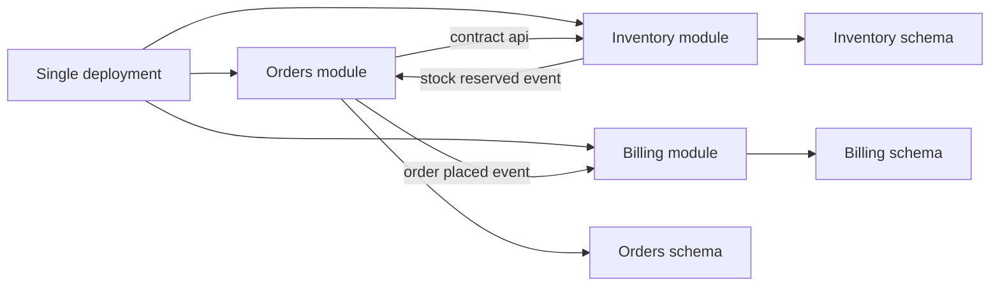

# Intro

A modular monolith is a single deployable application that is intentionally split into strict modules with explicit boundaries. It matters because you get most of the practical benefits people want from [[Microservices]] - clear ownership, clean contracts, and safer parallel development - without paying the full distributed systems tax on day one. Reach for it when your product is growing, domain boundaries are becoming clear, and your team does not want the operational overhead of many services yet. For most product teams, it is the pragmatic default: improve boundaries first, then distribute only where pressure proves it is worth it.

## Mechanism

Each module owns its own domain model, use cases, persistence rules, and public contract.

- **Boundary shape**: a module exposes only contracts such as interfaces, commands, events, and DTOs from its contracts assembly.
- **Allowed communication**: modules call each other only through those contracts, never by referencing another module internal classes.
- **Data isolation**: each module should have its own `DbContext` and ideally its own schema or database; at minimum, table ownership is explicit and cross module direct reads are prohibited.
- **In process now, distributed later**: module communication can be in process via mediator or integration events. Stable contracts reduce extraction churn, but replacing a local call with HTTP, gRPC, or messaging changes latency, failure, and transaction semantics even when the application-facing interface survives.

> [!IMPORTANT]
> **Data isolation makes the transaction boundary explicit.** Separate `DbContext` types or schemas can still share one local ACID transaction when they use the same relational database, connection, and provider transaction. The boundary becomes asynchronous when modules use separate databases, brokers, or resources that cannot participate in the same supported transaction. Then keep each local change atomic and publish reliably through an outbox instead of assuming all modules committed together. [[Modular Monolith in NET]] shows both cases.

## .NET implementation

[[Modular Monolith in NET]] contains the project layout, contracts-only dependency rule, concrete module registration, module-owned EF Core persistence, and a shared-transaction example for two `DbContext` instances using one relational resource.

## Extraction path to microservices

Clean boundaries make extraction bounded, not transparent. Keeping call sites behind a contract such as `IInventoryGateway` can preserve the use-case shape, but the new network boundary must become visible in the design:

1. Define request deadlines, cancellation, failure responses, and what callers do when Inventory is unavailable or slow.
2. Retry only operations that are idempotent, carry idempotency keys where duplicate execution is possible, and avoid retry storms with backoff and limits.
3. Propagate trace and correlation context; add dependency latency, error-rate, saturation, and retry metrics before cutting traffic over.
4. Replace one-process transactions with local transactions plus an outbox, compensating action, or saga where a workflow crosses services.
5. Move owned data deliberately, including backfill, dual-read or dual-write windows, reconciliation, and rollback.

The interface may remain familiar, but its contract now includes partial failure and eventual consistency. That is still safer than extracting tangled code: module ownership and data isolation narrow the migration surface without pretending a local method call and a remote operation are equivalent.

## Collocation and scale cases

Collocation pays when stages always change together, share one scaling profile, and exchange large intermediate data. Prime Video's monitoring team reported that moving one tightly ordered video-analysis pipeline into one process removed remote orchestration and transfer costs. The result was specific to that workload, not a general comparison between monoliths and services.

Stack Overflow's documented 2016 architecture shows a different mechanism: a stateless application tier scaled horizontally while SQL Server, Redis, and search remained specialized systems. The lesson is not a server-count target. A modular deployment can carry substantial load when request paths, caches, database constraints, and failure headroom are measured.

Use these cases as boundary tests. Collocate modules when their changes, data movement, and scaling remain coupled. Extract a service only when independent deployment, failure isolation, or asymmetric scaling repeatedly pays for the new network and operating boundary.

## Pitfalls

- **Boundary erosion**: direct table reads, internal project references, and cross-module joins turn folders into decoration. Contracts-only references, table ownership, and architecture tests must fail the build when a shortcut crosses the boundary.
- **Shared database coupling**: one database can preserve local ACID transactions, but shared tables and unowned migrations couple modules. Give each module a schema and `DbContext`; exchange data through contracts or events.
- **Premature partitioning**: too many modules around unstable domains create constant boundary churn. Start with a few bounded contexts and split when ownership, change frequency, or scaling evidence makes the boundary durable.

## Tradeoffs

| Criterion | Traditional Monolith | Modular Monolith | Microservices |
|---|---|---|---|
| Deployment | Single unit | Single unit | Independent service deployments |
| Team model | Shared ownership across codebase | Ownership by module with explicit contracts | Ownership by service with strong autonomy |
| Data isolation | Usually shared schema and shared table access | Isolated schema or strict table ownership per module | Database per service with hard isolation |
| Runtime overhead | Lowest in process calls | Low in process calls plus boundary discipline | Highest due to network calls and resilience layers |
| Operational complexity | Low | Low to medium | High observability platform and deployment orchestration needs |
| Extraction cost | High if internals are tangled | Medium: contracts reduce code churn, but remote failure semantics and data migration remain | Not applicable: already extracted |

Decision rule: default to modular monolith for most product teams, choose traditional monolith only for very small or short lived systems, and move to microservices only when independent deployment or scaling constraints are repeatedly blocking delivery.

## Questions

> [!QUESTION]- How do you enforce module boundaries in a modular monolith to prevent it from degrading into a traditional monolith?
> Split each module into contracts, core, and infrastructure assemblies; allow cross-module references only to contracts. Give tables an owner, block cross-module joins, and use architecture tests to fail CI on forbidden project or namespace dependencies. The friction is intentional: a boundary that cannot reject a shortcut is only documentation.

> [!QUESTION]- When would you choose a modular monolith over microservices, and what signals tell you it is time to extract?
> Choose the modular monolith while domains can be owned as modules and one deployment remains reliable. Extract when a module repeatedly needs independent scaling, release cadence, security isolation, or reliability posture. Before cutover, preserve the domain contract but redesign the interaction for remote deadlines, retries, observability, and transaction boundaries.

## References

- [Modular Monolith with DDD repository by Kamil Grzybek](https://github.com/kgrzybek/modular-monolith-with-ddd) - Anchor practitioner codebase showing strict module boundaries, integration events, and architecture tests in a real .NET solution.
- [Kamil Grzybek Modular Monolith Primer](https://www.kamilgrzybek.com/blog/posts/modular-monolith-primer) - Conceptual explanation of module boundaries, communication patterns, and why modular monolith is a strategic step before service extraction.
- [Modular Monolith Communication Patterns by Milan Jovanovic](https://www.milanjovanovic.tech/blog/modular-monolith-communication-patterns) - Practitioner guidance on in process communication choices and contract based module interaction in .NET.
- [.NET Microservices Architecture guide](https://learn.microsoft.com/en-us/dotnet/architecture/microservices/) - Microsoft architecture anchor describing service boundaries, independent deployment, and distributed systems tradeoffs.
- [Prime Video monitoring service](https://www.primevideotech.com/video-streaming/scaling-up-the-prime-video-audio-video-monitoring-service-and-reducing-costs-by-90) — primary case describing the transfer and orchestration costs removed by collocation.
- [Stack Overflow architecture, 2016](https://nickcraver.com/blog/2016/02/17/stack-overflow-the-architecture-2016-edition/) — primary historical account of the application tier, data systems, traffic, and capacity headroom.
