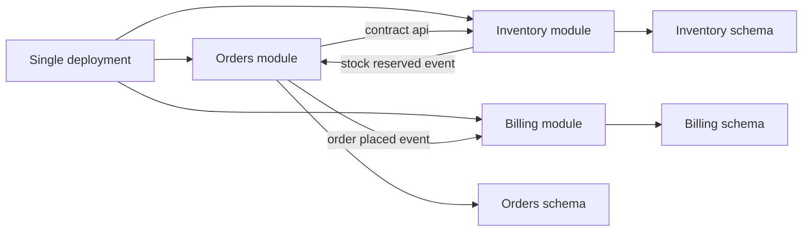

# Intro

A modular monolith is a single deployable application that is intentionally split into strict modules with explicit boundaries. It matters because you get most of the practical benefits people want from [[Microservices]] - clear ownership, clean contracts, and safer parallel development - without paying the full distributed systems tax on day one. Reach for it when your product is growing, domain boundaries are becoming clear, and your team does not want the operational overhead of many services yet. For most product teams, especially on .NET with Aspire, this is the pragmatic default: evolve architecture quality first, then distribute only where pressure proves it is worth it.

## Mechanism

Each module owns its own domain model, use cases, persistence rules, and public contract.

- **Boundary shape**: a module exposes only contracts such as interfaces, commands, events, and DTOs from its contracts assembly.
- **Allowed communication**: modules call each other only through those contracts, never by referencing another module internal classes.
- **Data isolation**: each module should have its own `DbContext` and ideally its own schema or database; at minimum, table ownership is explicit and cross module direct reads are prohibited.
- **In process now, distributed later**: module communication can be in process via mediator or domain integration events; if boundaries stay clean, transport can move to HTTP or gRPC later without changing business call sites.

> [!IMPORTANT]
> **Data isolation makes the transaction boundary explicit.** Separate `DbContext` types or schemas can still share one local ACID transaction when they use the same relational database, connection, and provider transaction. The boundary becomes asynchronous when modules use separate databases, brokers, or resources that cannot participate in the same supported transaction. Then keep each local change atomic and publish reliably through an outbox instead of assuming all modules committed together. [[Modular Monolith in NET]] shows both cases.

## .NET implementation

[[Modular Monolith in NET]] contains the project layout, contracts-only dependency rule, concrete module registration, module-owned EF Core persistence, and a shared-transaction example for two `DbContext` instances using one relational resource.

## Extraction Path to Microservices

If boundaries are real, extraction is mechanical instead of a rewrite.

1. Keep call sites targeting contracts such as `IInventoryGateway`.
2. Replace in process implementation with an HTTP or gRPC client implementation behind the same interface.
3. Move Inventory module runtime to its own deployable service with owned data.
4. Keep Orders calling code unchanged because the contract shape stays the same.

This is why modular monolith is often a safer first architecture than either a big unstructured monolith or premature microservices. It gives an incremental path from [[Monolith Architecture]] toward [[Microservices]] only when real scaling or release pressure appears.

## Collocation and scale cases

Collocation pays when stages always change together, share one scaling profile, and exchange large intermediate data. Prime Video's monitoring team reported that moving one tightly ordered video-analysis pipeline into one process removed remote orchestration and transfer costs. The result was specific to that workload, not a general comparison between monoliths and services.

Stack Overflow's documented 2016 architecture shows a different mechanism: a stateless application tier scaled horizontally while SQL Server, Redis, and search remained specialized systems. The lesson is not a server-count target. A modular deployment can carry substantial load when request paths, caches, database constraints, and failure headroom are measured.

Use these cases as boundary tests. Collocate modules when their changes, data movement, and scaling remain coupled. Extract a service only when independent deployment, failure isolation, or asymmetric scaling repeatedly pays for the new network and operating boundary.

## Pitfalls

### 1 Boundary erosion through shortcuts

- **What goes wrong**: developers start reading other modules tables directly or referencing internals for speed, and modules collapse into hidden coupling.
- **Why it happens**: delivery pressure rewards short term convenience, while no guardrail fails the build.
- **How to avoid it**: enforce contracts assemblies, block forbidden references with architecture tests, and fail pull requests that introduce cross module table access.

### 2 Shared database without isolation

- **What goes wrong**: modules become coupled through shared tables, migration order dependencies, and cross module joins.
- **Why it happens**: one schema feels faster early, then ownership boundaries stay ambiguous.
- **How to avoid it**: assign each module schema and `DbContext`, make table ownership explicit, and treat cross module data needs as API or event driven integration.

### 3 Over modularization too early

- **What goes wrong**: teams create many modules before domain boundaries are stable, causing constant boundary churn and accidental complexity.
- **Why it happens**: architecture is optimized for a future scale pattern that has not happened yet.
- **How to avoid it**: start with a few clear bounded contexts, split only when change frequency and ownership data show real pressure.

### 4 Modular in name only

- **What goes wrong**: folder structure looks clean but runtime dependencies still bypass contracts, so the system behaves like a traditional monolith.
- **Why it happens**: structure is documented but not executable as constraints.
- **How to avoid it**: add architecture tests for dependency rules, monitor forbidden namespace usage, and include boundary checks in CI.

## Tradeoffs

| Criterion | Traditional Monolith | Modular Monolith | Microservices |
|---|---|---|---|
| Deployment | Single unit | Single unit | Independent service deployments |
| Team model | Shared ownership across codebase | Ownership by module with explicit contracts | Ownership by service with strong autonomy |
| Data isolation | Usually shared schema and shared table access | Isolated schema or strict table ownership per module | Database per service with hard isolation |
| Runtime overhead | Lowest in process calls | Low in process calls plus boundary discipline | Highest due to network calls and resilience layers |
| Operational complexity | Low | Low to medium | High observability platform and deployment orchestration needs |
| Extraction cost | High if internals are tangled | Low to medium if contracts and data isolation are enforced | Not applicable already extracted |

Decision rule: default to modular monolith for most product teams, choose traditional monolith only for very small or short lived systems, and move to microservices only when independent deployment or scaling constraints are repeatedly blocking delivery.

## Questions

> [!QUESTION]- How do you enforce module boundaries in a modular monolith to prevent it from degrading into a traditional monolith?
>
> - Split each module into contracts core and infrastructure assemblies and allow cross module references only to contracts.
> - Enforce table ownership and block cross module joins from application code.
> - Add architecture tests that fail CI on forbidden project references and namespace dependencies.
> - Keep integration through explicit APIs events or mediator requests rather than direct class calls.
> - Track boundary drift with code review checklists and dependency graph checks.
> - Tradeoff: stronger enforcement raises short term friction but prevents long term structural decay.

> [!QUESTION]- When would you choose a modular monolith over microservices, and what signals tell you it is time to extract?
>
> - Choose modular monolith when domains are clear enough for module ownership but not enough operational pressure exists to justify distributed systems overhead.
> - Prefer it when one platform team can run a single deployment reliably and release cadence is still mostly coordinated.
> - Extract when one module needs independent scaling, independent release frequency, or different reliability posture that the shared deployment cannot satisfy.
> - Extract when change coupling metrics show one module repeatedly blocked by unrelated regression risk in the shared deploy.
> - Keep contract stable first then swap transport from in process implementation to HTTP or gRPC.
> - Tradeoff: delaying extraction avoids premature complexity but waiting too long can slow teams once scaling pressure is persistent.

## References

- [Modular Monolith with DDD repository by Kamil Grzybek](https://github.com/kgrzybek/modular-monolith-with-ddd) - Anchor practitioner codebase showing strict module boundaries, integration events, and architecture tests in a real .NET solution.
- [Kamil Grzybek Modular Monolith Primer](https://www.kamilgrzybek.com/blog/posts/modular-monolith-primer) - Conceptual explanation of module boundaries, communication patterns, and why modular monolith is a strategic step before service extraction.
- [Modular Monolith Communication Patterns by Milan Jovanovic](https://www.milanjovanovic.tech/blog/modular-monolith-communication-patterns) - Practitioner guidance on in process communication choices and contract based module interaction in .NET.
- [.NET Microservices Architecture guide](https://learn.microsoft.com/en-us/dotnet/architecture/microservices/) - Microsoft architecture anchor describing service boundaries, independent deployment, and distributed systems tradeoffs.
- [.NET Aspire overview](https://aspire.dev/get-started/what-is-aspire/) - Official .NET Aspire guidance covering local orchestration, code first service composition, and deployment flexibility when evolving modules into separately deployed services.
- [Prime Video monitoring service](https://www.primevideotech.com/video-streaming/scaling-up-the-prime-video-audio-video-monitoring-service-and-reducing-costs-by-90) — primary case describing the transfer and orchestration costs removed by collocation.
- [Stack Overflow architecture, 2016](https://nickcraver.com/blog/2016/02/17/stack-overflow-the-architecture-2016-edition/) — primary historical account of the application tier, data systems, traffic, and capacity headroom.
