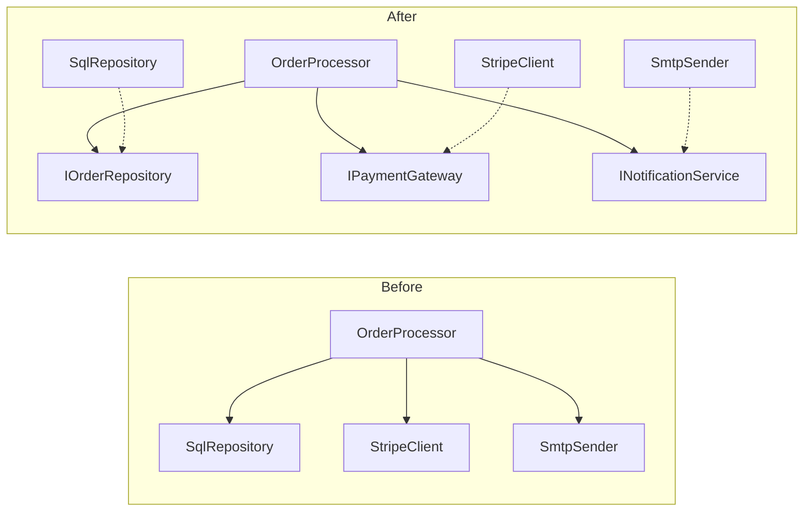

SOLID names five principles for managing change, dependencies, and behavioral contracts in object-oriented design. They are diagnostic tools, not a demand for an interface around every class. Each principle identifies a different failure mode:

| Principle | Question it asks |
| --- | --- |
| Single Responsibility | Which actor or policy causes this module to change? |
| Open/Closed | Can the expected variant be added without reopening stable policy? |
| Liskov Substitution | Does every subtype preserve the contract its callers rely on? |
| Interface Segregation | Does each client depend only on the operations it needs? |
| Dependency Inversion | Do source dependencies point toward policy or toward details? |

# S — Single Responsibility Principle

**A module should have one reason to change.** A reason is tied to an actor: a group whose requirements change together. SRP is about cohesive change, not about limiting a class to one method.

When one class serves independent actors, their changes collide. The `OrderService` below combines persistence policy, notification formatting, and invoice generation even though those concerns evolve for different reasons.

**Violation — one class, three actors:**

```csharp
// ⚠️ Three reasons to change: persistence logic, email templates, PDF formatting
public class OrderService
{
    private readonly ShopDbContext _db;
    private readonly SmtpClient _smtp;
    public OrderService(ShopDbContext db, SmtpClient smtp) { _db = db; _smtp = smtp; }

    public async Task PlaceOrderAsync(Order order)
    {
        // Actor 1: warehouse — storage rules
        order.Status = OrderStatus.Placed;
        _db.Orders.Add(order);
        await _db.SaveChangesAsync();

        // Actor 2: marketing — email content and design
        var body = $"<h1>Thank you, {order.Customer.Name}</h1>";
        await _smtp.SendMailAsync(new MailMessage("noreply@shop.com",
            order.Customer.Email, "Order Confirmed", body));

        // Actor 3: finance — invoice format, tax rules
        var pdf = GenerateInvoicePdf(order);
        await File.WriteAllBytesAsync($"invoices/{order.Id}.pdf", pdf);
    }

    private byte[] GenerateInvoicePdf(Order order) =>
        Encoding.UTF8.GetBytes($"INVOICE #{order.Id}\n{order.Customer.Name}\nTotal: {order.Total:C}");
}
```

An email-formatting failure can occur after `SaveChangesAsync` has persisted the order. The method then reports failure despite partial completion, so a retry may repeat already-completed work. The failure crosses responsibility boundaries because persistence and notification share one execution unit.

**Fix — each actor gets its own class:**

```csharp
// ✅ Each class changes for exactly one actor
public class OrderRepository
{
    private readonly ShopDbContext _db;
    public OrderRepository(ShopDbContext db) => _db = db;
    public async Task SaveAsync(Order order)
    {
        order.Status = OrderStatus.Placed;
        _db.Orders.Add(order);
        await _db.SaveChangesAsync();
    }
}

public class OrderConfirmationMailer
{
    private readonly SmtpClient _smtp;
    public OrderConfirmationMailer(SmtpClient smtp) => _smtp = smtp;
    public async Task SendAsync(Order order) =>
        await _smtp.SendMailAsync(BuildMessage(order));
    private MailMessage BuildMessage(Order order) =>
        new("noreply@shop.com", order.Customer.Email, "Order Confirmed",
            $"<h1>Thank you, {order.Customer.Name}</h1><p>Order #{order.Id}</p>");
}

public class InvoiceGenerator
{
    public byte[] Generate(Order order) =>
        Encoding.UTF8.GetBytes($"Invoice #{order.Id} | {order.Customer.Name} | {order.Total:C}");
}
```

The split isolates change and test setup, but it does not by itself make the workflow atomic. A coordinator still owns ordering, idempotency, and recovery across the repository, mailer, and invoice generator.

**Evidence of an SRP problem:** unrelated actors repeatedly edit the same module, a focused test requires unrelated infrastructure, or one concern cannot change without retesting several independent policies. The word “and” is only a prompt to inspect cohesion, not proof of a violation.

# O — Open/Closed Principle

**Software entities should be open for extension and closed for modification.** Closure is always relative to a predicted axis of change. A module can stabilize its dispatch policy while allowing new variants through an established abstraction. It cannot be closed against every future requirement.

The problem appears when every new variant edits the same selection logic. That file becomes both the registry of variants and the policy that executes them, so unrelated additions compete in one change surface.

**Violation — switch statement that grows with every new shipping carrier:**

```csharp
// ⚠️ Adding FedEx means modifying this method and retesting UPS + DHL paths
public class ShippingCostCalculator
{
    public decimal Calculate(Order order, string carrier) => carrier switch
    {
        "UPS" => order.TotalWeight * 1.5m + 4.99m,
        "DHL" => order.TotalWeight * 1.8m + 2.99m,
        // Every new carrier: edit this file, retest everything
        _ => throw new NotSupportedException($"Unknown carrier: {carrier}")
    };
}
```

**Refactor — stable dispatch with carrier strategies:**

```csharp
// ✅ Adding FedEx = adding one new class. Zero changes to existing code.
public interface IShippingCostStrategy
{
    string Carrier { get; }
    decimal Calculate(Order order);
}

public class UpsShipping : IShippingCostStrategy
{
    public string Carrier => "UPS";
    public decimal Calculate(Order order) => order.TotalWeight * 1.5m + 4.99m;
}

public class DhlShipping : IShippingCostStrategy
{
    public string Carrier => "DHL";
    public decimal Calculate(Order order) => order.TotalWeight * 1.8m + 2.99m;
}

public class ShippingCostCalculator
{
    private readonly IEnumerable<IShippingCostStrategy> _strategies;
    public ShippingCostCalculator(IEnumerable<IShippingCostStrategy> strategies)
        => _strategies = strategies;

    public decimal Calculate(Order order, string carrier)
        => _strategies.First(s => s.Carrier == carrier).Calculate(order);
}
```

The strategy version keeps calculation policy stable while new carrier implementations vary independently. The composition root or registration data may still change to make a carrier available. OCP removes recurring edits from the stable policy, not every edit from the system.

**Evidence of an OCP problem:** the same dispatch method changes for every new variant, unrelated additions create merge conflicts, or one branch addition requires retesting all existing branches. A `switch` is not automatically wrong. A small, stable, non-duplicated switch can be clearer than a speculative hierarchy.

# L — Liskov Substitution Principle

**Subtypes must preserve the contract of the type they replace.** A subtype cannot require more from callers, promise less in return, violate invariants, or introduce failures that the base contract excludes. The rule concerns observable behavior, not shared syntax or inheritance mechanics.

These violations compile because C# checks type compatibility, not the full behavioral contract.

**Violation — a caching repository that silently drops writes:**

```csharp
// ⚠️ Base contract: Save persists the product. Subtype silently breaks this.
public class ProductRepository
{
    protected readonly ShopDbContext Db;
    public ProductRepository(ShopDbContext db) => Db = db;
    public virtual async Task<Product> GetByIdAsync(int id)
        => await Db.Products.FindAsync(id);

    public virtual async Task SaveAsync(Product product)
    {
        Db.Products.Update(product);
        await Db.SaveChangesAsync(); // ← caller relies on this persisting
    }
}

public class CachedProductRepository : ProductRepository
{
    private readonly IMemoryCache _cache;
    public CachedProductRepository(ShopDbContext db, IMemoryCache cache) : base(db) => _cache = cache;

    public override async Task SaveAsync(Product product)
    {
        // ⚠️ Only updates cache, skips database entirely
        _cache.Set($"product:{product.Id}", product);
        // No call to base.SaveAsync — writes are silently lost
    }
}
```

The base contract says that `SaveAsync` persists a product. The override stores only a cached value, so callers observe success without durable state. A later cache miss or process restart exposes the lost write.

**Fix — composition instead of inheritance, explicit contracts:**

```csharp
// ✅ Cache is a decorator that preserves the persistence contract
public sealed record ProductSnapshot(int Id, string Name, decimal Price);

public interface IProductRepository
{
    Task<ProductSnapshot?> GetByIdAsync(int id);
    Task SaveAsync(Product product);
}

public class SqlProductRepository : IProductRepository
{
    private readonly ShopDbContext _db;
    public SqlProductRepository(ShopDbContext db) => _db = db;
    public async Task<ProductSnapshot?> GetByIdAsync(int id)
    {
        var product = await _db.Products.FindAsync(id);
        return product is null
            ? null
            : new ProductSnapshot(product.Id, product.Name, product.Price);
    }
    public async Task SaveAsync(Product product)
    {
        _db.Products.Update(product);
        await _db.SaveChangesAsync();
    }
}

public class CachedProductRepository : IProductRepository
{
    private readonly IProductRepository _inner;
    private readonly IMemoryCache _cache;
    public CachedProductRepository(IProductRepository inner, IMemoryCache cache) { _inner = inner; _cache = cache; }

    public async Task<ProductSnapshot?> GetByIdAsync(int id)
    {
        if (_cache.TryGetValue<ProductSnapshot>($"product:{id}", out var cached))
            return cached;

        var product = await _inner.GetByIdAsync(id);
        if (product is not null)
            _cache.Set($"product:{id}", product);
        return product;
    }

    public async Task SaveAsync(Product product)
    {
        await _inner.SaveAsync(product); // ✅ Persistence contract honored
        _cache.Remove($"product:{product.Id}");
    }
}
```

The decorator preserves the persistence postcondition and adds caching as a separate behavior. Cached reads are detached immutable snapshots, and a successful write invalidates them; mutable EF-tracked entities are never shared through the process cache. Composition is not inherently safer than inheritance. It works here because the wrapper explicitly delegates the original contract before adding its own effect.

**Evidence of an LSP problem:** a subtype throws `NotSupportedException` for a promised operation, strengthens input requirements, weakens output guarantees, or makes callers branch on the runtime type. Calling `base.Method()` is neither required nor sufficient. Substitutability is judged from externally visible behavior.

# I — Interface Segregation Principle

**No client should be forced to depend on methods it does not use.** Interfaces are shaped around client roles, not around the complete capability list of one implementation. Smallness is a consequence of that boundary, not the objective by itself.

A broad interface couples clients and implementers to operations outside their role. Changes to those operations then propagate through code that neither calls nor supports them.

**Violation — one interface forces every implementation to handle everything:**

```csharp
// ⚠️ Notification service must implement SMS even if it only handles email
public interface IOrderService
{
    Task<Order> CreateOrderAsync(OrderRequest request);
    Task CancelOrderAsync(int orderId);
    Task RefundOrderAsync(int orderId, decimal amount);
    Task SendConfirmationEmailAsync(int orderId);
    Task SendShippingNotificationSmsAsync(int orderId);
    Task<byte[]> GenerateInvoicePdfAsync(int orderId);
    Task SyncInventoryAsync(int orderId);
}

// ⚠️ This class only needs to send notifications, but must implement 7 methods
public class NotificationHandler : IOrderService
{
    private readonly IEmailClient _email;
    private readonly ISmsClient _sms;
    public NotificationHandler(IEmailClient email, ISmsClient sms) { _email = email; _sms = sms; }
    public Task<Order> CreateOrderAsync(OrderRequest r) => throw new NotSupportedException();
    public Task CancelOrderAsync(int id) => throw new NotSupportedException();
    public Task RefundOrderAsync(int id, decimal a) => throw new NotSupportedException();
    public Task SendConfirmationEmailAsync(int id) => _email.SendAsync($"Order {id} confirmed");
    public Task SendShippingNotificationSmsAsync(int id) => _sms.SendAsync($"Order {id} shipped");
    public Task<byte[]> GenerateInvoicePdfAsync(int id) => throw new NotSupportedException();
    public Task SyncInventoryAsync(int id) => throw new NotSupportedException();
}
```

**Fix — interfaces split by client need:**

```csharp
// ✅ Each interface represents one capability
public interface IOrderManager
{
    Task<Order> CreateOrderAsync(OrderRequest request);
    Task CancelOrderAsync(int orderId);
    Task RefundOrderAsync(int orderId, decimal amount);
}

public interface IOrderNotifier
{
    Task SendConfirmationEmailAsync(int orderId);
    Task SendShippingNotificationSmsAsync(int orderId);
}

public interface IInvoiceGenerator
{
    Task<byte[]> GenerateInvoicePdfAsync(int orderId);
}

// ✅ NotificationHandler only implements what it actually does
public class NotificationHandler : IOrderNotifier
{
    private readonly IEmailClient _email;
    private readonly ISmsClient _sms;
    public NotificationHandler(IEmailClient email, ISmsClient sms) { _email = email; _sms = sms; }
    public Task SendConfirmationEmailAsync(int id) => _email.SendAsync($"Order {id} confirmed");
    public Task SendShippingNotificationSmsAsync(int id) => _sms.SendAsync($"Order {id} shipped");
}
```

The split lets order management, notification, and invoicing evolve for their own clients. A class may legitimately implement several interfaces when it serves several roles. ISP prevents those roles from being bundled into every client contract.

**Evidence of an ISP problem:** implementations contain unsupported-operation stubs, clients mock members they never call, or an interface change forces unrelated consumers to rebuild and retest. Many one-method interfaces can be the opposite failure when all clients use the same cohesive operation set.

# D — Dependency Inversion Principle

**High-level policy should not depend on low-level details. Both should depend on abstractions.** The policy side owns the contract it needs, and infrastructure implements that contract. Runtime calls can still flow from policy to infrastructure while source-code dependencies point back toward policy.

Without DIP, the `OrderProcessor` chooses SQL persistence, a payment provider, and email infrastructure itself. Those construction decisions make volatile details part of the business module.

**Violation — business logic hardcoded to infrastructure:**

```csharp
// ⚠️ Changing payment provider means rewriting the business class
public class OrderProcessor
{
    private readonly SqlOrderRepository _repo = new();
    private readonly StripePaymentClient _stripe = new(Environment.GetEnvironmentVariable("STRIPE_SECRET_KEY")!);
    private readonly SmtpEmailSender _mailer = new("smtp.company.com");

    public async Task ProcessAsync(Order order)
    {
        await _stripe.ChargeAsync(order.Total, order.Customer.CardToken);
        await _repo.SaveAsync(order);
        await _mailer.SendAsync(order.Customer.Email, "Order confirmed");
    }
}
```

**Fix — depend on abstractions, inject implementations:**

```csharp
// ✅ Business logic depends on interfaces. Infrastructure plugs in from outside.
public class OrderProcessor
{
    private readonly IOrderRepository _repo;
    private readonly IPaymentGateway _payment;
    private readonly INotificationService _notifier;

    public OrderProcessor(
        IOrderRepository repo,
        IPaymentGateway payment,
        INotificationService notifier)
    {
        _repo = repo;
        _payment = payment;
        _notifier = notifier;
    }

    public async Task ProcessAsync(Order order)
    {
        await _payment.ChargeAsync(order.Total, order.Customer.PaymentToken);
        await _repo.SaveAsync(order);
        await _notifier.SendOrderConfirmationAsync(order);
    }
}
```

The dependency direction flips:



Dependency injection supplies the implementations, but it is not DIP by itself. DIP is the source-dependency rule shown in the diagram: the business policy knows its abstractions, while infrastructure and the composition root know the concrete details.

**Evidence of a DIP problem:** business policy imports provider SDK types, constructs infrastructure dependencies, or changes whenever a storage or transport detail changes. Constructing concrete classes is expected inside a composition root and harmless inside self-contained leaf code. Location and dependency direction determine the design cost.

# How the Principles Reinforce Each Other

The principles overlap without becoming interchangeable. SRP identifies change axes. OCP can stabilize an extension point along one of those axes. ISP keeps a contract aligned with its clients. LSP requires every implementation of that contract to remain substitutable. DIP places those abstractions on the policy side so infrastructure changes do not pull business logic with them.

A single design smell may therefore have several causes. An interface full of unsupported members is both an ISP warning and evidence that implementations cannot satisfy one substitutable contract. A frequently edited policy class may need a clearer responsibility boundary before it needs polymorphism.

# Tradeoffs

| Principle | Useful pressure | Over-application signal |
| --- | --- | --- |
| SRP | Independent actors change independently | Cohesive behavior is scattered across tiny classes |
| OCP | A recurring variant can extend a stable policy | An abstraction predicts variants that have not appeared |
| LSP | One contract supports honest substitution | The hierarchy exists only for code reuse and needs exceptions |
| ISP | Clients see role-specific contracts | Interfaces are split more finely than any client requires |
| DIP | Volatile details depend on stable policy contracts | Every leaf class receives an interface and container registration |

SOLID pays for itself at observed change seams: repeated edits, unstable dependencies, dishonest contracts, or tests dominated by unrelated setup. Concrete, cohesive code remains the simpler choice where no such seam exists. LSP is different from the other tradeoffs: once a subtype relationship is declared, violating its contract is a correctness defect rather than a simplification.

# Pitfalls

- **One method per class.** SRP concerns cohesive change for one actor, not method count.
- **An abstraction for every class.** DIP protects a policy/detail boundary. It does not require indirection around stable leaf code.
- **No switches anywhere.** OCP targets recurring extension pressure. A local, stable switch can express a closed set clearly.
- **Inheritance for reuse.** Shared implementation does not establish behavioral substitutability. Composition often exposes the real contract more honestly.
- **Tiny interfaces by default.** ISP starts from client needs. Splitting a contract without a client boundary only increases navigation and wiring.

# References

- [Architectural Principles](https://learn.microsoft.com/en-us/dotnet/architecture/modern-web-apps-azure/architectural-principles)
- [Clean Architecture](https://www.pearson.com/en-us/subject-catalog/p/Martin-Clean-Architecture-A-Craftsman-s-Guide-to-Software-Structure-and-Design/P200000009528?view=educator)
