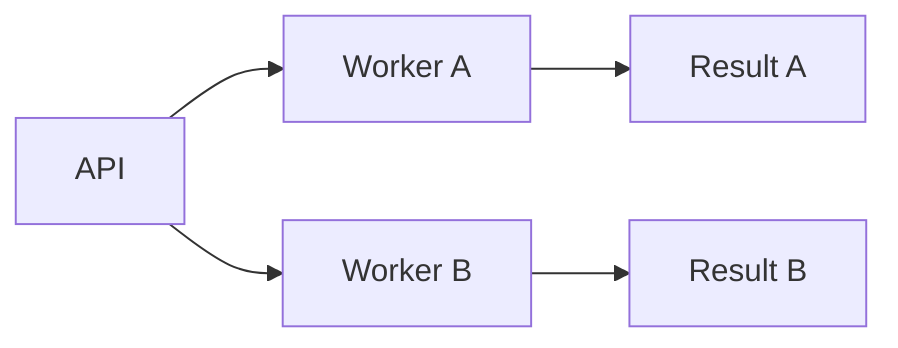

# Flowmaid

Flowmaid adds deterministic simulation, metrics, controls, and removable animation to native Mermaid flowcharts in Obsidian and Quartz.

## Authoring

Keep the diagram and its versionless Flowmaid program in one ordinary `mermaid` fence. Node IDs in the YAML refer to Mermaid node IDs.

The beta vocabulary is closed:

- `controls.<id>`: `label`, `min`, `max`, `value`, `step`, and optional `unit`.
- `sources[]`: `rate` is a non-negative number or control ID; `nodes` is a non-empty list of Mermaid node IDs.
- `distribution.<node>`: `strategy` is `roundRobin`, `weightedRoundRobin`, `random`, or `broadcast`. Only `weightedRoundRobin` accepts positive `weights` keyed by target node ID.
- `queues.<node>.capacity`: positive processing capacity.
- `dots`: optional `radius` from 1 through 6 and `durationMs` from 250 through 10000; defaults are 3 and 1000.

Without Flowmaid, the comment block is inert and Mermaid still renders the authored topology. Missing metadata leaves an ordinary Mermaid diagram; invalid metadata leaves the native diagram visible and adds a diagnostic instead of replacing it.

## Build and hosts

From `Web/`, run `npm run flowmaid:build` to produce exactly six committed artifacts and `npm run flowmaid:check` to verify them byte-for-byte. `npm run flowmaid:typecheck`, `npm run flowmaid:test`, and `npm run flowmaid:visual` cover source, behavior, and the SVG oracle.

Host-neutral source owns authoring, validation, simulation, Mermaid augmentation, controls, and teardown. The Obsidian adapter supplies plugin lifecycle and native sliders; the Quartz transformer, loader, runtime, component, and emitter remain isolated from it.

If Flowmaid becomes independently distributed, extract these adapters as `obsidian-flowmaid` and `quartz-flowmaid` packages around the same host-neutral core. Do not fork the authoring language or simulation semantics.
