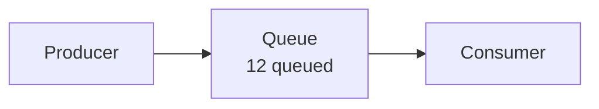

# Mermaid Flow

Mermaid Flow adds simulated traffic, metrics, semantic states, and native controls to an ordinary Mermaid flowchart. The Mermaid diagram remains complete when the plugin is absent.

## Authoring

Place a lowercase kebab-case marker in a `mermaid` fence, then put one strict JSON `mermaid-flow` fence immediately after it. The marker and `for` value must match.

````markdown


```mermaid-flow
{
  "version": 1,
  "for": "queue-demo",
  "defaults": {
    "nodes": { "queue": { "metric": "12 queued", "state": "normal" } },
    "edges": {
      "0": { "radius": 2, "particlesPerCycle": 3, "travelMs": 800 },
      "1": { "radius": 2, "particlesPerCycle": 2, "travelMs": 1000 }
    }
  }
}
```
````

Nodes use authored Mermaid IDs. A node with a `metric` keeps its fallback value as the final `<span>` line in the Mermaid label; the runtime updates only that line. Edges use zero-based Mermaid link-definition order. JSON is intentionally strict: unknown fields, invalid ranges, duplicate writers, ambiguous pairing, and unsupported versions fail closed with a readable diagnostic.

V1 controls are `scenario`, `range`, and `reset`. Scenarios apply named patches; bindings map a range to one property and may apply a bounded `scale`/`offset`/`min`/`max`/`round` numeric transform; thresholds map one range to ordered state bands. Optional `queues` integrate a transformed arrival rate against a fixed per-second capacity, writing accumulated queue and consumer counters plus current/maximum load bars inside authored nodes. Pause/Resume freezes counters and particles; Reset clears counters and restores controls.

## Ownership and delivery

Production behavior lives under `src/`. `MermaidSvgAdapter` is the only module that knows Mermaid-emitted SVG selectors and IDs. The shared mount owns normalization, local state, rendering, reduced-motion behavior, SVG replacement, and idempotent teardown. Obsidian also supplies the same native `SliderComponent` host control used by StepTrace; Quartz uses the shared fallback range. Both hosts otherwise supply only pairing and lifecycle integration.

`npm run mermaid-flow:build` creates exactly six projections; never edit them directly:

- `Web/custom/mermaid-flow/generated/engine.js`
- `Web/custom/mermaid-flow/generated/engine.css`
- `Vault/.obsidian/plugins/mermaid-flow/main.js`
- `Vault/.obsidian/plugins/mermaid-flow/styles.css`
- `Vault/.obsidian/plugins/mermaid-flow/manifest.json`
- `Vault/.obsidian/plugins/mermaid-flow/.hotreload`

Use `npm run mermaid-flow:test`, `npm run mermaid-flow:typecheck`, and `npm run mermaid-flow:check` for behavior, strict source coverage, and projection freshness.

## Limits

Mermaid Flow is a local teaching visualizer, not a general simulation engine or monitoring client. Its only time model is the bounded queue accumulator declared in a paired configuration. It performs no live-data fetch, polling, telemetry, persistence, external-origin request, topology editing, relayout, or arbitrary label replacement. Reduced motion preserves states, metrics, counters, load bars, and controls while removing continuous particle travel.
