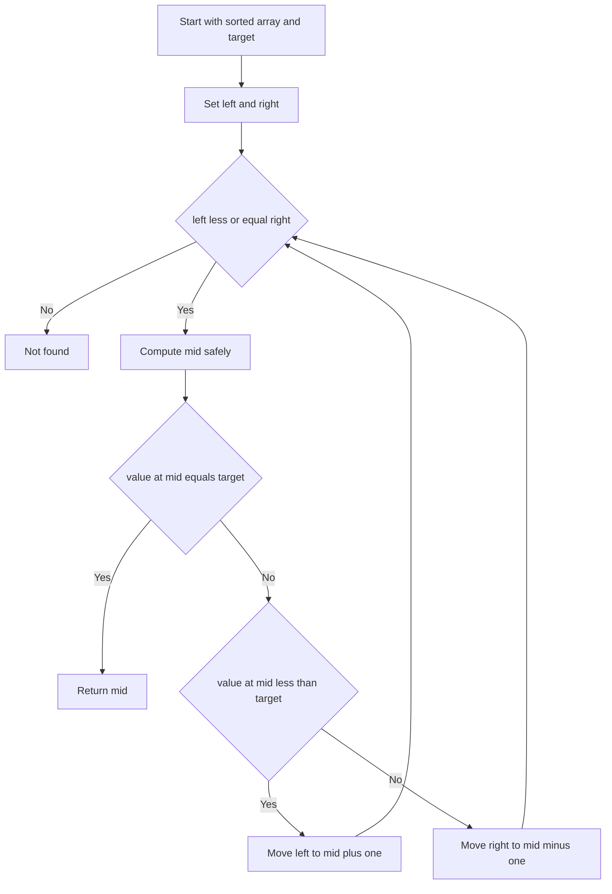

---
{"dg-publish":true,"permalink":"/software-engineering/02-computer-science/algorithms/search-algorithms/binary-search/","dg-note-properties":{"topic":["Computer Science"],"subtopic":["Algorithms"],"level":["4"],"priority":"Medium","status":"Ready To Repeat"}}
---


# Intro

Binary Search finds a target in a sorted array by repeatedly cutting the search range in half. This gives logarithmic time complexity and predictable performance for large inputs. Use it when the data is sorted and random access is cheap. Example: finding a user id in a sorted list of millions of numeric ids.

## Deeper Explanation

- Keep two boundaries `left` and `right` and inspect the middle index each loop.
- If `a[mid]` is less than target, move `left` to `mid + 1`; if `a[mid]` is greater than target, move `right` to `mid - 1`; if equal, return `mid`.
- Use `mid = left + (right - left) / 2` to avoid integer overflow in fixed-width integer languages.
- Complexity: `O(log n)` time, `O(1)` extra space for iterative implementation.

## Example

```csharp
public static int BinarySearch(int[] arr, int target)
{
    int left = 0;
    int right = arr.Length - 1;

    while (left <= right)
    {
        int mid = left + (right - left) / 2;

        if (arr[mid] == target)
        {
            return mid;
        }

        if (arr[mid] < target)
        {
            left = mid + 1;
        }
        else
        {
            right = mid - 1;
        }
    }

    return -1;
}
```

## Diagram



## Pitfalls

- Unsorted input breaks correctness because binary search relies on monotonic ordering; sort first or use a different strategy.
- Off by one boundary mistakes can produce infinite loops; keep loop condition and boundary updates consistent (`left <= right`).
- Duplicate values require a variant when you need first or last occurrence, not just any match.

## Tradeoffs

- Binary Search vs Linear Search: binary search is much faster on large sorted arrays, but linear search works on unsorted data and tiny lists without sort cost.
- Binary Search vs Hash lookup: hash lookup is average `O(1)` but needs extra memory and hash maintenance; binary search works in-place on sorted arrays and preserves order for range queries.

## Questions

> [!QUESTION]- Why does binary search require sorted data?
> - The half-split decision depends on monotonic ordering.
> - Without sorting, `a[mid] < target` gives no guarantee about where the target can be.
> - Binary search can skip over the target on unsorted input and return false negatives.
> - Why it matters: correctness depends on this precondition, so production code should assert or document it.

> [!QUESTION]- How do you find the first occurrence of a duplicated value?
> - On equality, store `mid` as a candidate answer.
> - Continue searching the left half by setting `right = mid - 1`.
> - Keep the same loop condition and safe midpoint calculation.
> - Return the stored candidate after the loop ends.
> - Why it matters: this lower-bound variant is a common interview and production requirement.

## References

- [Binary search (cp algorithms)](https://cp-algorithms.com/num_methods/binary_search.html)
- [Array BinarySearch method .NET](https://learn.microsoft.com/dotnet/api/system.array.binarysearch)
- [Nearly all binary searches and mergesorts are broken](https://research.google/blog/extra-extra-read-all-about-it-nearly-all-binary-searches-and-mergesorts-are-broken/)

<!-- whats-next:start -->

---

> [!note] Whats next
> **Parent**
>  [[Software Engineering/02 Computer Science/Algorithms/Algorithms\|Algorithms]]
>
> **Pages**
> - [[Software Engineering/02 Computer Science/Algorithms/Search Algorithms/DFS BFS\|DFS BFS]]
> - [[Software Engineering/02 Computer Science/Algorithms/Search Algorithms/KMP (Knuth-Morris-Pratt) Algorithm\|KMP (Knuth-Morris-Pratt) Algorithm]]
> - [[Software Engineering/02 Computer Science/Algorithms/Search Algorithms/Rabin Karp Search\|Rabin Karp Search]]
<!-- whats-next:end -->
