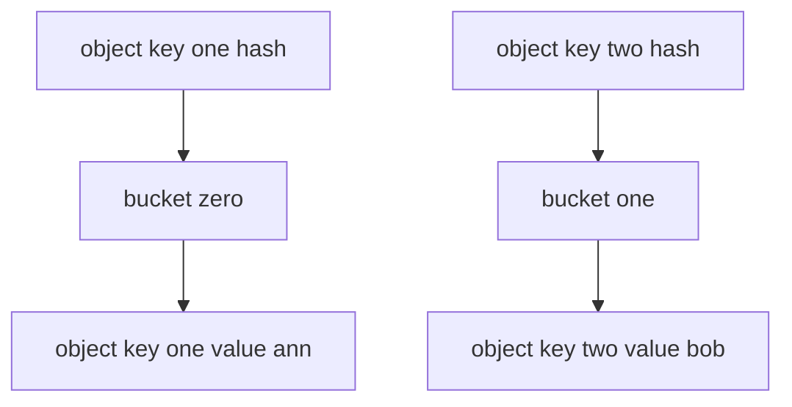

---
{"dg-publish":true,"permalink":"/software-engineering/02-computer-science/data-structures/hashtable/","dg-note-properties":{"topic":["Computer Science"],"subtopic":["Data Structures"],"level":["4"],"priority":"Medium","status":"Creation"}}
---


# Intro

`Hashtable` is the non-generic hash table from `System.Collections`. It is mostly legacy in modern .NET and is usually replaced by `Dictionary<TKey, TValue>`.

## Deeper Explanation

`Hashtable` stores keys and values as `object`, so value types are boxed/unboxed.
It still uses hash buckets and collision resolution similar to modern hash-based collections.

Internally, `Hashtable` uses separate chaining: when two keys hash to the same bucket, they form a linked list at that slot. Lookup traverses the chain until the matching key is found, making worst-case performance O(n) when all keys collide. `Dictionary<TKey, TValue>` uses open addressing with prime-based probing, which is more cache-friendly and avoids per-collision heap allocations. This is the primary performance reason to prefer `Dictionary` in new code.
## Structure



### Example

```csharp
var table = new Hashtable
{
    ["user:1"] = "Ann"
};

var value = table["user:1"]; // object
```

### Pitfalls

- No compile-time type safety because everything is `object`.
- Boxing/unboxing increases allocations and CPU overhead.
- `Synchronized()` wrappers do not make multi-step operations atomic.

### Tradeoffs

- Keep only for interop with old APIs that already require `Hashtable`.
- Prefer `Dictionary<TKey, TValue>` for regular code and `ConcurrentDictionary` for concurrent writes.

## Questions

> [!QUESTION]- How does inserting a value into a hashtable work?
> The key is hashed, mapped to a bucket, and inserted there. Collisions are handled by chain/probe resolution.

> [!QUESTION]- Why does using a hash code instead of comparing full keys speed up lookups?
> Hashing narrows search to one bucket instead of scanning all entries.

## Hash-Based Collections Comparison

| Type | Key type | Type-safe | When to use |
|---|---|---|---|
| `Hashtable` | `object` | No | Legacy interop only |
| `Dictionary<TKey,TValue>` | Generic | Yes | Default key-value map in modern .NET |
| `ConcurrentDictionary<TKey,TValue>` | Generic | Yes | Concurrent read/write |

**Decision rule**: do not use `Hashtable` in new code. Migrate to `Dictionary<TKey,TValue>` for type safety and better performance.

## Links

- [Hashtable class](https://learn.microsoft.com/en-us/dotnet/api/system.collections.hashtable) — API reference; documents the legacy non-generic hash table.
- [When to use generic collections](https://learn.microsoft.com/en-us/dotnet/standard/collections/when-to-use-generic-collections) — explains why generic collections replace non-generic ones for type safety and performance.
- [Selecting a collection class](https://learn.microsoft.com/en-us/dotnet/standard/collections/selecting-a-collection-class) — decision guide for choosing the right collection type.
- [Hashtable implementation in dotnet runtime](https://github.com/dotnet/runtime/blob/main/src/libraries/System.Private.CoreLib/src/System/Collections/Hashtable.cs) — source code showing the legacy bucket and collision design.

<!-- whats-next:start -->

---

> [!note] Whats next
> **Parent**
>  [[Software Engineering/02 Computer Science/02 Computer Science\|02 Computer Science]]
>
> **Pages**
> - [[Software Engineering/02 Computer Science/Data Structures/Dictionary\|Dictionary]]
> - [[Software Engineering/02 Computer Science/Data Structures/Graph\|Graph]]
> - [[Software Engineering/02 Computer Science/Data Structures/HashMap\|HashMap]]
> - [[Software Engineering/02 Computer Science/Data Structures/HashSet\|HashSet]]
> - [[Software Engineering/02 Computer Science/Data Structures/Heap\|Heap]]
> - [[Software Engineering/02 Computer Science/Data Structures/LinkedList\|LinkedList]]
> - [[Software Engineering/02 Computer Science/Data Structures/List\|List]]
> - [[Software Engineering/02 Computer Science/Data Structures/Queue\|Queue]]
> - [[Software Engineering/02 Computer Science/Data Structures/Span\|Span]]
> - [[Software Engineering/02 Computer Science/Data Structures/Stack\|Stack]]
> - [[Software Engineering/02 Computer Science/Data Structures/Trees\|Trees]]
<!-- whats-next:end -->
