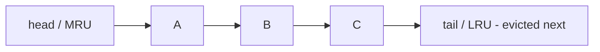

---
{"dg-publish":true,"permalink":"/software-engineering/02-computer-science/data-structures/lru-cache/","dg-note-properties":{"topic":["Computer Science"],"subtopic":["Data Structures"],"level":["4"],"priority":"High","status":"Ready to Repeat"}}
---


# Intro

An LRU (Least Recently Used) cache stores a bounded number of items and, when full, evicts the item that has gone unused the longest. The trick is doing **both** "look up by key" and "evict the oldest" in **O(1)** — achieved by combining a hash map (key → node) with a **doubly linked list** ordered by recency. It is the canonical eviction policy behind CPU caches, database buffer pools, HTTP caches, and `MemoryCache`-style components, and a perennial interview question precisely because it forces you to compose two structures.

## How It Works

Two structures cooperate:

- A **`Dictionary<TKey, Node>`** gives O(1) access to any node by key.
- A **doubly linked list** keeps nodes in recency order: most-recently-used at the head, least-recently-used at the tail.

Operations:

- **Get(key)**: hash-lookup the node, **move it to the head** (now most recent), return its value.
- **Put(key, value)**: insert/update at the head. If size exceeds capacity, **remove the tail node** and its map entry.

The doubly linked list is essential: moving or removing a node is O(1) only if you have pointers to both neighbours, which a *singly* linked list can't give you cheaply.



## Example

`.NET` has no built-in LRU, but `LinkedList<T>` + `Dictionary` compose one cleanly:

```csharp
public class LruCache<TKey, TValue> where TKey : notnull
{
    private readonly int _capacity;
    private readonly Dictionary<TKey, LinkedListNode<(TKey Key, TValue Value)>> _map = new();
    private readonly LinkedList<(TKey Key, TValue Value)> _order = new(); // head = MRU

    public LruCache(int capacity) => _capacity = capacity;

    public bool TryGet(TKey key, out TValue value)
    {
        if (_map.TryGetValue(key, out var node))
        {
            _order.Remove(node);
            _order.AddFirst(node);          // mark most-recently-used
            value = node.Value.Value;
            return true;
        }
        value = default!;
        return false;
    }

    public void Put(TKey key, TValue value)
    {
        if (_map.TryGetValue(key, out var existing))
        {
            _order.Remove(existing);
        }
        else if (_map.Count >= _capacity)
        {
            var lru = _order.Last!;          // tail = least-recently-used
            _order.RemoveLast();
            _map.Remove(lru.Value.Key);
        }
        var node = _order.AddFirst((key, value));
        _map[key] = node;
    }
}
```

## Pitfalls

- **Singly linked list can't be O(1)** — to move/evict a node you need its predecessor. With a singly linked list that's an O(n) scan, collapsing the whole point. Use a doubly linked list (or `LinkedList<T>`, which is doubly linked).
- **Forgetting to update *both* structures** — every move/evict must keep the map and the list in lockstep. A common bug evicts the list tail but leaves the stale key in the map, causing a memory leak and false hits.
- **Thread safety** — the two-structure dance is not atomic. Concurrent `Get`/`Put` corrupt the list. Guard with a lock, or use a sharded/striped design; for high-concurrency caches consider policies like **LRU-K**, **segmented LRU**, or **TinyLFU** (what Caffeine/`MemoryCache` lean toward) which also resist scan-pollution.
- **LRU isn't always the best policy** — a single large scan can evict the entire hot set ("cache pollution"). **LFU** (least *frequently* used) or admission policies handle that better; LRU just trades simplicity for that weakness.

## Tradeoffs

| Policy | Evicts | Strength | Weakness |
|---|---|---|---|
| **LRU** | Least recently used | Simple, O(1), good for temporal locality | One big scan flushes the hot set |
| **LFU** | Least frequently used | Keeps genuinely popular items | Slow to adapt; cold-start bias; more bookkeeping |
| **FIFO** | Oldest inserted | Trivial | Ignores usage entirely |
| **TinyLFU / W-TinyLFU** | Admission + frequency sketch | Resists scans, near-optimal hit rate | More complex |

**Decision rule**: default to LRU for general caching with temporal locality. Move to LFU/TinyLFU only when you observe scan-induced eviction of hot data.

## Questions

> [!QUESTION]- Why does an LRU cache need a doubly linked list specifically?
> Both operations must be O(1): `Get` moves a node to the head and `Put` evicts the tail. Moving or removing an arbitrary node in O(1) requires constant-time access to its neighbours, which only a doubly linked list provides. A singly linked list would need an O(n) scan to find the predecessor.

> [!QUESTION]- How do the hash map and linked list divide responsibility?
> The hash map answers "where is key k?" in O(1) (random access by key). The linked list answers "what is the recency order?" and supports O(1) move-to-front and remove-from-tail (ordering). Neither structure alone gives both fast lookup *and* fast ordered eviction.

> [!QUESTION]- What is cache pollution and which policy resists it?
> A large one-off scan touches many items once, pushing the genuinely hot items out of an LRU cache even though they'll be needed again. Frequency-aware policies (LFU, TinyLFU/W-TinyLFU) resist it by favouring items accessed *often*, not merely *recently*.

## References

- [Cache replacement policies (Wikipedia)](https://en.wikipedia.org/wiki/Cache_replacement_policies) — LRU, LFU, FIFO, and adaptive policies compared.
- [Design and implementation of a cache (Caffeine wiki)](https://github.com/ben-manes/caffeine/wiki/Efficiency) — why modern caches use W-TinyLFU over plain LRU.
- [LRU Cache (LeetCode #146)](https://leetcode.com/problems/lru-cache/) — the canonical implementation exercise.

<!-- whats-next:start -->

---

> [!note] Whats next
> **Parent**
>  [[Software Engineering/02 Computer Science/02 Computer Science\|02 Computer Science]]
>
> **Pages**
> - [[Software Engineering/02 Computer Science/Data Structures/Bloom Filter\|Bloom Filter]]
> - [[Software Engineering/02 Computer Science/Data Structures/Circular Buffer\|Circular Buffer]]
> - [[Software Engineering/02 Computer Science/Data Structures/Dictionary\|Dictionary]]
> - [[Software Engineering/02 Computer Science/Data Structures/Graph\|Graph]]
> - [[Software Engineering/02 Computer Science/Data Structures/HashMap\|HashMap]]
> - [[Software Engineering/02 Computer Science/Data Structures/HashSet\|HashSet]]
> - [[Software Engineering/02 Computer Science/Data Structures/Hashtable\|Hashtable]]
> - [[Software Engineering/02 Computer Science/Data Structures/Heap\|Heap]]
> - [[Software Engineering/02 Computer Science/Data Structures/LinkedList\|LinkedList]]
> - [[Software Engineering/02 Computer Science/Data Structures/List\|List]]
> - [[Software Engineering/02 Computer Science/Data Structures/Queue\|Queue]]
> - [[Software Engineering/02 Computer Science/Data Structures/Span\|Span]]
> - [[Software Engineering/02 Computer Science/Data Structures/Stack\|Stack]]
> - [[Software Engineering/02 Computer Science/Data Structures/Trees\|Trees]]
> - [[Software Engineering/02 Computer Science/Data Structures/Trie\|Trie]]
<!-- whats-next:end -->
