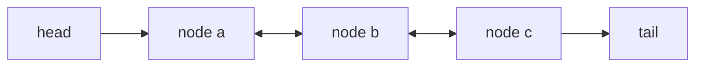

---
{"dg-publish":true,"permalink":"/software-engineering/02-computer-science/data-structures/linked-list/","dg-note-properties":{"topic":["Computer Science"],"subtopic":["Data Structures"],"level":["4"],"priority":"Medium","status":"Ready To Repeat"}}
---


# Intro

`LinkedList<T>` is a doubly linked list where each node points to previous and next nodes. It is useful when you already keep node references and need frequent O(1) inserts/removes around those nodes.

Unlike array-backed collections, linked lists do not store elements contiguously:

- Random index access is O(n) because traversal is required.
- Inserting/removing at a known node is O(1).
- Each element carries node-pointer overhead, so memory locality is worse than `List<T>`.

## Structure



### Example

```csharp
var list = new LinkedList<string>();
var a = list.AddLast("A");
list.AddLast("C");

list.AddAfter(a, "B");
list.Remove("C");
```

### Pitfalls

- Using `LinkedList<T>` for index-based access causes O(n) scans and can underperform `List<T>` significantly. Prefer `List<T>`/arrays for index-heavy workloads, or store node handles when linked-list locality edits are truly required.
- Using detached or foreign `LinkedListNode<T>` instances as anchors (`AddBefore`, `AddAfter`, `Remove`) throws because a node must belong to the target list context. Check `node.List` before using node handles and re-find/re-add nodes when needed.
- Pointer-rich node allocation hurts cache locality, so iteration can be slower even when complexity looks similar on paper. Prefer `List<T>` for traversal-heavy workloads unless node-local O(1) edits are the dominant operation.

### Tradeoffs

- `LinkedList<T>` vs `List<T>`: linked list wins for O(1) local edits around known nodes; list usually wins for traversal and random access.
- `LinkedList<T>` vs `Queue<T>`/`Stack<T>`: queue/stack APIs are simpler and often faster when you only need FIFO/LIFO behavior.

## Questions

> [!QUESTION]- Why is `LinkedList<T>` often slower than `List<T>` in real workloads despite O(1) inserts/removes?
> CPU cache locality dominates many workloads. `List<T>` keeps data contiguous, while linked-list nodes are scattered and require pointer chasing.

> [!QUESTION]- When is `LinkedList<T>` the right choice in .NET?
> When your algorithm already stores `LinkedListNode<T>` handles and performs many localized inserts/removes around them.

> [!QUESTION]- What is a common migration signal from `LinkedList<T>` to `List<T>`?
> If code frequently searches by index/value before each operation, you are paying O(n) traversal repeatedly and should usually switch to `List<T>` or another structure.

## Links

- [`LinkedList<T>` class](https://learn.microsoft.com/en-us/dotnet/api/system.collections.generic.linkedlist-1) — API reference covering node operations, AddBefore/AddAfter, and enumeration.
- [Selecting a collection class](https://learn.microsoft.com/en-us/dotnet/standard/collections/selecting-a-collection-class) — Microsoft decision guide; explains when linked list is appropriate vs array-backed collections.
- [Performance tips for collections](https://learn.microsoft.com/en-us/dotnet/standard/collections/) — overview of .NET collection types with complexity and memory characteristics.
- [Exploring C# LinkedLists via LRU Caches](https://blog.softwx.net/2012/07/exploring-c-linkedlists-via-lru-caches.html) — practitioner example of a real use case (LRU cache) where O(1) node-local edits justify linked list overhead.

<!-- whats-next:start -->

---

> [!note] Whats next
> **Parent**
>  [[Software Engineering/02 Computer Science/02 Computer Science\|02 Computer Science]]
>
> **Pages**
> - [[Software Engineering/02 Computer Science/Data Structures/Dictionary\|Dictionary]]
> - [[Software Engineering/02 Computer Science/Data Structures/Graph\|Graph]]
> - [[Software Engineering/02 Computer Science/Data Structures/HashMap\|HashMap]]
> - [[Software Engineering/02 Computer Science/Data Structures/HashSet\|HashSet]]
> - [[Software Engineering/02 Computer Science/Data Structures/Hashtable\|Hashtable]]
> - [[Software Engineering/02 Computer Science/Data Structures/Heap\|Heap]]
> - [[Software Engineering/02 Computer Science/Data Structures/List\|List]]
> - [[Software Engineering/02 Computer Science/Data Structures/Queue\|Queue]]
> - [[Software Engineering/02 Computer Science/Data Structures/Span\|Span]]
> - [[Software Engineering/02 Computer Science/Data Structures/Stack\|Stack]]
> - [[Software Engineering/02 Computer Science/Data Structures/Trees\|Trees]]
<!-- whats-next:end -->
