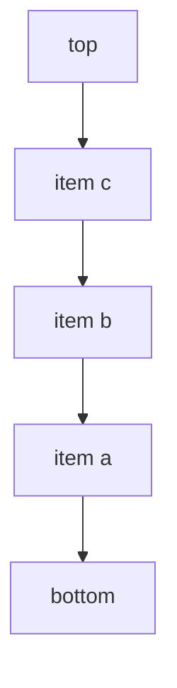

---
{"dg-publish":true,"permalink":"/software-engineering/02-computer-science/data-structures/stack/","dg-note-properties":{"topic":["Computer Science"],"subtopic":["Data Structures"],"level":["4"],"priority":"Medium","status":"Done"}}
---


# Intro

`Stack<T>` is a LIFO (last in, first out) collection. The most recently pushed element is the first popped. Use it for backtracking, undo flows, and depth-first traversals.

It is array-backed — internally an array plus a `_size` counter. `Push` writes at index `_size` and increments it (doubling the array when full), `Pop` decrements `_size` and returns that slot, and `Peek` reads it without removing. Because all mutation happens at one end, the three operations are O(1) on average and no elements are ever shifted.

The runtime's own call stack follows the same LIFO discipline: each call pushes a frame with local variables and a return address, and returning pops it. An explicit `Stack<T>` mirrors that in application code — handy for undo/redo chains, expression evaluation, and depth-first backtracking without the recursion-depth limit, bounded only by heap memory.



## Example

```csharp
var stack = new Stack<string>();
stack.Push("A");
stack.Push("B");

Console.WriteLine(stack.Peek()); // B
Console.WriteLine(stack.Pop());  // B
Console.WriteLine(stack.Pop());  // A
```

## Pitfalls

- **Popping an empty stack** — `Pop`/`Peek` on an empty stack throws `InvalidOperationException`. Check `Count` first (or use `TryPop`/`TryPeek`) when emptiness is possible.
- **Using LIFO where FIFO is expected** — reaching for `Stack<T>` in a queue-like workflow reverses processing order and causes subtle logic bugs. Validate ordering requirements before choosing it.
- **Retained capacity after shrinking** — a stack that grew large keeps its backing array even after most items are popped. Call `TrimExcess()` when a long-lived stack shrinks significantly.

## Tradeoffs

| Choice | `Stack<T>` | Alternative | Decision criteria |
| --- | --- | --- | --- |
| vs [[Software Engineering/02 Computer Science/Data Structures/Queue\|Queue]] | LIFO — newest item processed first | FIFO — preserves arrival order | Use a stack for backtracking/undo/DFS; use a queue when fairness or arrival order matters. |
| vs recursive [[Software Engineering/02 Computer Science/Algorithms/Search Algorithms/DFS BFS\|DFS]] | Explicit state, no call-stack limit | Concise, uses the call stack | Use an explicit stack when depth may be large or unbounded; recursion is fine for shallow, bounded depth. |
| vs `Stack` (non-generic) | Type-safe, no boxing | Stores `object` | Always prefer the generic `Stack<T>`; the legacy type exists only for old interop. |

## Questions

> [!QUESTION]- When is an explicit `Stack<T>` better than recursion?
> - Use it when graph/tree depth may be large or unbounded — an explicit stack lives on the heap and avoids a `StackOverflowException`.
> - It also gives you control over traversal state you can inspect, pause, or resume, which recursion hides in call frames.
> - The traversal logic is identical: push instead of recurse, pop instead of return.
> - It is more verbose than recursion, but it is the safe default whenever input depth is attacker- or data-controlled.

> [!QUESTION]- Why can `Stack<T>` be a poor fit for work queues?
> - Work queues usually need FIFO fairness so the oldest item is handled first.
> - LIFO processing serves the newest item first, which can starve older items indefinitely under sustained load.
> - This is a correctness/SLA bug, not a performance one — it passes tests but misbehaves in production bursts.
> - A stack is simpler and cache-friendly, but choose `Queue<T>` (or a priority queue) the moment ordering guarantees matter.

> [!QUESTION]- What is the complexity of `Push` and why is it not always constant in practice?
> - `Push` is **amortized** O(1): most pushes just write a slot and bump the counter.
> - When the backing array is full, `Push` allocates a doubled array and copies all elements — that individual call is O(n).
> - Doubling makes any sequence of n pushes cost O(n) total, so the average stays O(1).
> - Pre-size with `new Stack<T>(capacity)` when the count is known to flatten those resize spikes on latency-sensitive paths.

## References

- [`Stack<T>` class](https://learn.microsoft.com/en-us/dotnet/api/system.collections.generic.stack-1) — API reference covering Push, Pop, Peek, and enumeration order.
- [Selecting a collection class](https://learn.microsoft.com/en-us/dotnet/standard/collections/selecting-a-collection-class) — Microsoft decision guide for choosing between Stack, Queue, and other collection types.
- [Generic collections in .NET](https://learn.microsoft.com/en-us/dotnet/standard/collections/) — overview of all generic collection types with complexity and usage guidance.
- [Stack implementation in dotnet runtime](https://github.com/dotnet/runtime/blob/main/src/libraries/System.Private.CoreLib/src/System/Collections/Generic/Stack.cs) — source code showing the internal array and resize logic.

<!-- whats-next:start -->

---

> [!note] Whats next
> **Parent**
>  [[Software Engineering/02 Computer Science/02 Computer Science\|02 Computer Science]]
>
> **Pages**
> - [[Software Engineering/02 Computer Science/Data Structures/Bloom Filter\|Bloom Filter]]
> - [[Software Engineering/02 Computer Science/Data Structures/Circular Buffer\|Circular Buffer]]
> - [[Software Engineering/02 Computer Science/Data Structures/Dictionary\|Dictionary]]
> - [[Software Engineering/02 Computer Science/Data Structures/Graph\|Graph]]
> - [[Software Engineering/02 Computer Science/Data Structures/HashMap\|HashMap]]
> - [[Software Engineering/02 Computer Science/Data Structures/HashSet\|HashSet]]
> - [[Software Engineering/02 Computer Science/Data Structures/Hashtable\|Hashtable]]
> - [[Software Engineering/02 Computer Science/Data Structures/Heap\|Heap]]
> - [[Software Engineering/02 Computer Science/Data Structures/LinkedList\|LinkedList]]
> - [[Software Engineering/02 Computer Science/Data Structures/List\|List]]
> - [[Software Engineering/02 Computer Science/Data Structures/LRU Cache\|LRU Cache]]
> - [[Software Engineering/02 Computer Science/Data Structures/Queue\|Queue]]
> - [[Software Engineering/02 Computer Science/Data Structures/Span\|Span]]
> - [[Software Engineering/02 Computer Science/Data Structures/Trees\|Trees]]
> - [[Software Engineering/02 Computer Science/Data Structures/Trie\|Trie]]
<!-- whats-next:end -->
