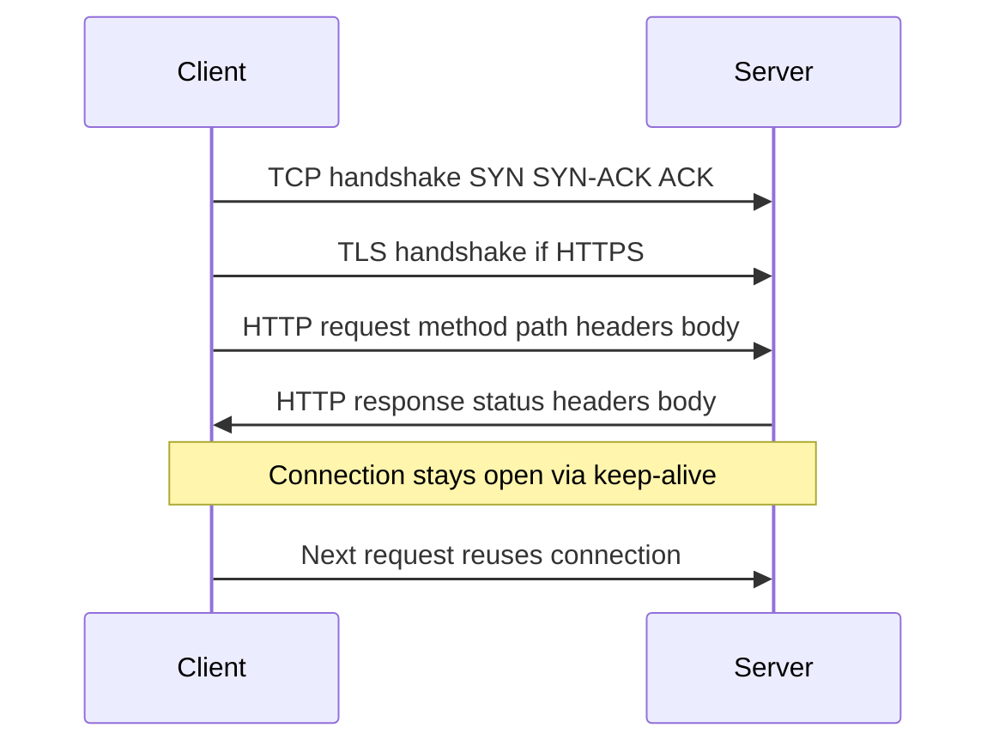

---
{"dg-publish":true,"permalink":"/software-engineering/04-networks/protocols/http/"}
---


# Intro

HTTP (Hypertext Transfer Protocol) is a stateless request-response protocol that carries nearly all web and API traffic in modern systems. You reach for it every time a client talks to a server over the network — browser page loads, REST APIs, webhooks, health checks, file downloads. Understanding HTTP mechanics — connection lifecycle, caching semantics, status codes, and TLS — directly affects the latency, reliability, and security of every service you build. In .NET, HTTP is the transport underneath `HttpClient`, ASP.NET Core, and gRPC (over HTTP/2), making it foundational knowledge for senior .NET work.

## Request-Response Lifecycle

An HTTP/1.1 exchange follows this sequence:



### Persistent Connections

HTTP/1.0 opened a new TCP connection per request — catastrophically expensive. HTTP/1.1 made persistent connections the default: the same TCP socket is reused for multiple request-response cycles. The `Connection: keep-alive` header controls idle timeout and max requests. Idle connections still consume server-side file descriptors and memory, so servers close them after a configurable timeout.

### Head-of-Line Blocking

HTTP/1.1 processes requests sequentially on each connection: the response to request #1 must complete before request #2 begins. If request #1 triggers a slow database query, requests #2 and #3 wait behind it. Browsers work around this by opening up to 6 parallel TCP connections per origin, but this wastes resources and still hits limits. [[Software Engineering/04 Networks/Protocols/HTTP 2\|HTTP 2]] solves this with stream multiplexing.

**Pipelining** was an HTTP/1.1 attempt to fix HOL blocking by sending multiple requests without waiting for responses. It failed in practice because responses still had to arrive in order, and buggy intermediary proxies mishandled pipelined responses. Browsers disabled it by default.

## HTTPS and TLS

HTTPS is HTTP over TLS. It provides confidentiality (encryption), integrity (tamper detection), and server authentication via certificates. Plain HTTP has no protection against eavesdropping or manipulation.

### TLS 1.2 Handshake (2 RTTs)

```text
Client → Server: ClientHello (supported ciphers, random)
Server → Client: ServerHello, Certificate, ServerHelloDone
Client → Server: ClientKeyExchange, ChangeCipherSpec, Finished
Server → Client: ChangeCipherSpec, Finished
→ Application data begins (2 RTTs after TCP handshake)
```

The client validates the certificate chain: leaf cert → intermediate CA(s) → trusted root CA. Each cert is verified for signature validity, expiry, revocation status (OCSP or CRL), and hostname match against the SAN (Subject Alternative Name) field.

### TLS 1.3 (1 RTT)

TLS 1.3 (RFC 8446) reduced the handshake to 1 RTT and eliminated weak primitives:

- All cipher suites provide **forward secrecy** — ephemeral Diffie-Hellman only, no static RSA key exchange
- Handshake messages are **encrypted** — the certificate is not visible to network observers
- **0-RTT resumption** for repeat connections, but replay-vulnerable — safe only for idempotent requests
- Removed RC4, 3DES, CBC mode, and RSA key exchange entirely

### .NET TLS Guidance

Use `SslProtocols.None` to defer TLS version selection to the OS — never hardcode `SslProtocols.Tls12`. The legacy `SslProtocols.Default` maps to SSL3 + TLS 1.0, which is insecure. `ServicePointManager.SecurityProtocol` is process-global and affects all `HttpClient` instances — a footgun in shared libraries that silently downgrades TLS for the entire process.

## Methods and Semantics

| Method | Semantics | Idempotent | Safe |
|---|---|---|---|
| GET | Read resource representation | Yes | Yes |
| HEAD | Same as GET but response has no body | Yes | Yes |
| POST | Create resource or trigger processing | No | No |
| PUT | Replace target resource entirely | Yes | No |
| PATCH | Partial modification | Depends on implementation | No |
| DELETE | Remove target resource | Yes | No |
| OPTIONS | Describe communication options and CORS preflight | Yes | Yes |

**Safe** means the request does not change server state. **Idempotent** means repeating the same request produces the same resulting state — not the same response, but the same server-side outcome. Clients can safely auto-retry idempotent methods on ambiguous network failure, which is why `PUT` and `DELETE` are preferable over `POST` when the operation allows it.

## Status Codes

### Commonly Misused Codes

| Code | Correct Use | Common Mistake |
|---|---|---|
| 200 vs 204 | 204 for success with no body (DELETE, PUT acknowledgment) | Returning 200 with empty body wastes a Content-Length round-trip |
| 201 Created | Resource created; include `Location` header pointing to new resource | Using 200 for POST that creates a resource |
| 301 vs 308 | 308 preserves HTTP method on redirect | Using 301 for non-GET redirects; browsers may change POST to GET |
| 400 vs 422 | 400 for malformed syntax; 422 for valid syntax but invalid semantics | Using 400 for all validation errors |
| 401 vs 403 | 401 = not authenticated (must include `WWW-Authenticate`); 403 = authenticated but not authorized | Confusing authentication with authorization |
| 409 Conflict | Optimistic concurrency failure, duplicate resource | Using 400 for state conflicts |
| 429 Too Many Requests | Rate limited; include `Retry-After` header | Using 503 for rate limiting |
| 502 vs 503 | 502 = upstream returned invalid response; 503 = this server is overloaded or in maintenance | Treating them interchangeably; monitoring tools distinguish them for different alerting |

## Caching

HTTP caching prevents redundant data transfer by storing responses and reusing them for matching requests.

### Cache-Control

```http
Cache-Control: max-age=3600, must-revalidate, public
```

Key directives:

- `max-age=N` — fresh for N seconds; no revalidation until expired
- `no-cache` — store the response but **always revalidate** before serving (does NOT mean "don't cache")
- `no-store` — never store the response anywhere (for sensitive data like banking pages)
- `private` — only browser cache, not shared or CDN caches
- `public` — storable in shared caches (required when `Authorization` header is present and caching is intended)
- `immutable` — content will never change; skip revalidation even on reload (use with cache-busted URLs like `app.abc123.js`)

**Heuristic caching trap**: if no `Cache-Control` is set, RFC 9111 allows caches to apply heuristic freshness (~10% of `Last-Modified` age). Always set explicit `Cache-Control` headers — especially on API responses.

### Conditional Requests and ETag

```http
# Server sends ETag with original response
ETag: "33a64df5"

# Client revalidates later
If-None-Match: "33a64df5"

# Server responds 304 if unchanged — no body transferred
HTTP/1.1 304 Not Modified
```

ETags are preferred over `Last-Modified` because `Last-Modified` has only 1-second granularity and distributed servers struggle to synchronize file timestamps. `If-None-Match` takes precedence over `If-Modified-Since` when both are present (RFC 9110).

### Vary Header

`Vary: Accept-Encoding` tells caches to key on both URL and the listed request headers. Without it, a CDN might serve a gzip-compressed response to a client that only accepts brotli. `Vary: User-Agent` is a cache-killing anti-pattern — thousands of User-Agent variants effectively disable caching.

## Pitfalls

### 1) HttpClient Socket Exhaustion in .NET

- **What goes wrong**: creating a new `HttpClient` per request exhausts sockets. `Dispose()` does not immediately release the underlying socket — the OS holds it in `TIME_WAIT` state (~4 minutes on Windows). Under load, ephemeral ports run out → `SocketException`.
- **Why it happens**: `HttpClient` wraps a connection pool in `SocketsHttpHandler`. Disposing the client tears down the pool, but the OS keeps TCP sockets in `TIME_WAIT` for reliable connection termination.
- **Mitigation**: use `IHttpClientFactory` (default handler lifetime: 2 minutes, handles both pooling and DNS refresh) or a singleton `HttpClient` with `SocketsHttpHandler.PooledConnectionLifetime` set to force periodic connection recycling.

### 2) DNS Staleness with Singleton HttpClient

- **What goes wrong**: a singleton `HttpClient` resolves DNS once and caches the IP for the lifetime of the connection. In Kubernetes where pod IPs change on redeploy, requests route to terminated pods.
- **Why it happens**: the connection pool reuses established TCP connections without re-resolving DNS. There is no mechanism to honor DNS TTL at the connection level.
- **Mitigation**: set `PooledConnectionLifetime = TimeSpan.FromMinutes(2)` on `SocketsHttpHandler` to force connection recycling and DNS re-resolution. `IHttpClientFactory` does this automatically via handler lifetime rotation.

### 3) Heuristic Caching Surprises

- **What goes wrong**: API responses without explicit `Cache-Control` headers get cached by intermediate proxies using heuristic rules, serving stale data to clients.
- **Why it happens**: RFC 9111 permits caches to infer freshness from `Last-Modified` when no explicit freshness directive is present.
- **Mitigation**: always set explicit `Cache-Control` headers on API responses. Use `no-store` for sensitive data, `no-cache` when revalidation is acceptable, or a specific `max-age` when staleness is tolerable.

## Tradeoffs

| Aspect | HTTP/1.1 | HTTP/2 | HTTP/3 via QUIC |
|---|---|---|---|
| Multiplexing | No; one request per connection at a time | Yes; many streams per TCP connection | Yes; streams per QUIC connection |
| Head-of-line blocking | Application-level and TCP-level | TCP-level only; a single lost packet stalls all streams | None; streams are independent at transport level |
| Header compression | None | HPACK | QPACK |
| Transport | TCP | TCP | UDP with QUIC |
| Adoption | Universal | Widespread | Growing |

**Decision rule**: HTTP/1.1 for maximum compatibility and simplicity. Upgrade to HTTP/2 when multiplexing and header compression matter (most modern services benefit). HTTP/3 for latency-sensitive, loss-prone networks like mobile clients and global CDN edges.

## Questions

> [!QUESTION]- Why is creating a new HttpClient per request dangerous in .NET, and what are the two correct alternatives?
> **Expected answer:**
> - `HttpClient.Dispose()` does not immediately release sockets — the OS holds them in `TIME_WAIT` for ~4 minutes.
> - Under load, this exhausts the ephemeral port range → `SocketException`.
> - Fix 1: `IHttpClientFactory` with default 2-minute handler lifetime — handles both socket pooling and DNS re-resolution.
> - Fix 2: singleton `HttpClient` with `SocketsHttpHandler.PooledConnectionLifetime` set to force periodic connection recycling.
> - Even the singleton approach has a DNS staleness trap without `PooledConnectionLifetime`.
>
> **Why this matters:** the most common HTTP production failure in .NET; tests understanding of socket lifecycle and connection pool mechanics.

> [!QUESTION]- What is the difference between Cache-Control no-cache and no-store?
> **Expected answer:**
> - `no-cache` means the response CAN be stored, but the cache MUST revalidate with the origin server before every use via conditional request (`If-None-Match` or `If-Modified-Since`).
> - `no-store` means the response MUST NOT be stored at all — not in browser cache, not in CDN, not on disk.
> - `no-cache` is appropriate for content that changes but benefits from 304 responses (saves bandwidth when content has not changed). `no-store` is for sensitive data like banking pages or PII.
> - The naming is misleading — `no-cache` does not mean "don't cache."
>
> **Why this matters:** the most commonly misunderstood HTTP caching directive; wrong choice either leaks sensitive data or kills performance.

> [!QUESTION]- Explain the difference between 401 and 403 status codes.
> **Expected answer:**
> - 401 Unauthorized means the client is not authenticated — no credentials were provided, or they are invalid. The response MUST include a `WWW-Authenticate` header.
> - 403 Forbidden means the client IS authenticated but not authorized — the server knows who you are, but you lack permission for this resource.
> - 401 tells the client to retry with valid credentials. 403 tells the client that retrying with the same identity is pointless.
> - Security consideration: some APIs return 404 instead of 403 to avoid revealing resource existence to unauthorized users.
>
> **Why this matters:** authentication vs authorization is a fundamental security distinction; misusing these codes breaks client auth flows and retry logic.

## Links

- [RFC 9110 — HTTP Semantics](https://www.rfc-editor.org/rfc/rfc9110)
- [RFC 9111 — HTTP Caching](https://www.rfc-editor.org/rfc/rfc9111)
- [RFC 8446 — TLS 1.3](https://datatracker.ietf.org/doc/html/rfc8446)
- [MDN — HTTP Caching](https://developer.mozilla.org/en-US/docs/Web/HTTP/Guides/Caching)
- [MDN — Connection Management in HTTP/1.x](https://developer.mozilla.org/en-US/docs/Web/HTTP/Guides/Connection_management_in_HTTP_1.x)
- [Microsoft Learn — Guidelines for Using HttpClient](https://learn.microsoft.com/dotnet/fundamentals/networking/http/httpclient-guidelines)
- [Microsoft Learn — IHttpClientFactory](https://learn.microsoft.com/dotnet/core/extensions/httpclient-factory)
- [You're Using HttpClient Wrong (ASP.NET Monsters)](https://aspnetmonsters.com/2016/08/2016-08-27-httpclientwrong/)

<!-- whats-next:start -->

---

> [!note] Whats next
> **Parent**
>  [[Software Engineering/04 Networks/04 Networks\|04 Networks]]
>
> **Pages**
> - [[Software Engineering/04 Networks/Protocols/DNS\|DNS]]
> - [[Software Engineering/04 Networks/Protocols/gRPC\|gRPC]]
> - [[Software Engineering/04 Networks/Protocols/HTTP 2\|HTTP 2]]
> - [[Software Engineering/04 Networks/Protocols/REST\|REST]]
> - [[Software Engineering/04 Networks/Protocols/RPC\|RPC]]
> - [[Software Engineering/04 Networks/Protocols/SMTP\|SMTP]]
<!-- whats-next:end -->
