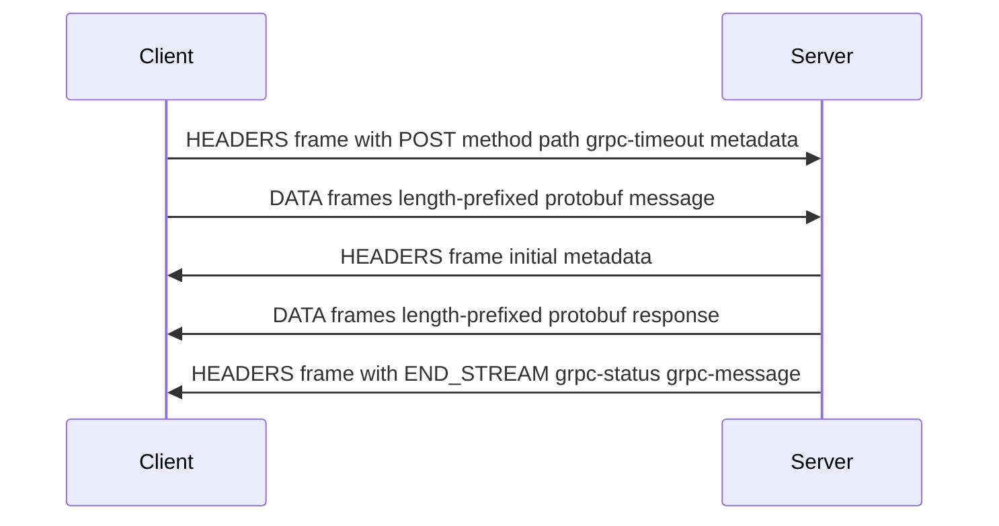

---
{"dg-publish":true,"permalink":"/software-engineering/04-networks/protocols/g-rpc/"}
---


# Intro

gRPC is a remote procedure call framework that runs over [[Software Engineering/04 Networks/Protocols/HTTP 2\|HTTP 2]] and uses Protocol Buffers for message serialization by default. You reach for it when you control both client and server and want strong contracts, fast binary payloads, and first-class streaming — the typical case for internal service-to-service communication in microservices. What makes gRPC distinct from REST is not just performance: it gives you code-generated clients in any language, four streaming patterns, built-in deadline propagation, and a contract-first workflow where the `.proto` file is the API specification.

In production, gRPC design is about deadlines, load balancing awareness, proto versioning discipline, and observability — not just defining a service.

## How It Works

### gRPC over HTTP/2

Every gRPC call is an HTTP/2 **stream** — a bidirectional sequence of frames within a single TCP connection. Multiple calls multiplex over one connection without blocking each other (solving HTTP/1.1 head-of-line blocking).



Key mechanism: gRPC status codes travel in **trailing headers** (a second HEADERS frame at the end), not in the HTTP status line. This is why L4 load balancers cannot see gRPC errors — they operate at the TCP connection level and do not inspect HTTP/2 frames at all. It is also why gRPC-Web has to simulate trailers in the response body, since browsers cannot read HTTP trailers.

### Flow Control and Backpressure

HTTP/2 flow control operates at two levels: connection-wide and per-stream. When the receiver's buffer fills, it stops sending `WINDOW_UPDATE` frames, and the sender's `WriteAsync` blocks until the receiver drains data. This is the backpressure mechanism — a fast-producing server stream naturally slows down when the client cannot keep up.

Default Kestrel stream window is 768 KB. For services that regularly exchange messages larger than this, increase `Http2Limits.InitialStreamWindowSize`. The connection window must always be greater than or equal to the stream window.

## Streaming Patterns

| Pattern | Client Sends | Server Sends | Use Case |
|---|---|---|---|
| Unary | 1 message | 1 message | CRUD, auth, most service calls |
| Server streaming | 1 message | N messages | Event feeds, large dataset pagination, log tailing |
| Client streaming | N messages | 1 message | Bulk ingestion, file upload, telemetry batching |
| Bidirectional | N messages | N messages | Chat, real-time sync, replacing high-frequency unary calls |

### Server Streaming Example

```proto
service OrderService {
  rpc ListOrders (ListOrdersRequest) returns (stream OrderResponse);
}
```

```csharp
// Server
public override async Task ListOrders(
    ListOrdersRequest request,
    IServerStreamWriter<OrderResponse> responseStream,
    ServerCallContext context)
{
    await foreach (var order in _repository.GetOrdersAsync(
        request.CustomerId, context.CancellationToken))
    {
        await responseStream.WriteAsync(order, context.CancellationToken);
    }
}

// Client
using var call = client.ListOrders(new ListOrdersRequest { CustomerId = "cust-42" });
await foreach (var order in call.ResponseStream.ReadAllAsync())
{
    Console.WriteLine($"Order {order.Id}: {order.Total}");
}
```

**Thread safety note**: `RequestStream.WriteAsync` on client-streaming calls is not thread-safe. For multi-producer scenarios, serialize writes through a `Channel<T>` queue.

## .NET Integration

### Channel Management

A `GrpcChannel` wraps an `HttpClient` and maintains a pool of HTTP/2 connections. Channels are thread-safe — share one channel across the application and create lightweight client instances from it.

```csharp
var handler = new SocketsHttpHandler
{
    PooledConnectionIdleTimeout = Timeout.InfiniteTimeSpan,
    KeepAlivePingDelay = TimeSpan.FromSeconds(60),
    KeepAlivePingTimeout = TimeSpan.FromSeconds(30),
    EnableMultipleHttp2Connections = true
};

var channel = GrpcChannel.ForAddress("https://order-service:5001", new GrpcChannelOptions
{
    HttpHandler = handler
});
var client = new OrderService.OrderServiceClient(channel);
```

`EnableMultipleHttp2Connections = true` opens additional TCP connections when the 100-stream-per-connection limit is hit, rather than queuing calls client-side. Keep-alive pings prevent idle connections from being closed by proxies — but the server must support them, or it will send `GOAWAY` and close the connection.

### Deadline Propagation

gRPC has no default deadline. A call without one can hang indefinitely, consuming resources on every hop in a service chain. Always set deadlines explicitly.

```csharp
// Manual: set deadline on outgoing call
var reply = await client.GetOrderAsync(
    request,
    deadline: DateTime.UtcNow.AddSeconds(5));

// Automatic: propagate incoming deadline to downstream calls
services.AddGrpcClient<OrderServiceClient>(o =>
        o.Address = new Uri("https://order-service:5001"))
    .EnableCallContextPropagation();
```

`EnableCallContextPropagation` forwards both deadline and cancellation token to child calls. The framework always uses the minimum deadline — if the child call specifies a smaller value, it wins. The deadline is converted to a remaining timeout at each hop, which handles clock skew between servers.

### Interceptors

Interceptors inherit from `Interceptor` and operate at the typed message level — they see deserialized C# objects, not raw bytes. This distinguishes them from ASP.NET Core middleware, which runs earlier at the HTTP level.

- Use **middleware** for: auth token extraction, rate limiting, request logging at the HTTP level
- Use **interceptors** for: logging typed request/response payloads, deadline propagation, per-method metrics, retry logic

Registration order matters: `channel.Intercept(A).Intercept(B).Intercept(C)` executes C → B → A (reverse of chaining order).

## Pitfalls

### 1) L4 Load Balancer Pins All Calls to One Backend

- **What goes wrong**: an L4 (transport-layer) load balancer distributes TCP connections, not HTTP/2 streams. Since gRPC multiplexes all calls over one TCP connection, every call from a client goes to the same backend — load distribution does not happen.
- **Why it happens**: L4 operates below HTTP and cannot see individual streams within the multiplexed connection.
- **Mitigation**: use an L7 proxy that understands HTTP/2 (Envoy, Linkerd, YARP) and distributes individual streams, or use client-side load balancing with service discovery (DNS round-robin, xDS protocol).

### 2) Missing Deadlines Cause Cascading Resource Waste

- **What goes wrong**: Service A calls B with a 2-second deadline. B does 500ms of work, then calls C without propagating the deadline. A times out at 2s, but C continues processing — wasting resources on a result nobody will consume.
- **Why it happens**: deadline propagation is not automatic unless explicitly configured. The server's `CancellationToken` is also not passed to downstream operations by default.
- **Mitigation**: use `EnableCallContextPropagation()` in the gRPC client factory. Pass `ServerCallContext.CancellationToken` to all async operations (DB queries, HTTP calls) so they cancel promptly when the deadline passes.

### 3) Proto Field Renumbering Silently Corrupts Data

- **What goes wrong**: renumbering a field in a `.proto` file causes old clients to write data into the wrong field on updated servers. An old client sending field 3 has its value interpreted as the new field 3, which may be a completely different type.
- **Why it happens**: protobuf binary encoding uses the field **number** as wire identity. Field names exist only in generated code — they are never on the wire.
- **Mitigation**: never change field numbers. When removing a field, use `reserved` to prevent the number from being reused in future schema evolution:

```proto
message UserRequest {
  reserved 5;
  reserved "old_field_name";
  string user_id = 1;
}
```

### 4) gRPC-Web Cannot Do Client or Bidirectional Streaming

- **What goes wrong**: teams build a gRPC API with bidirectional streaming, then discover browser clients cannot use it.
- **Why it happens**: gRPC-Web can run over HTTP/1.1 or HTTP/2, but browser clients have protocol-level limitations that restrict them to unary and server streaming only. Client streaming and bidirectional streaming are not supported by the gRPC-Web protocol specification.
- **Mitigation**: for browser clients, use gRPC JSON transcoding (ASP.NET Core 7+) which generates a REST/JSON facade from the same `.proto` file. Or restrict browser-facing services to unary and server streaming only.

## Tradeoffs

| Criterion | gRPC | REST/JSON |
|---|---|---|
| Contract | Required `.proto` file | Optional via OpenAPI |
| Payload size | Small binary protobuf | Larger text JSON |
| Streaming | All 4 patterns natively | Workarounds needed via SSE or WebSocket |
| Browser support | Requires gRPC-Web or JSON transcoding | Native |
| Human-readable wire format | No | Yes |
| Tooling such as curl and Postman | Limited via grpcurl and Postman gRPC support | Excellent |
| HTTP caching | Not built-in since HTTP/2 POST is not cacheable | Built-in via HTTP cache semantics |

**Decision rule**: use gRPC for internal service-to-service calls where you control both ends, need streaming, or benefit from codegen across languages. Use REST for public-facing APIs, browser clients, and when HTTP caching and broad tooling compatibility matter. Many production systems use gRPC internally and expose REST externally via a gateway.

## Questions

> [!QUESTION]- Why does gRPC not work well with L4 load balancers, and how do you fix it?
> **Expected answer:**
> - gRPC multiplexes all calls over a single HTTP/2 TCP connection.
> - L4 load balancers distribute at the TCP connection level — they cannot see individual HTTP/2 streams within that connection.
> - All calls from one client land on the same backend, defeating load distribution.
> - Fix: use an L7 proxy (Envoy, Linkerd, YARP) that terminates HTTP/2 and distributes individual streams across backends. Or use client-side load balancing with service discovery.
>
> **Why this matters:** the most common production surprise when adopting gRPC; tests understanding of HTTP/2 multiplexing at the transport layer.

> [!QUESTION]- What happens if you call a gRPC service without setting a deadline?
> **Expected answer:**
> - The call has no timeout and can hang indefinitely.
> - Resources (threads, sockets, memory) on both client and server are consumed with no bound.
> - In a microservice chain, one hanging call can exhaust connection pools upstream, causing cascading failures across services.
> - gRPC intentionally has no default deadline because the right value depends on the operation.
> - Use `EnableCallContextPropagation()` to automatically forward deadlines through a service chain.
>
> **Why this matters:** deadlines are the single most important production gRPC configuration; missing them is the top cause of gRPC-related outages.

> [!QUESTION]- Why is renaming a proto field safe but renumbering it is not?
> **Expected answer:**
> - Protobuf binary encoding uses the field **number** as the wire identifier, not the name.
> - Renaming a field changes only the generated code accessor — the wire format is unchanged, so old and new clients interoperate seamlessly.
> - Renumbering changes the wire identity — old clients sending the old number will have their data silently interpreted as the new field by the updated server.
> - When removing fields, use `reserved` to prevent the number and name from being reused in future schema changes.
>
> **Why this matters:** proto versioning is the contract management layer of gRPC; getting it wrong causes silent data corruption that is extremely hard to debug.

## Links

- [gRPC Core Concepts](https://grpc.io/docs/what-is-grpc/core-concepts/)
- [gRPC HTTP/2 Protocol Spec](https://github.com/grpc/grpc/blob/master/doc/PROTOCOL-HTTP2.md)
- [gRPC Deadlines Guide](https://grpc.io/docs/guides/deadlines/)
- [Microsoft Learn — gRPC Performance Best Practices](https://learn.microsoft.com/aspnet/core/grpc/performance)
- [Microsoft Learn — gRPC Deadlines and Cancellation](https://learn.microsoft.com/aspnet/core/grpc/deadlines-cancellation)
- [Microsoft Learn — Compare gRPC with HTTP APIs](https://learn.microsoft.com/aspnet/core/grpc/comparison)
- [gRPC Load Balancing (grpc.io)](https://grpc.io/blog/grpc-load-balancing/)
- [Dropbox — Our Journey to gRPC](https://dropbox.tech/infrastructure/courier-dropbox-migration-to-grpc)

<!-- whats-next:start -->

---

> [!note] Whats next
> **Parent**
>  [[Software Engineering/04 Networks/04 Networks\|04 Networks]]
>
> **Pages**
> - [[Software Engineering/04 Networks/Protocols/DNS\|DNS]]
> - [[Software Engineering/04 Networks/Protocols/HTTP\|HTTP]]
> - [[Software Engineering/04 Networks/Protocols/HTTP 2\|HTTP 2]]
> - [[Software Engineering/04 Networks/Protocols/REST\|REST]]
> - [[Software Engineering/04 Networks/Protocols/RPC\|RPC]]
> - [[Software Engineering/04 Networks/Protocols/SMTP\|SMTP]]
<!-- whats-next:end -->
