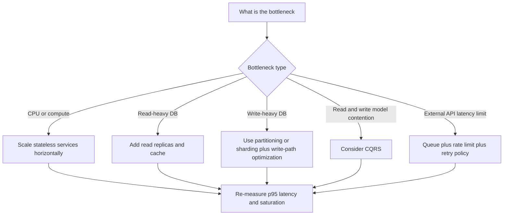

---
{"dg-publish":true,"permalink":"/software-engineering/05-architecture/distributed-systems/scalability-patterns/scalability-patterns/","tags":["FolderNote"]}
---


# Intro

Scalability is a system's ability to keep serving requests as load grows by adding resources, without a proportional drop in reliability or latency. In interviews, this matters because most "works at 1k RPS" designs fail when asked "how does this reach 10x?" The goal is not just to survive spikes, but to scale in a way that is cost-efficient and operationally predictable. You start thinking about scalability as soon as you can identify request volume, traffic shape, data growth, and the first likely bottleneck.

Concrete interview lens: if checkout traffic grows from 1,000 RPS to 10,000 RPS, a good answer is not "add more servers" but "measure where saturation appears first, then apply the right pattern for that bottleneck."

## Vertical vs Horizontal Scaling

Two fundamental approaches to adding capacity: [[Software Engineering/05 Architecture/Distributed Systems/Scalability Patterns/Vertical Scaling\|Vertical Scaling]] (bigger node) and [[Software Engineering/05 Architecture/Distributed Systems/Scalability Patterns/Horizontal Scaling\|Horizontal Scaling]] (more nodes). Vertical is the fastest first move; horizontal is the long-term strategy for stateless services. See the dedicated pages for mechanisms, tradeoffs, and pitfalls.

## Core Patterns

| Pattern | Primary bottleneck addressed | How it helps | Tradeoff and interview caveat |
|---|---|---|---|
| Horizontal scaling (stateless services behind LB, see [[Software Engineering/05 Architecture/Distributed Systems/Load Balancing\|Load Balancing]]) | App CPU and request concurrency | Add service instances behind a load balancer to increase throughput and availability | Requires stateless handlers; sticky sessions can hurt elasticity |
| Database read replicas | Read-heavy relational load | Offload read queries from primary to replicas | Replica lag can break read-after-write expectations |
| Database sharding | Write throughput and dataset size | Partition data by key so writes and storage spread across shards | Rebalancing, cross-shard queries, and hotspot keys add major complexity |
| CQRS (see [[Software Engineering/05 Architecture/Patterns/Architectural Patterns/CQRS\|CQRS]]) | Read/write contention with different query needs | Separate write model from read model to optimize each independently | Eventual consistency and projection maintenance must be explicit |
| Caching (see [[Software Engineering/03 Data Persistence/Caching\|Caching]]) | Repeated expensive reads | Serve hot data from in-memory cache to reduce DB/API pressure | Cache invalidation and staleness policy drive correctness risk |
| CDN | Static asset latency and origin egress | Move static content to edge locations close to users | Cache-control mistakes can serve stale or private content |
| Async processing and message queues (see [[Software Engineering/05 Architecture/Distributed Systems/Message Queues/Message Queues\|Message Queues]]) | Synchronous dependency latency and burst traffic | Buffer work, decouple producers/consumers, smooth spikes | Requires idempotency, retry policy, and dead-letter handling |
| Connection pooling | Expensive connection setup and DB connection limits | Reuse open connections to reduce handshake cost and limit churn | Pool exhaustion often appears as latency spikes before hard failures |
| Event-Driven Architecture (see [[Software Engineering/05 Architecture/System Architecture/Event-Driven Architecture\|Event-Driven Architecture]]) | Tight coupling between services | Publish events so services scale and evolve independently | Ordering, duplication, and schema evolution must be designed upfront |
| Load shedding and rate limiting | Overload collapse during spikes | Reject or defer excess traffic early to protect critical paths | Requires clear priority rules and client retry behavior |

How to use this table in interviews: name the bottleneck first, then pick one or two patterns that directly reduce that bottleneck.

### Pattern Walkthrough (Quick Explanations)

1. Horizontal scale works best when each request can be handled by any instance, so session and cache state must be externalized.
2. Read replicas are usually your first database scale step for read-heavy APIs, but you must call out replication lag.
3. Sharding is usually late-stage because operational and data-model complexity is high.
4. CQRS helps when read models and write invariants conflict; it is not mandatory for every CRUD app.
5. Caching is often the highest ROI pattern when read repetition is high and staleness tolerance exists.
6. CDN is often a high-ROI optimization for cacheable static assets and can reduce origin cost.
7. Queues protect upstream systems from spikes and third-party slowness.
8. Connection pooling is usually low-effort, high-impact hygiene before more dramatic architecture changes.
9. Event-driven design scales team autonomy and workload isolation, but consistency guarantees must be explicit.

## Scaling Decision Framework

Start with telemetry and saturation, not architecture fashion.



Practical checklist for the first 10x discussion:

- Confirm current limits using p95 latency, CPU saturation, queue depth, DB waits, and error rates.
- Separate steady load from burst load; spikes often need buffering, not just more instances.
- Distinguish read growth from write growth; they usually need different patterns.
- Validate non-functional constraints early (consistency, RTO and RPO, compliance, budget).

## .NET and Azure Context

- Azure App Service scale-out adds instances quickly for stateless ASP.NET Core apps; pair it with health checks and external session state.
- Kubernetes Horizontal Pod Autoscaler (HPA) scales pods by CPU, memory, or custom metrics; this is useful when queue depth is the real trigger.
- For PostgreSQL-heavy workloads, PgBouncer helps with connection pooling so app scale-out does not overwhelm DB connection limits.
- Redis is a common distributed cache choice in .NET systems (session state, response caching, hot lookups, rate limiting counters).

Minimal ASP.NET Core example with Redis distributed cache:

```csharp
builder.Services.AddStackExchangeRedisCache(options =>
{
    options.Configuration = builder.Configuration.GetConnectionString("Redis");
    options.InstanceName = "scalability-patterns:";
});
```

Simple production pattern:

- Keep APIs stateless.
- Put Redis between API and database for hot reads.
- Add read replicas before discussing sharding.
- Introduce queues where downstream latency is unpredictable.

## Tradeoffs

| Choice | Better when | Worse when |
|---|---|---|
| Vertical vs horizontal app scaling | You need immediate capacity and low migration risk | Single-node ceiling and blast radius become dominant |
| Read replicas vs caching for reads | Queries are complex and freshness matters more than latency | Cache hit ratio is high and stale-tolerant reads dominate |
| Sharding vs larger primary DB | Write throughput and data size exceed one node limits | Team is small and cross-shard operations are frequent |
| Sync calls vs queue-based async | User needs immediate result and latency budget allows it | Dependency is slow or rate-limited and bursty traffic is expected |

## Pitfalls

1. **Scaling before finding the real bottleneck**  
   What goes wrong: teams add app instances while p95 remains high.  
   Why: the bottleneck is often DB lock contention, external API latency, or connection saturation.  
   Mitigation: baseline telemetry first, then scale the saturated component.

2. **Premature sharding**  
   What goes wrong: delivery speed drops and incident complexity rises.  
   Why: shard routing, cross-shard queries, and resharding become permanent operational overhead.  
   Mitigation: exhaust simpler options first (indexes, read replicas, caching, partitioning, queueing).

3. **Stateful services that cannot scale horizontally**  
   What goes wrong: sticky sessions and per-node memory state cause uneven load and failover pain.  
   Why: user session or cache state is stored in-process.  
   Mitigation: externalize session to Redis and keep handlers stateless.

4. **Ignoring database bottlenecks while scaling app tier**  
   What goes wrong: more app instances generate more DB pressure and failures happen faster.  
   Why: DB CPU, locks, or connection limits were already near saturation.  
   Mitigation: profile queries, add indexes, tune pools, use read replicas, then scale app tier.

## Questions

> [!QUESTION]- When would you choose read replicas instead of CQRS for a scaling problem?
> **Expected answer:**
> - Choose read replicas when main pressure is read throughput on an existing relational model.
> - Choose CQRS when read/write models diverge and read projections need different shape or storage.
> - Mention consistency behavior: replicas have lag; CQRS read models are eventually consistent by design.
> - Mention complexity: replicas are simpler operationally than full CQRS/event projection pipelines.
> **Why this is strong:** It balances architecture fit, consistency, and operational cost.

## References

- [System Design Primer - Scalability](https://github.com/donnemartin/system-design-primer#scalability)
- [Azure Architecture Center - Design to scale out](https://learn.microsoft.com/azure/architecture/guide/design-principles/scale-out)
- [Azure App Service - Scale up and scale out](https://learn.microsoft.com/azure/app-service/manage-scale-up)
- [Amazon Builders Library - Using load shedding to avoid overload](https://aws.amazon.com/builders-library/using-load-shedding-to-avoid-overload/)
- [ASP.NET Core distributed caching guidance](https://learn.microsoft.com/aspnet/core/performance/caching/distributed?view=aspnetcore-10.0)

<!-- whats-next:start -->

---

> [!note] Whats next
> **Parent**
>  [[Software Engineering/05 Architecture/Distributed Systems/Distributed Systems\|Distributed Systems]]
>
> **Pages**
> - [[Software Engineering/05 Architecture/Distributed Systems/Scalability Patterns/Horizontal Scaling\|Horizontal Scaling]]
> - [[Software Engineering/05 Architecture/Distributed Systems/Scalability Patterns/Vertical Scaling\|Vertical Scaling]]
<!-- whats-next:end -->
