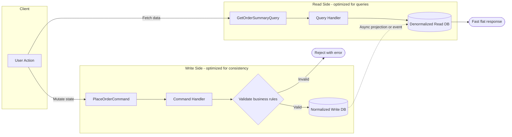

---
{"dg-publish":true,"permalink":"/software-engineering/05-architecture/patterns/architectural-patterns/cqrs/","dg-note-properties":{"topic":["Architecture"],"subtopic":["Patterns"],"level":["3"],"priority":"High","status":"Ready To Repeat"}}
---

# Intro

CQRS (Command Query Responsibility Segregation) separates the part of the system that changes state from the part that serves read data. It matters because read and write workloads usually have different shapes: writes care about consistency and invariants, while reads care about latency and query flexibility. With CQRS, you can scale and optimize these paths independently instead of forcing one model to serve both. Reach for it when your domain rules are non-trivial, your query surface is broad, or your read:write ratio is high enough that a denormalized read model pays off.

## Mechanism

At the core, CQRS uses two different models with different responsibilities:

- Commands validate intent and mutate state.
- Queries return data and must have no side effects.
- The write model protects business invariants.
- The read model is shaped for fast, task-focused queries.

The write side is typically normalized and transactional (for example, EF Core with aggregate boundaries and concurrency control). The read side is often denormalized (materialized views, projection tables, or document-style records) to avoid expensive joins at query time.

Bridge options between write and read models:
- **Synchronous projection**: update read model in the same request path. Lower staleness, higher coupling and latency.
- **Asynchronous projection**: publish domain/integration events and project in background. Better decoupling and throughput, but eventual consistency.

In interviews, emphasize that CQRS is about **separating responsibilities and optimization goals**, not automatically about adding message brokers or multiple databases.

## Deeper Explanation



The key insight: the **write model** is normalized and enforces business rules, while the **read model** is denormalized and shaped for fast queries. They can use different databases, different schemas, or even different technologies. The trade-off is **eventual consistency** between the two sides.

## ASP.NET Core Example (EF Core writes + Dapper reads)
This sample uses MediatR for handler wiring; CQRS itself is library-agnostic. MediatR has community and commercial licensing options, so verify current terms at [mediatr.io](https://mediatr.io/). Alternatives include direct DI-wired command/query handlers with custom interfaces.
Write side: command handler validates invariants and persists normalized state.

```csharp
using MediatR;
using Microsoft.EntityFrameworkCore;
public sealed record PlaceOrderCommand(Guid CustomerId, IReadOnlyList<OrderLineInput> Lines)
    : IRequest<Guid>;

public sealed record OrderLineInput(Guid ProductId, int Quantity);

public sealed class PlaceOrderHandler : IRequestHandler<PlaceOrderCommand, Guid>
{
    private readonly OrderingDbContext _db;
    private readonly IMediator _mediator;
    public PlaceOrderHandler(OrderingDbContext db, IMediator mediator)
    {
        _db = db;
        _mediator = mediator;
    }

    public async Task<Guid> Handle(PlaceOrderCommand request, CancellationToken ct)
    {
        if (request.Lines.Count == 0)
            throw new ValidationException("Order must contain at least one line.");

        var customer = await _db.Customers.SingleOrDefaultAsync(c => c.Id == request.CustomerId, ct);
        if (customer is null)
            throw new ValidationException("Customer does not exist.");

        var productIds = request.Lines.Select(x => x.ProductId).Distinct().ToArray();
        var products = await _db.Products
            .Where(p => productIds.Contains(p.Id))
            .ToDictionaryAsync(p => p.Id, ct);
        foreach (var line in request.Lines)
        {
            if (!products.TryGetValue(line.ProductId, out var p) || !p.IsActive)
                throw new ValidationException($"Product {line.ProductId} is unavailable.");
        }

        var order = Order.Create(request.CustomerId, request.Lines);
        _db.Orders.Add(order);
        await _db.SaveChangesAsync(ct);
        // In-process publish is awaited; use outbox + broker for truly asynchronous projection.
        await _mediator.Publish(new OrderPlaced(order.Id, customer.Name, order.Total, order.CreatedUtc), ct);
        return order.Id;
    }
}
```

Read side: query handler loads a denormalized view optimized for the screen.

```csharp
using Dapper;
using MediatR;
using System.Data;
public sealed record GetOrderSummaryQuery(Guid OrderId) : IRequest<OrderSummaryDto?>;

public sealed record OrderSummaryDto(
    Guid OrderId,
    string CustomerName,
    decimal Total,
    string Status,
    DateTime CreatedUtc);

public sealed class GetOrderSummaryHandler : IRequestHandler<GetOrderSummaryQuery, OrderSummaryDto?>
{
    private readonly IDbConnection _connection;
    public GetOrderSummaryHandler(IDbConnection connection) => _connection = connection;

    public async Task<OrderSummaryDto?> Handle(GetOrderSummaryQuery request, CancellationToken ct)
    {
        const string sql = """
            SELECT
                order_id     AS OrderId,
                customer_name AS CustomerName,
                total_amount  AS Total,
                status        AS Status,
                created_utc   AS CreatedUtc
            FROM read.order_summary
            WHERE order_id = @OrderId;
            """;
        var cmd = new CommandDefinition(sql, new { request.OrderId }, cancellationToken: ct);
        return await _connection.QuerySingleOrDefaultAsync<OrderSummaryDto>(cmd);
    }
}
```

A minimal projection that feeds the read model from events (PostgreSQL syntax using `ON CONFLICT`):

```csharp
using MediatR;

public sealed record OrderPlaced(Guid OrderId, string CustomerName, decimal Total, DateTime CreatedUtc) : INotification;

public sealed class OrderSummaryProjection : INotificationHandler<OrderPlaced>
{
    private readonly IDbConnection _connection;
    public OrderSummaryProjection(IDbConnection connection) => _connection = connection;

    public Task Handle(OrderPlaced notification, CancellationToken cancellationToken)
    {
        const string upsert = """
            INSERT INTO read.order_summary (order_id, customer_name, total_amount, status, created_utc)
            VALUES (@OrderId, @CustomerName, @Total, 'Placed', @CreatedUtc)
            ON CONFLICT (order_id) DO UPDATE
            SET total_amount = EXCLUDED.total_amount,
                status = EXCLUDED.status;
            """;
        return _connection.ExecuteAsync(new CommandDefinition(upsert, new
        {
            notification.OrderId,
            notification.CustomerName,
            notification.Total,
            notification.CreatedUtc
        }, cancellationToken: cancellationToken));
    }
}
```

## CQRS and Event Sourcing
CQRS pairs naturally with [[Software Engineering/05 Architecture/Patterns/Architectural Patterns/Event Sourcing\|Event Sourcing]] because events are already the canonical change stream that can project into one or many read models. This makes rebuilding read views and supporting new query shapes easier.
Important distinction for interviews: **CQRS does not require Event Sourcing**.

- CQRS without Event Sourcing: write model persists current state (for example, relational tables), and emits events only as integration/projection signals.
- Event Sourcing without full CQRS: possible; event streams can be queried directly, and specialized read projections are added when query needs grow.

Use both when auditability, temporal debugging, replay, and multiple read projections are first-class requirements.

## Pitfalls
- **Eventual consistency surprises users**: a command succeeds but the read model has not caught up, so users see stale dashboards. Use UX hints ("updating..."), projection lag monitoring, and read-your-own-write for critical paths (serve the immediate follow-up read from the write model for that user/session).
- **Overkill for simple CRUD**: if the same model can handle reads and writes with acceptable performance, CQRS adds architecture tax without clear payoff.
- **Two models double maintenance**: schema evolution, testing, and observability now span command flow, events, and projections. A common failure is non-idempotent projections duplicating or corrupting read rows because brokers are usually at-least-once: a consumer can write, crash before ack, then process the same event again. Use upserts, store processed event IDs to skip duplicates, and run replay tests.
- **Projection and write are not atomic by default**: if you save state and then project in-process, a handler failure can leave write and read models temporarily divergent. Use the outbox pattern when atomic event capture is required, then project asynchronously with retries.
- **"CQRS everywhere" anti-pattern**: applying CQRS globally increases complexity and cognitive load. Use it selectively per bounded context where constraints justify it.

## Tradeoffs: CQRS vs Simple CRUD
| Criterion | Simple CRUD model | CQRS model |
|---|---|---|
| Read/write ratio close to 1:1 | Usually sufficient | Often unnecessary complexity |
| Read-heavy workloads | Can degrade with heavy joins/index pressure | Read model can be denormalized for low-latency queries |
| Domain invariants and complex write rules | Possible but can bloat entity model | Write model stays explicit and invariant-focused |
| Operational complexity | Lower | Higher (projections, lag, retries, idempotency) |
| Independent scaling | Limited | Strong, especially with separate stores |
Decision rule: CQRS is usually worth it when at least two are true at once: high read:write ratio, complex query requirements, and clear need to scale read/write paths independently.
## Questions
> [!QUESTION]- When is CQRS worth the operational complexity, and when is it an anti-pattern?
> **Expected answer:** CQRS is justified when read/write workloads differ materially (high read ratio, complex query shapes, independent scaling needs) and the domain has meaningful invariants. It is usually an anti-pattern for simple CRUD with low scale pressure, because projection pipelines, eventual consistency handling, and dual-model maintenance add avoidable complexity.
Warm-up refresher: What is CQRS? CQRS separates commands (state changes) from queries (read-only data retrieval) so each side can be modeled and optimized independently.
## References
- [Microsoft Learn - CQRS pattern](https://learn.microsoft.com/azure/architecture/patterns/cqrs)
- [Martin Fowler - CQRS](https://martinfowler.com/bliki/CQRS.html)
- [Microservices.io - CQRS pattern](https://microservices.io/patterns/data/cqrs.html)
- [Chris Richardson - Idempotent Consumer pattern](https://microservices.io/post/microservices/patterns/2020/10/16/idempotent-consumer.html)
- [Udi Dahan - Clarified CQRS](https://udidahan.com/2009/12/09/clarified-cqrs/)
- [Greg Young - CQRS Documents](https://cqrs.files.wordpress.com/2010/11/cqrs_documents.pdf)
<!-- whats-next:start -->

---

> [!note] Whats next
> **Parent**
>  [[Software Engineering/05 Architecture/Patterns/Patterns\|Patterns]]
>
> **Pages**
> - [[Software Engineering/05 Architecture/Patterns/Architectural Patterns/Domain-Driven Design\|Domain-Driven Design]]
> - [[Software Engineering/05 Architecture/Patterns/Architectural Patterns/Event Sourcing\|Event Sourcing]]
<!-- whats-next:end -->
