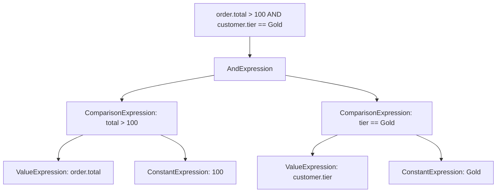

---
{"dg-publish":true,"permalink":"/software-engineering/05-architecture/patterns/design-patterns/behavioral/interpreter/","dg-note-properties":{"topic":["Architecture"],"subtopic":["Patterns"],"level":["3"],"priority":"High","status":"Creation"}}
---

# Interpreter

A calculator is an Interpreter. You type `2 + 3 * 4` and the calculator parses it into a tree — multiply first, then add — and evaluates the result by walking the tree. Each operator node knows how to compute itself. LINQ Expression Trees work the same way: your C# lambda `o => o.Total > 100` becomes an abstract syntax tree that EF Core interprets into SQL at runtime, without you writing any SQL.

The Interpreter pattern defines a grammar for a language and provides an interpreter that evaluates sentences in that grammar. Each grammar rule becomes a class implementing an `IExpression` interface with an `Interpret(context)` method. Complex expressions are composed from simpler ones — `AndExpression` holds two child expressions, `ComparisonExpression` evaluates a single condition. This is the Composite pattern applied to a grammar. In .NET, **LINQ Expression Trees + EF Core `IQueryable<T>` are the canonical production Interpreter**: the LINQ provider traverses the expression tree and translates each node into the target language (SQL, MongoDB queries, Elasticsearch DSL).



## Problem

`DiscountService` has hardcoded if/else chains for discount rules — every new promotion requires code changes and deployment:

```csharp
public class DiscountService
{
    // ⚠️ Every new promotion rule requires a code change and deployment
    public decimal CalculateDiscount(Order order)
    {
        decimal discount = 0m;

        // ⚠️ "10% off orders over $100" — hardcoded
        if (order.Total > 100m)
            discount += order.Total * 0.10m;

        // ⚠️ "Free shipping for Gold members" — hardcoded
        if (order.Customer.Tier == CustomerTier.Gold)
            discount += order.ShippingCost;

        // ⚠️ "Buy 2 get 1 free on Electronics" — hardcoded
        var electronicsItems = order.Items.Where(i => i.Product.Category == "Electronics").ToList();
        if (electronicsItems.Count >= 2)
        {
            var cheapest = electronicsItems.MinBy(i => i.UnitPrice);
            if (cheapest is not null) discount += cheapest.UnitPrice;
        }

        // ⚠️ Marketing wants "20% off for Silver members on orders over $200 placed on weekends"
        // That's a new deployment just to add a rule
        return discount;
    }
}
```

Here's what breaks when requirements change: the marketing team wants to configure promotions without engineering involvement — impossible with hardcoded rules.

## Solution

A discount rule DSL where rules are stored as strings and evaluated at runtime:

```csharp
// Evaluation context — the data available to expressions
public class DiscountContext
{
    public Order Order { get; init; } = null!;
    public Customer Customer { get; init; } = null!;
}

// Expression interface
public interface IDiscountExpression
{
    bool Evaluate(DiscountContext context);
}

// Terminal expressions — leaf nodes
public class OrderTotalGreaterThan(decimal threshold) : IDiscountExpression
{
    public bool Evaluate(DiscountContext ctx) => ctx.Order.Total > threshold;
}

public class CustomerTierEquals(CustomerTier tier) : IDiscountExpression
{
    public bool Evaluate(DiscountContext ctx) => ctx.Customer.Tier == tier;
}

public class OrderDayOfWeek(DayOfWeek day) : IDiscountExpression
{
    public bool Evaluate(DiscountContext ctx) => ctx.Order.CreatedAt.DayOfWeek == day;
}

// Non-terminal expressions — composite nodes
public class AndExpression(IDiscountExpression left, IDiscountExpression right) : IDiscountExpression
{
    public bool Evaluate(DiscountContext ctx) =>
        left.Evaluate(ctx) && right.Evaluate(ctx); // ✅ recursive evaluation
}

public class OrExpression(IDiscountExpression left, IDiscountExpression right) : IDiscountExpression
{
    public bool Evaluate(DiscountContext ctx) =>
        left.Evaluate(ctx) || right.Evaluate(ctx);
}

public class NotExpression(IDiscountExpression operand) : IDiscountExpression
{
    public bool Evaluate(DiscountContext ctx) => !operand.Evaluate(ctx);
}

// Discount rule — pairs a condition expression with a discount action
public class DiscountRule
{
    public string Name { get; init; } = "";
    public IDiscountExpression Condition { get; init; } = null!;
    public Func<DiscountContext, decimal> CalculateDiscount { get; init; } = null!;
}

// Rule engine — evaluates rules against a context
public class DiscountRuleEngine(IEnumerable<DiscountRule> rules)
{
    public decimal CalculateTotalDiscount(Order order, Customer customer)
    {
        var context = new DiscountContext { Order = order, Customer = customer };
        return rules
            .Where(r => r.Condition.Evaluate(context)) // ✅ interpret each rule
            .Sum(r => r.CalculateDiscount(context));
    }
}

// Rules configured at startup (or loaded from DB/config)
var rules = new[]
{
    new DiscountRule
    {
        Name = "10% off orders over $100",
        Condition = new OrderTotalGreaterThan(100m),
        CalculateDiscount = ctx => ctx.Order.Total * 0.10m
    },
    new DiscountRule
    {
        Name = "20% off for Silver members on weekend orders over $200",
        // ✅ Compose expressions — no code change needed for new rule combinations
        Condition = new AndExpression(
            new AndExpression(
                new CustomerTierEquals(CustomerTier.Silver),
                new OrderTotalGreaterThan(200m)),
            new OrExpression(
                new OrderDayOfWeek(DayOfWeek.Saturday),
                new OrderDayOfWeek(DayOfWeek.Sunday))),
        CalculateDiscount = ctx => ctx.Order.Total * 0.20m
    }
};

// ✅ Marketing adds new rules by composing existing expressions — no deployment
```

## You Already Use This

**LINQ Expression Trees + EF Core `IQueryable<T>`** — the canonical production .NET Interpreter. `dbContext.Orders.Where(o => o.Total > 100 && o.Customer.Tier == CustomerTier.Gold)` builds an expression tree (an AST). EF Core's query translator is an `ExpressionVisitor` that interprets this AST into SQL: `WHERE Total > 100 AND CustomerTier = 2`. The expression tree is the grammar; EF Core is the interpreter. This is why EF Core can translate LINQ to SQL but throws for expressions it can't interpret — the interpreter doesn't know that grammar rule.

**`Regex`** — a compiled regex is an interpreter for a regular expression grammar. The regex engine interprets the pattern (grammar) against the input string. `Regex.IsMatch(input, pattern)` evaluates the pattern expression against the context (input).

**Roslyn scripting API (`CSharpScript.EvaluateAsync`)** — interprets C# code at runtime. `await CSharpScript.EvaluateAsync<decimal>("order.Total * 0.10m", globals: new { order })` compiles and executes C# expressions dynamically.

**NCalc / DynamicExpresso** — .NET libraries that implement the Interpreter pattern for mathematical and logical expressions. `new Expression("order.Total > 100 AND customer.Tier == 'Gold'").Evaluate(parameters)` interprets a string expression at runtime.

## Pitfalls

**Performance of recursive interpretation** — evaluating a deep expression tree on every request is slower than compiled code. For high-frequency evaluation (every HTTP request), compile the expression tree to a delegate: `Expression.Lambda<Func<DiscountContext, bool>>(tree).Compile()`. The compiled delegate runs at near-native speed. Cache the compiled delegate — compilation is expensive; evaluation is fast.

**Grammar complexity** — the Interpreter pattern works well for simple grammars (boolean logic, comparisons). For complex grammars (full DSLs, query languages), use a proper parser (ANTLR, Sprache) that produces an AST, then interpret the AST. Don't hand-write a parser for complex grammars.

**Security of runtime-evaluated expressions** — if expressions come from user input, they can be used for injection attacks. Validate and sanitize expressions before evaluation. Prefer a restricted DSL (only predefined expression types) over general-purpose scripting (Roslyn) for user-provided rules.

## Tradeoffs

| Concern | Interpreter | Hardcoded rules | External rules engine (NCalc, Drools) |
|---|---|---|---|
| Adding a new rule | New expression composition, no deployment | Code change + deployment | Configure in rules engine UI |
| Performance | Slower (tree traversal) | Fastest (compiled) | Depends on engine |
| Rule complexity | Limited by grammar | Unlimited | Depends on engine |
| Debugging | Hard (runtime evaluation) | Easy (debugger) | Engine-specific tooling |
| Dependencies | None | None | External library/service |

**Decision rule**: Use Interpreter when rules change frequently and you want to avoid deployments, the grammar is simple (boolean logic, comparisons), and performance is not critical. Use hardcoded rules when rules are stable and performance matters. Use an external rules engine (NCalc, DynamicExpresso) when you need a richer expression language without building your own parser.

## Questions

> [!QUESTION]- How does EF Core use LINQ Expression Trees as an Interpreter?
> When you write `dbContext.Orders.Where(o => o.Total > 100)`, the C# compiler doesn't compile the lambda to IL — it compiles it to an `Expression<Func<Order, bool>>` (an expression tree, an AST). EF Core's query translator walks this AST using `ExpressionVisitor`: `VisitBinary` for `o.Total > 100` emits `Total > @p0`; `VisitMember` for `o.Total` emits the column name. The final SQL is assembled from the visited nodes. This is the Interpreter pattern: the expression tree is the grammar; EF Core is the interpreter; SQL is the output. The cost: EF Core can only interpret expressions it knows — calling a custom method in a LINQ query throws `InvalidOperationException` because the interpreter doesn't have a rule for that method.

> [!QUESTION]- When should you compile an expression tree to a delegate instead of interpreting it?
> When the same expression is evaluated many times (e.g., a discount rule evaluated on every order in a batch). `Expression.Lambda<Func<DiscountContext, bool>>(tree).Compile()` converts the expression tree to IL and returns a delegate that runs at near-native speed. The compilation itself is expensive (milliseconds); cache the compiled delegate. The tradeoff: compilation adds startup cost and memory; interpretation adds per-evaluation cost. Break-even is roughly 100+ evaluations of the same expression. EF Core compiles and caches query expressions for this reason.

> [!QUESTION]- What's the difference between Interpreter and Strategy for runtime rule selection?
> Strategy selects a pre-written algorithm at runtime. Interpreter evaluates a rule defined as data at runtime. With Strategy, the algorithms are written in code and selected by name or type. With Interpreter, the rule is a data structure (expression tree, string) that the interpreter evaluates. Interpreter is more flexible (rules can be composed from primitives without code changes) but more complex (requires a grammar and interpreter). Strategy is simpler (just inject the right implementation) but requires a code change for each new algorithm. Use Strategy when the set of algorithms is known at compile time; use Interpreter when rules are defined by non-developers or change without deployment.

## References

- [Interpreter — GoF Design Patterns](https://www.amazon.com/Design-Patterns-Elements-Reusable-Object-Oriented/dp/0201633612) — original pattern definition (not covered by refactoring.guru)
- [Expression Trees — Microsoft Learn](https://learn.microsoft.com/en-us/dotnet/csharp/advanced-topics/expression-trees/) — LINQ expression trees as the canonical .NET Interpreter
- [How EF Core translates LINQ to SQL — Microsoft Learn](https://learn.microsoft.com/en-us/ef/core/querying/how-query-works) — EF Core's ExpressionVisitor-based Interpreter in production
- [NCalc — GitHub](https://github.com/ncalc/ncalc) — .NET expression evaluator library implementing the Interpreter pattern
- [DynamicExpresso — GitHub](https://github.com/dynamicexpresso/DynamicExpresso) — .NET runtime expression interpreter with C#-like syntax

<!-- whats-next:start -->

---

> [!note] Whats next
> **Parent**
>  [[Software Engineering/05 Architecture/Patterns/Design Patterns/Design Patterns\|Design Patterns]]
>
> **Pages**
> - [[Software Engineering/05 Architecture/Patterns/Design Patterns/Behavioral/Chain of Responsibility\|Chain of Responsibility]]
> - [[Software Engineering/05 Architecture/Patterns/Design Patterns/Behavioral/Command\|Command]]
> - [[Software Engineering/05 Architecture/Patterns/Design Patterns/Behavioral/Iterator\|Iterator]]
> - [[Software Engineering/05 Architecture/Patterns/Design Patterns/Behavioral/Mediator\|Mediator]]
> - [[Software Engineering/05 Architecture/Patterns/Design Patterns/Behavioral/Memento\|Memento]]
> - [[Software Engineering/05 Architecture/Patterns/Design Patterns/Behavioral/Observer\|Observer]]
> - [[Software Engineering/05 Architecture/Patterns/Design Patterns/Behavioral/State\|State]]
> - [[Software Engineering/05 Architecture/Patterns/Design Patterns/Behavioral/Strategy\|Strategy]]
> - [[Software Engineering/05 Architecture/Patterns/Design Patterns/Behavioral/Template Method\|Template Method]]
> - [[Software Engineering/05 Architecture/Patterns/Design Patterns/Behavioral/Visitor\|Visitor]]
<!-- whats-next:end -->
