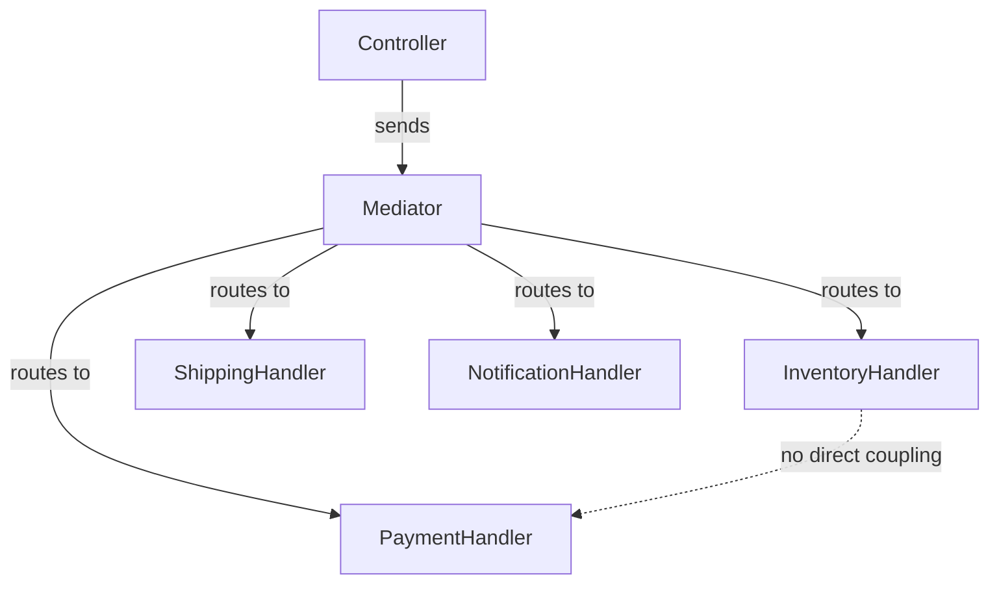

---
{"dg-publish":true,"permalink":"/software-engineering/05-architecture/patterns/design-patterns/behavioral/mediator/"}
---

# Mediator

Air traffic control is a Mediator. Planes don’t talk to each other directly — a pilot about to land doesn’t radio every other plane in the area. All communication goes through the control tower, which knows the positions, altitudes, and intentions of every aircraft. Adding a new plane to the airspace doesn’t require every existing plane to know about it — only the tower needs updating.

The Mediator pattern defines an object that encapsulates how a set of components interact. Instead of components referring to each other directly (creating a many-to-many dependency web), they communicate through the mediator, reducing dependencies to one-to-many. In .NET, **MediatR is the canonical implementation** — `IMediator.Send(command)` routes a request to its registered handler without the sender knowing the handler. The checkout controller sends `CheckoutCommand`; the mediator finds and invokes `CheckoutHandler`. Adding a new operation means adding a new command and handler pair, not editing the controller.



## Problem

`CheckoutController` directly calls 4 services — all coupled through the controller, which becomes a god class:

```csharp
[ApiController]
public class CheckoutController(
    IInventoryService inventory,
    IPaymentService payment,
    IShippingService shipping,
    INotificationService notification) : ControllerBase
{
    // ⚠️ Controller knows about all services and their coordination
    [HttpPost]
    public async Task<IActionResult> CheckoutAsync(CheckoutRequest request)
    {
        if (!await inventory.CheckStockAsync(request.Items))
            return BadRequest("Out of stock");

        var payment = await payment.ChargeAsync(request.Total, request.PaymentMethod);
        if (!payment.Success) return BadRequest("Payment failed");

        var shipment = await shipping.CreateLabelAsync(request.Items, request.Address);
        await notification.SendConfirmationAsync(request.CustomerId, shipment.TrackingNumber);

        return Ok(new { shipment.TrackingNumber });
    }
    // ⚠️ Adding analytics tracking requires editing this controller
    // ⚠️ Mobile API controller duplicates the same coordination logic
}
```

Here's what breaks when requirements change: adding fraud detection requires editing every controller that processes orders — web, mobile, B2B API all have the same coordination logic duplicated.

## Solution

`CheckoutCommand` is sent to the mediator; the handler coordinates the services:

```csharp
// Command — data only, no behavior
public record CheckoutCommand(
    Guid CustomerId,
    IReadOnlyList<OrderItem> Items,
    Address ShippingAddress,
    PaymentMethod PaymentMethod) : IRequest<CheckoutResult>;

public record CheckoutResult(Guid OrderId, string TrackingNumber);

// Handler — knows how to process the command
public class CheckoutCommandHandler(
    IInventoryService inventory,
    IPaymentService payment,
    IShippingService shipping,
    INotificationService notification) : IRequestHandler<CheckoutCommand, CheckoutResult>
{
    public async Task<CheckoutResult> Handle(CheckoutCommand cmd, CancellationToken ct)
    {
        // ✅ Coordination logic in one place — all callers use the same handler
        if (!await inventory.CheckStockAsync(cmd.Items))
            throw new OutOfStockException();

        var paymentResult = await payment.ChargeAsync(cmd.Items.Sum(i => i.Total), cmd.PaymentMethod);
        if (!paymentResult.Success)
            throw new PaymentFailedException(paymentResult.Reason);

        var shipment = await shipping.CreateLabelAsync(cmd.Items, cmd.ShippingAddress);
        await notification.SendConfirmationAsync(cmd.CustomerId, shipment.TrackingNumber);

        return new CheckoutResult(Guid.NewGuid(), shipment.TrackingNumber);
    }
}

// ✅ Controller has one dependency — IMediator
[ApiController]
public class CheckoutController(IMediator mediator) : ControllerBase
{
    [HttpPost]
    public async Task<IActionResult> CheckoutAsync(CheckoutRequest request)
    {
        try
        {
            var result = await mediator.Send(new CheckoutCommand(
                request.CustomerId, request.Items, request.Address, request.PaymentMethod));
            return Ok(result);
        }
        catch (OutOfStockException) { return BadRequest("Out of stock"); }
        catch (PaymentFailedException ex) { return BadRequest(ex.Message); }
    }
}

// DI registration
builder.Services.AddMediatR(cfg => cfg.RegisterServicesFromAssembly(typeof(Program).Assembly));
```

Adding fraud detection now means adding a MediatR pipeline behavior — the controller and handler never change.

## You Already Use This

**MediatR `IMediator`** — the canonical .NET Mediator. `mediator.Send(command)` routes to the registered `IRequestHandler<TCommand, TResult>`. Pipeline behaviors add cross-cutting concerns (validation, logging, caching) without touching handlers.

**SignalR `IHubContext<T>`** — the hub context is a mediator between server code and connected clients. `hubContext.Clients.All.SendAsync("OrderUpdated", order)` broadcasts without the sender knowing which clients are connected.

**MassTransit / NServiceBus** — message buses act as mediators between services. Publishing a `CheckoutCompletedEvent` routes to all registered consumers without the publisher knowing the consumers.

## Questions

> [!QUESTION]- When does Mediator become a bottleneck or anti-pattern?
> When the mediator becomes a god class that knows too much — if `CheckoutCommandHandler` grows to 300 lines with complex branching, the complexity moved from the controller to the handler without being reduced. The mediator pattern reduces coupling but doesn't reduce complexity. Also avoid Mediator when the interaction is simple and direct: if `OrderService` only ever calls `InventoryService`, a direct dependency is clearer than routing through a mediator. The signal: if you can't explain what the mediator does without listing all its handlers, it's too complex.

> [!QUESTION]- How do MediatR pipeline behaviors implement the Chain of Responsibility pattern?
> Each `IPipelineBehavior<TRequest, TResponse>` wraps the next behavior in the pipeline. `Handle(request, next, ct)` calls `next()` to continue or returns early to short-circuit. Behaviors are registered in order; the outermost runs first. This is exactly Chain of Responsibility: each behavior decides whether to pass the request along. The difference from a manual chain: MediatR's pipeline is configured via DI registration order, not explicit `SetNext()` calls. The tradeoff: DI-based ordering is less explicit but easier to configure.

## References

- [Mediator — refactoring.guru](https://refactoring.guru/design-patterns/mediator) — canonical pattern description with component/mediator diagram and C# example
- [MediatR — GitHub](https://github.com/jbogard/MediatR) — the standard .NET Mediator implementation with pipeline behaviors
- [IHubContext — Microsoft Learn](https://learn.microsoft.com/en-us/aspnet/core/signalr/hubcontext) — SignalR's mediator for server-to-client communication
- [CQRS pattern — Microsoft Learn](https://learn.microsoft.com/en-us/azure/architecture/patterns/cqrs) — Mediator pattern applied to command/query separation

<!-- whats-next:start -->

---

> [!note] Whats next
> **Parent**
>  [[Software Engineering/05 Architecture/Patterns/Design Patterns/Design Patterns\|Design Patterns]]
>
> **Pages**
> - [[Software Engineering/05 Architecture/Patterns/Design Patterns/Behavioral/Chain of Responsibility\|Chain of Responsibility]]
> - [[Software Engineering/05 Architecture/Patterns/Design Patterns/Behavioral/Command\|Command]]
> - [[Software Engineering/05 Architecture/Patterns/Design Patterns/Behavioral/Interpreter\|Interpreter]]
> - [[Software Engineering/05 Architecture/Patterns/Design Patterns/Behavioral/Iterator\|Iterator]]
> - [[Software Engineering/05 Architecture/Patterns/Design Patterns/Behavioral/Memento\|Memento]]
> - [[Software Engineering/05 Architecture/Patterns/Design Patterns/Behavioral/Observer\|Observer]]
> - [[Software Engineering/05 Architecture/Patterns/Design Patterns/Behavioral/State\|State]]
> - [[Software Engineering/05 Architecture/Patterns/Design Patterns/Behavioral/Strategy\|Strategy]]
> - [[Software Engineering/05 Architecture/Patterns/Design Patterns/Behavioral/Template Method\|Template Method]]
> - [[Software Engineering/05 Architecture/Patterns/Design Patterns/Behavioral/Visitor\|Visitor]]
<!-- whats-next:end -->
