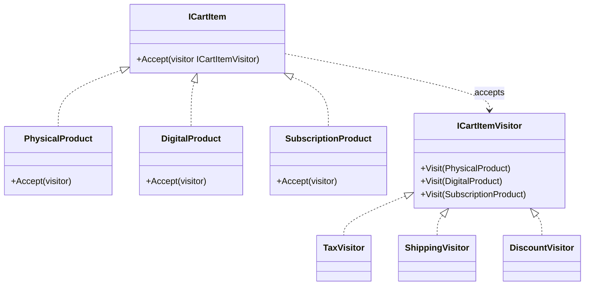

---
{"dg-publish":true,"permalink":"/software-engineering/05-architecture/patterns/design-patterns/behavioral/visitor/","dg-note-properties":{"topic":["Architecture"],"subtopic":["Patterns"],"level":["3"],"priority":"High","status":"Creation"}}
---

# Visitor

A museum audio guide is a Visitor. The exhibits (element hierarchy) stay the same, but you can load different tours — art history, architecture, kids’ tour. Each tour visits the same exhibits but tells different stories. Adding a new tour doesn’t require changing any exhibit; adding a new exhibit requires updating every tour. That trade-off — easy to add operations, hard to add elements — is the Visitor’s defining characteristic.

The Visitor pattern lets you add new operations to an object hierarchy without modifying the classes in that hierarchy. Each element implements `Accept(IVisitor visitor)`, which calls `visitor.Visit(this)` — this **double dispatch** ensures the correct `Visit` overload runs for the concrete element type. The visitor carries the operation and any accumulated state. In an e-commerce cart, `PhysicalProduct`, `DigitalProduct`, and `SubscriptionProduct` each accept visitors like `TaxVisitor`, `ShippingVisitor`, or `DiscountVisitor` — adding a new calculation means adding a new visitor class, not editing the product hierarchy.



**Modern C# note**: For simple type-dispatch scenarios, C# pattern matching (`switch` expressions with type patterns) can replace Visitor with less ceremony. Visitor earns its complexity when: the element hierarchy is stable and large, new operations are frequent, or you need the visitor to carry state across elements. For 2-3 element types with 1-2 operations, use pattern matching.

## Problem

`CartService` has switch/if on item type for every calculation — adding a new calculation means editing every method:

```csharp
public class CartService
{
    // ⚠️ Type-checking duplicated in every calculation method
    public decimal CalculateTax(ICartItem item)
    {
        if (item is PhysicalProduct physical)
            return physical.Price * 0.20m; // 20% VAT
        else if (item is DigitalProduct digital)
            return digital.Price * 0.05m; // 5% digital tax
        else if (item is SubscriptionProduct subscription)
            return 0m; // subscriptions are tax-exempt
        // ⚠️ Adding GiftCard item type requires editing CalculateTax, CalculateShipping, CalculateDiscount
        throw new NotSupportedException(item.GetType().Name);
    }

    public decimal CalculateShipping(ICartItem item)
    {
        if (item is PhysicalProduct physical)
            return physical.WeightKg * 2.50m;
        else if (item is DigitalProduct)
            return 0m; // no shipping for digital
        else if (item is SubscriptionProduct)
            return 0m;
        throw new NotSupportedException(item.GetType().Name);
    }

    // ⚠️ CalculateDiscount has the same switch — 3 methods × N item types = N×3 combinations
}
```

Here's what breaks when requirements change: adding a `GiftCard` item type requires editing `CalculateTax`, `CalculateShipping`, and `CalculateDiscount` — three separate methods.

## Solution

**Pattern matching approach** (modern C# — use for simple cases):

```csharp
// ✅ Pattern matching — no Visitor ceremony for simple type dispatch
public static class CartCalculations
{
    public static decimal CalculateTax(ICartItem item) => item switch
    {
        PhysicalProduct p => p.Price * 0.20m,
        DigitalProduct d => d.Price * 0.05m,
        SubscriptionProduct => 0m,
        GiftCard => 0m, // ✅ adding GiftCard = one new case per switch
        _ => throw new NotSupportedException(item.GetType().Name)
    };

    public static decimal CalculateShipping(ICartItem item) => item switch
    {
        PhysicalProduct p => p.WeightKg * 2.50m,
        DigitalProduct or SubscriptionProduct or GiftCard => 0m,
        _ => throw new NotSupportedException(item.GetType().Name)
    };
}
```

**Visitor approach** (use when operations are frequent and element hierarchy is stable):

```csharp
// Element interface — accepts a visitor
public interface ICartItem
{
    decimal Price { get; }
    void Accept(ICartItemVisitor visitor); // ✅ double dispatch hook
}

// Visitor interface — one Visit overload per element type
public interface ICartItemVisitor
{
    void Visit(PhysicalProduct item);
    void Visit(DigitalProduct item);
    void Visit(SubscriptionProduct item);
}

// Concrete elements — each calls the correct Visit overload
public class PhysicalProduct : ICartItem
{
    public decimal Price { get; init; }
    public decimal WeightKg { get; init; }
    public void Accept(ICartItemVisitor visitor) => visitor.Visit(this); // ✅ double dispatch
}

public class DigitalProduct : ICartItem
{
    public decimal Price { get; init; }
    public string DownloadUrl { get; init; } = "";
    public void Accept(ICartItemVisitor visitor) => visitor.Visit(this);
}

public class SubscriptionProduct : ICartItem
{
    public decimal Price { get; init; }
    public int MonthsDuration { get; init; }
    public void Accept(ICartItemVisitor visitor) => visitor.Visit(this);
}

// Concrete visitors — each encapsulates one operation across all element types
public class TaxCalculatorVisitor : ICartItemVisitor
{
    public decimal TotalTax { get; private set; }

    public void Visit(PhysicalProduct item) => TotalTax += item.Price * 0.20m;
    public void Visit(DigitalProduct item) => TotalTax += item.Price * 0.05m;
    public void Visit(SubscriptionProduct item) { } // tax-exempt
}

public class ShippingCalculatorVisitor : ICartItemVisitor
{
    public decimal TotalShipping { get; private set; }

    public void Visit(PhysicalProduct item) => TotalShipping += item.WeightKg * 2.50m;
    public void Visit(DigitalProduct item) { } // no shipping
    public void Visit(SubscriptionProduct item) { } // no shipping
}

// ✅ Adding DiscountCalculatorVisitor = new class, zero changes to element classes
public class DiscountCalculatorVisitor(Customer customer) : ICartItemVisitor
{
    public decimal TotalDiscount { get; private set; }

    public void Visit(PhysicalProduct item) =>
        TotalDiscount += customer.Tier == CustomerTier.Gold ? item.Price * 0.10m : 0m;
    public void Visit(DigitalProduct item) =>
        TotalDiscount += customer.Tier == CustomerTier.Gold ? item.Price * 0.05m : 0m;
    public void Visit(SubscriptionProduct item) { } // no discount on subscriptions
}

// Usage
var taxVisitor = new TaxCalculatorVisitor();
foreach (var item in cart.Items)
    item.Accept(taxVisitor);
Console.WriteLine($"Total tax: {taxVisitor.TotalTax:C}");
```

Adding a `DiscountCalculatorVisitor` now means one new class — element classes never change.

## You Already Use This

**`ExpressionVisitor` (LINQ)** — the canonical .NET Visitor. `ExpressionVisitor` traverses a LINQ expression tree, visiting each node type (`BinaryExpression`, `MethodCallExpression`, `ParameterExpression`). EF Core's query translator is an `ExpressionVisitor` that converts LINQ expressions into SQL. Override `VisitBinary()`, `VisitMethodCall()` etc. to transform or analyze expressions.

**Roslyn `CSharpSyntaxWalker` / `CSharpSyntaxRewriter`** — Roslyn's Visitor for C# syntax trees. `CSharpSyntaxWalker` visits every node; `CSharpSyntaxRewriter` visits and can replace nodes. Code analyzers and refactoring tools use these to traverse and transform C# code.

**`JsonConverter<T>`** — a visitor over the JSON token stream. `Read()` visits JSON tokens; `Write()` emits tokens. Each converter handles a specific type, implementing the Visitor's type-specific behavior.

## Pitfalls

**Adding a new element type breaks all visitors** — if you add `GiftCard` to `ICartItem`, you must add `Visit(GiftCard)` to `ICartItemVisitor` and implement it in every concrete visitor. This is the fundamental Visitor tradeoff: easy to add operations, hard to add element types. If your hierarchy changes frequently, use pattern matching instead.

**Double dispatch complexity** — `item.Accept(visitor)` → `visitor.Visit(this)` is two virtual calls. Developers unfamiliar with the pattern find it confusing. Document the double dispatch mechanism explicitly. For teams that find it confusing, pattern matching is a clearer alternative.

## Tradeoffs

| Concern | Visitor | Pattern matching | Polymorphism (virtual methods) |
|---|---|---|---|
| Adding a new operation | New visitor class | New switch expression | Add method to interface + all classes |
| Adding a new element type | Add to interface + all visitors | Add case to each switch | New class only |
| Element hierarchy stability | Required (stable) | Flexible | Flexible |
| Carrying state across elements | Natural (visitor fields) | Awkward | Awkward |
| Readability | Double dispatch is non-obvious | Explicit and readable | Natural OOP |

**Decision rule**: Use Visitor when the element hierarchy is stable (rarely new types) and operations are frequent (new calculations added regularly). Use pattern matching when the hierarchy is small (2-4 types) or changes frequently. Use virtual methods (polymorphism) when each element type knows best how to perform the operation.

## Questions

> [!QUESTION]- What is double dispatch and why does Visitor need it?
> Single dispatch: the method called depends on the runtime type of ONE object (the receiver). Double dispatch: the method called depends on the runtime types of TWO objects (the element AND the visitor). Without double dispatch, `visitor.Visit(item)` would call the `Visit(ICartItem)` overload — the compiler resolves overloads at compile time based on the declared type. `item.Accept(visitor)` → `visitor.Visit(this)` forces the compiler to resolve the overload based on `this`'s concrete type at runtime. The cost: two virtual calls instead of one; the pattern is non-obvious to developers unfamiliar with it.

> [!QUESTION]- When does EF Core use ExpressionVisitor, and what does it do?
> EF Core's query translator is an `ExpressionVisitor` that walks the LINQ expression tree and converts it to SQL. `dbContext.Orders.Where(o => o.Total > 100).Select(o => o.Id)` builds an expression tree; EF Core visits each node: `VisitMethodCall` for `Where` and `Select`, `VisitBinary` for `o.Total > 100`, `VisitMember` for `o.Total` and `o.Id`. Each visit emits SQL fragments. The final SQL is assembled from the visited nodes. This is why EF Core can translate LINQ to SQL but throws `InvalidOperationException` for expressions it can't translate — the visitor doesn't know how to visit that node type.

> [!QUESTION]- When should you use pattern matching instead of Visitor?
> When the element hierarchy is small (2-4 types), changes frequently (new types added regularly), or the operations are simple (one-liners per type). Pattern matching is more readable, requires no `Accept()` method on elements, and handles new element types with a compiler warning (exhaustiveness checking with `_` catch-all). Visitor earns its complexity when: you have 5+ element types, 5+ operations, and the hierarchy is stable. The signal: if adding a new element type requires editing more than 3 visitor classes, the hierarchy is too unstable for Visitor.

## References

- [Visitor — refactoring.guru](https://refactoring.guru/design-patterns/visitor) — canonical pattern description with double dispatch diagram and C# example
- [ExpressionVisitor — Microsoft Learn](https://learn.microsoft.com/en-us/dotnet/api/system.linq.expressions.expressionvisitor) — .NET's built-in Visitor for LINQ expression trees
- [CSharpSyntaxWalker — Microsoft Learn](https://learn.microsoft.com/en-us/dotnet/api/microsoft.codeanalysis.csharp.csharpsyntaxwalker) — Roslyn's Visitor for C# syntax trees
- [Pattern matching — C# reference — Microsoft Learn](https://learn.microsoft.com/en-us/dotnet/csharp/language-reference/operators/patterns) — modern C# alternative to Visitor for type dispatch

<!-- whats-next:start -->

---

> [!note] Whats next
> **Parent**
>  [[Software Engineering/05 Architecture/Patterns/Design Patterns/Design Patterns\|Design Patterns]]
>
> **Pages**
> - [[Software Engineering/05 Architecture/Patterns/Design Patterns/Behavioral/Chain of Responsibility\|Chain of Responsibility]]
> - [[Software Engineering/05 Architecture/Patterns/Design Patterns/Behavioral/Command\|Command]]
> - [[Software Engineering/05 Architecture/Patterns/Design Patterns/Behavioral/Interpreter\|Interpreter]]
> - [[Software Engineering/05 Architecture/Patterns/Design Patterns/Behavioral/Iterator\|Iterator]]
> - [[Software Engineering/05 Architecture/Patterns/Design Patterns/Behavioral/Mediator\|Mediator]]
> - [[Software Engineering/05 Architecture/Patterns/Design Patterns/Behavioral/Memento\|Memento]]
> - [[Software Engineering/05 Architecture/Patterns/Design Patterns/Behavioral/Observer\|Observer]]
> - [[Software Engineering/05 Architecture/Patterns/Design Patterns/Behavioral/State\|State]]
> - [[Software Engineering/05 Architecture/Patterns/Design Patterns/Behavioral/Strategy\|Strategy]]
> - [[Software Engineering/05 Architecture/Patterns/Design Patterns/Behavioral/Template Method\|Template Method]]
<!-- whats-next:end -->
