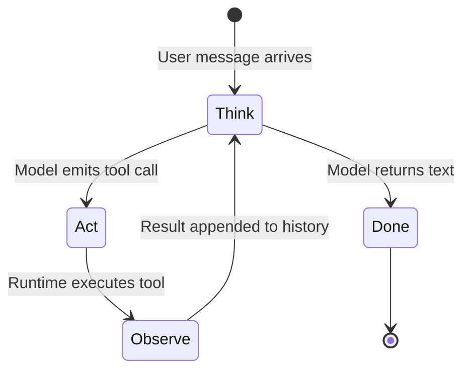

---
{"dg-publish":true,"permalink":"/software-engineering/11-ai-and-ml/llm/agents/agent-loop/"}
---


# Intro

The agent loop is the execution cycle that turns an LLM from a single-shot text generator into an autonomous problem solver. Instead of one prompt producing one response, the model runs in a loop: reason about the current state, call a tool, observe the result, then decide whether to continue or stop. This is the ReAct pattern (Reasoning + Acting), introduced by Yao et al. (ICLR 2023), and many production agent frameworks — Semantic Kernel, LangChain, AutoGen — use ReAct-like think-act-observe loops as their core execution model.

The loop works in four steps:

1. **Think** — the model receives the conversation history (including any prior tool results) and generates a reasoning trace. It decides what information it still needs or what action to take next.
2. **Act** — the model emits a structured tool call — a function name plus arguments — choosing from the [[Software Engineering/11 AI & ML/LLM/Agents/Tools\|tools]] provided in its schema.
3. **Observe** — the runtime executes the tool and appends the result to the conversation history as a tool-role message.
4. **Repeat** — the updated history goes back to the model. It either reasons and acts again (back to step 1) or returns a final text response to the user.



The critical insight from the ReAct paper: interleaving reasoning traces with tool use outperforms either approach alone. Chain-of-thought without tools hallucinates facts — the model fabricates answers from parametric memory when it should look them up. Tool use without reasoning cannot decompose complex goals into subgoals. On ALFWorld decision-making tasks, ReAct outperformed imitation learning and reinforcement learning baselines by 34% absolute success rate. The loop lets reasoning guide tool selection while tool outputs ground the reasoning in reality.

For the broader context of when an agent loop is the right choice versus simpler [[Software Engineering/11 AI & ML/LLM/Agents/Agents\|workflow patterns]], see the Agents hub page.

## How It Works in Practice

The loop maps directly to the chat completions API contract. Here is what happens at each step, concretely:

**Think.** The runtime sends the full chat history — system prompt, user messages, prior assistant messages, and tool results — plus the JSON schemas of all available tools. The model processes everything and generates a response.

**Act.** If the model's response contains `tool_calls` instead of plain text, the runtime extracts the function name and arguments. The model has decided it needs external data or a side effect before it can answer.

**Observe.** The runtime invokes the function, serializes the result, and appends it as a `tool`-role message in the chat history. The model never executes tools directly — it only sees the serialized result.

**Repeat.** The runtime sends the updated history back to the model. If the model responds with text and no tool calls, the loop terminates and the response reaches the user. If it responds with more tool calls, the cycle continues.

In Semantic Kernel (.NET), the loop is automated behind `FunctionChoiceBehavior.Auto()`:

```csharp
var builder = Kernel.CreateBuilder()
    .AddAzureOpenAIChatCompletion(deploymentName, endpoint, apiKey);
builder.Plugins.AddFromType<WeatherPlugin>("Weather");
var kernel = builder.Build();

var settings = new OpenAIPromptExecutionSettings
{
    FunctionChoiceBehavior = FunctionChoiceBehavior.Auto()
};

var history = new ChatHistory();
history.AddUserMessage("Should I bring an umbrella to Seattle today?");

// This single call runs the full Think-Act-Observe-Repeat loop internally
var response = await kernel.GetRequiredService<IChatCompletionService>()
    .GetChatMessageContentAsync(history, settings, kernel);
```

Behind `GetChatMessageContentAsync`, Semantic Kernel serializes all `[KernelFunction]` methods into JSON tool schemas, sends them with the chat history, invokes any requested functions, appends results, and repeats until the model returns a text response or hits the iteration cap.

The equivalent raw loop without framework abstraction:

```python
messages = [{"role": "user", "content": "Should I bring an umbrella to Seattle today?"}]

while True:
    response = client.chat.completions.create(
        model="gpt-4.1", messages=messages, tools=tools
    )
    choice = response.choices[0]

    if choice.finish_reason == "stop":
        print(choice.message.content)  # Final answer — loop ends
        break

    # Model wants to call tools — execute each one
    messages.append(choice.message)
    for tool_call in choice.message.tool_calls:
        result = execute_tool(tool_call.function.name, tool_call.function.arguments)
        messages.append({
            "role": "tool",
            "tool_call_id": tool_call.id,
            "content": json.dumps(result),
        })
    # Loop back — send updated history to model
```

Both examples implement the same four-step cycle. The framework version hides the loop; the raw version makes every step explicit.

## Pitfalls

### Infinite Loops and Tool Spam

The model enters a cycle where it repeatedly calls the same tool or alternates between two tools without making progress toward an answer. A production case documented by Hugo Nogueira: one agent run made 369 tool calls, consumed 9.7M tokens, and cost $2.74 — without ever reaching an answer. The model kept searching for information it had already retrieved because its reasoning trace lost track of prior observations.

**Why it happens**: as the context window fills with tool results, earlier reasoning traces fall outside the model's effective attention window. The model "forgets" what it already tried. Models also have no intrinsic sense of diminishing returns — they will keep trying if the prompt does not define a stop condition.

**Mitigation**: set a hard cap on loop iterations (Semantic Kernel's auto function-calling settings accept a maximum iteration count; LangGraph exposes `recursion_limit`). Add explicit stop instructions in the system prompt: "If you have called the same tool twice with the same arguments, stop and answer with what you have." Monitor tool call counts per request and alert on outliers.

### Token Explosion

Each loop iteration appends messages to the conversation history — the model's reasoning, the tool call, and the tool result. After 5–10 iterations, the accumulated context can reach thousands of tokens. Large tool responses — full API payloads, search results with multiple documents — accelerate this. Eventually the context window fills, and the model either truncates critical information or the API rejects the request.

**Why it happens**: tool results are appended verbatim without summarization. Developers return entire database records or full web pages when the model only needs a few fields.

**Mitigation**: keep tool return values compact — return only the fields the model needs. Set `max_tokens` on the model response to limit reasoning verbosity. For long-running agents, summarize or truncate older tool results before re-sending. Track cumulative token usage per loop iteration and terminate early if approaching the context limit.

### Hallucinated Tool Calls

The model invokes a function that does not exist, passes arguments that do not match the schema, or fabricates parameter values. This is especially common when tool schemas are ambiguous or when the model confuses similar function names across plugins.

**Why it happens**: tool schemas are sent as JSON descriptions — the model is predicting the next token, not reading documentation. Vague function names (`process`, `handle`) or under-specified parameter descriptions increase confusion. Complex nested schemas degrade argument accuracy.

**Mitigation**: use self-explanatory function names and explicit parameter descriptions. Validate tool call arguments against the schema before execution — reject and return a clear error message so the model can self-correct on the next iteration. Keep schemas flat and simple. Anthropic's SWE-bench agent team found that switching from relative to absolute file paths in tool parameters eliminated an entire class of hallucinated arguments.

## Questions

> [!QUESTION]- Why does the ReAct pattern outperform chain-of-thought reasoning alone for tasks requiring external knowledge?
> Chain-of-thought generates reasoning traces but has no mechanism to verify claims against external reality. When the model encounters a factual question it must rely on parametric memory, which produces confident but fabricated answers. ReAct interleaves reasoning with tool calls — the model can search, look up, or compute before continuing its chain. This grounds each step in real data, cutting hallucination. The original paper showed this on HotpotQA: CoT alone frequently hallucinated intermediate facts, while ReAct retrieved them. The tradeoff is latency and cost — each tool call adds a round trip and tokens.

> [!QUESTION]- What are the three most critical production safeguards for an agent loop?
> 1. **Iteration cap** — prevents infinite loops and cost runaway. Without a hard limit a confused agent loops indefinitely. Set per-request, not globally. 2. **Token budget tracking** — each iteration grows the context. Track cumulative tokens and terminate or summarize before hitting the window limit. Without this the model silently loses earlier context and quality degrades. 3. **Tool call validation** — validate function names and arguments against the schema before execution. A hallucinated tool call that passes through can trigger unintended side effects — database writes, payments, external API calls. Return errors to the model so it can self-correct.

> [!QUESTION]- When is a simple prompt chain preferable to an agent loop?
> When the task decomposes into a fixed, predictable sequence of steps. A prompt chain — step A then validate then step B then validate then step C — is cheaper, faster, more debuggable, and produces more consistent results. The agent loop adds value only when you cannot predict the steps in advance: the model must decide dynamically which tools to call and in what order based on intermediate results. Most production systems that call themselves agents are actually prompt chains, and that is the right choice for the majority of use cases.

## References

- [ReAct: Synergizing Reasoning and Acting in Language Models — Yao et al. ICLR 2023](https://arxiv.org/abs/2210.03629)
- [Function calling with chat completion — Semantic Kernel (Microsoft Learn)](https://learn.microsoft.com/semantic-kernel/concepts/ai-services/chat-completion/function-calling/)
- [Planning and the automatic function calling loop — Semantic Kernel (Microsoft Learn)](https://learn.microsoft.com/semantic-kernel/concepts/planning)
- [Function calling guide — OpenAI](https://platform.openai.com/docs/guides/function-calling)
- [Building Effective Agents — Anthropic Engineering](https://www.anthropic.com/engineering/building-effective-agents)
- [ReAct Agent Pattern with production safeguards — Agent Patterns](https://www.agentpatterns.tech/en/agent-patterns/react-agent)
- [The 100th Tool Call Problem — production failure analysis (Hugo Nogueira)](https://www.hugo.im/posts/100th-tool-call-problem)
- [ReAct agent from scratch — LangGraph](https://langchain-ai.github.io/langgraph/how-tos/react-agent-from-scratch-functional/)

<!-- whats-next:start -->

---

> [!note] Whats next
> **Parent**
>  [[Software Engineering/11 AI & ML/LLM/LLM\|LLM]]
>
> **Pages**
> - [[Software Engineering/11 AI & ML/LLM/Agents/Model Context Protocol\|Model Context Protocol]]
> - [[Software Engineering/11 AI & ML/LLM/Agents/Multi-Agentic Systems\|Multi-Agentic Systems]]
> - [[Software Engineering/11 AI & ML/LLM/Agents/Tools\|Tools]]
<!-- whats-next:end -->
