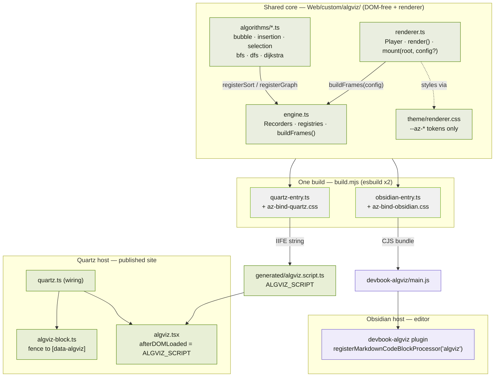
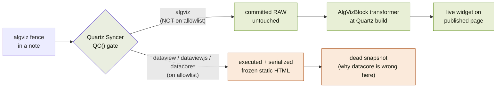
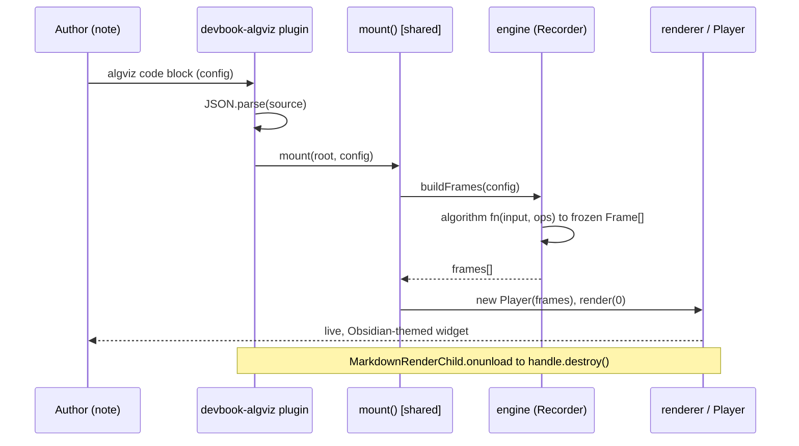
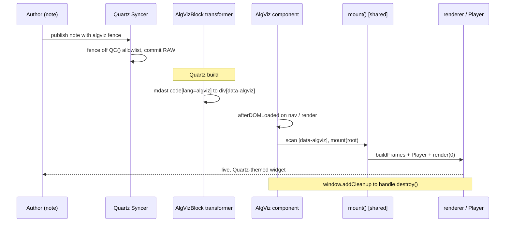
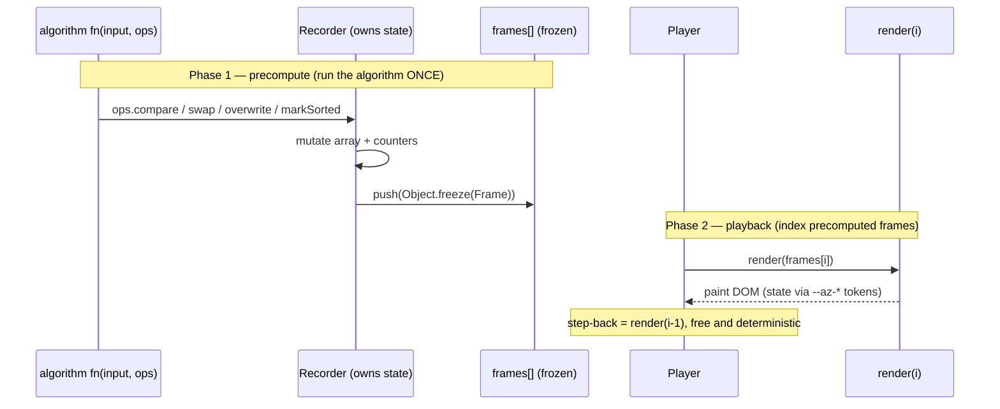

# AlgViz — components & interactions

How the algorithm-visualizer framework is split into components, and how one `algviz`
fence becomes a live widget in **both** Obsidian (editor) and Quartz (published site).

> One shared, DOM-free engine + renderer. Two thin host adapters. Two theme bindings.
> Adding an algorithm = one `fn(input, ops)` file + one `register` call.

See the full design + phased plan in the companion artifact; this doc is the visual map.

---

## 1 · Component map

Everything under `Web/custom/algviz/` is the **shared core** — it has no host knowledge.
Each host adapter is a thin wrapper that calls the same `mount()`.

| Component | Layer | Responsibility |
|---|---|---|
| `engine.ts` | core | Frame types, Recorders (sole frame authors), registries, `buildFrames()` |
| `algorithms/*.ts` | core | One file per algorithm — the extension surface |
| `renderer.ts` | core | The only DOM code: `Player`, `render()`, `mount(root, config?)` → `{destroy()}` |
| `theme/*.css` | core | `renderer.css` (tokens only) + one binding sheet per host |
| `build.mjs` | build | Emits `ALGVIZ_SCRIPT` (IIFE) **and** Obsidian `main.js` atomically |
| `algviz-block.ts` | Quartz | Transformer: rewrites the fence into a `[data-algviz]` element |
| `algviz.tsx` | Quartz | Component: ships `ALGVIZ_SCRIPT` + CSS, hydrates on nav |
| `devbook-algviz` | Obsidian | Plugin: registers the `algviz` code-block processor |

---

## 2 · Why one fence is live on both hosts

The keystone. Quartz Syncer only **executes-and-freezes** a fixed allowlist of fence
languages (`QC()` in its bundle). `algviz` isn't on it, so the fence is committed **raw**
— free for the Quartz transformer to hydrate. Datacore/DataviewJS *are* on the allowlist,
which is exactly why they'd publish a dead snapshot.

---

## 3 · Runtime — Obsidian (editor)

The plugin intercepts the code block directly and mounts the shared engine, cleaning up
via `MarkdownRenderChild` so no Player timers leak across re-renders.

---

## 4 · Runtime — Quartz (published site)

Publish-time transform + a client component that re-hydrates on SPA navigation (mirroring
`explorer-icons.tsx`: `nav`/`render` listeners + `window.addCleanup`).

Both hosts converge on the **same `mount()`** — the only difference is where the config
comes from (explicit arg in Obsidian, a `data-*` marker in Quartz) and which theme binding
was compiled in.

---

## 5 · The ops / Recorder contract

The interaction that makes "add an algorithm = one function" work. The algorithm never
builds a frame; it only calls `ops.*`. The Recorder owns state and is the sole frame
author, so frames are **precomputed once** — which is what makes step-back free and
deterministic.

---

### Legend

- 🟢 **Green** — Quartz / published path (DevBook's `--secondary`)
- 🟣 **Purple** — Obsidian / editor path (Obsidian's brand hue)
- ⚪ **Grey/olive** — shared, host-blind core and the single build

*Companion: the full design doc + 7-phase build plan (see the AlgViz artifact). The two
runnable prototypes live beside this file: `sorting.html`, `graph.html`.*
