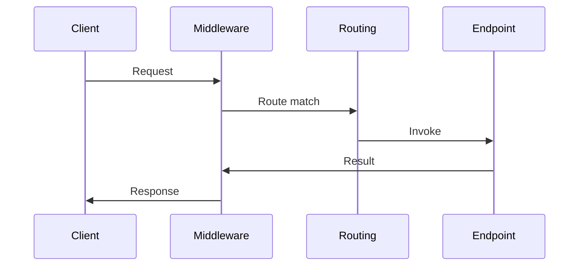

---
{"dg-publish":true,"permalink":"/software-engineering/01-programming/net/asp-net-web-api/asp-net-web-api/","tags":["FolderNote"],"noteIcon":"1"}
---


# Intro

ASP.NET Core Web API runs each HTTP request through a middleware pipeline, then dispatches it to an endpoint (a Minimal API handler or a controller action).
In practice, you design a Web API by choosing where logic lives (middleware vs filters vs endpoint code), how you validate and map inputs, and how you handle errors and auth.
This matters because most production issues come from cross-cutting concerns: auth, validation, versioning, serialization, and observability.

### Example



### Example

Minimal API:

```csharp
var app = WebApplication.CreateBuilder(args).Build();

app.MapGet("/health", () => Results.Ok(new { status = "ok" }));

app.Run();
```

Controller style:

```csharp
[ApiController]
[Route("api/orders")]
public sealed class OrdersController : ControllerBase
{
    [HttpGet("{id}")]
    public ActionResult<OrderDto> GetById(string id) => Ok(new OrderDto(id));
}
```
 
## Questions

> [!QUESTION]- What is mapping, why is it needed, and how can it be implemented?
> Mapping is the transformation of data from one shape/type to another (for example, Domain Entity -> DTO -> API response model).
> It is used to decouple layers, hide internal details, enforce API contracts, prevent over-posting, and shape data for clients.
> Typical implementation options:
> - manual mapping (constructors, factory methods, extension methods)
> - mapping libraries (AutoMapper, Mapster)
> - code generation / source generators for mappings

> [!QUESTION]- What are serialization and deserialization?
> Serialization converts an in-memory object graph into a format that can be stored or transmitted (for example, JSON text or a binary payload).
> Deserialization is the reverse process: converting that stored/transmitted representation back into objects.
> Common uses: API payloads, persistence, caching, messaging.

> [!QUESTION]- What is JSON and why is it used?
> JSON (JavaScript Object Notation) is a lightweight text data format based on objects (name/value pairs) and arrays.
> It is widely used for data interchange, especially in HTTP APIs, because it is human-readable, language-agnostic, and easy to parse.
> In .NET, JSON is commonly handled with `System.Text.Json` (built-in) or Newtonsoft.Json.

> [!QUESTION]- Where should authentication and authorization live in an ASP.NET Core API?
> Put authentication and authorization in the pipeline so endpoints can assume an authenticated principal.
> Use middleware for auth and use endpoint metadata and policies to decide access per endpoint.

> [!QUESTION]- When do you choose middleware over an endpoint filter?
> Choose middleware for cross-cutting concerns that apply broadly (logging, auth, exception handling).
> Choose endpoint filters for endpoint scoped behavior and validation around Minimal APIs.

## Links

- [ASP.NET Core web API docs](https://learn.microsoft.com/en-us/aspnet/core/web-api/?view=aspnetcore-8.0)
- [ASP.NET Core middleware](https://learn.microsoft.com/aspnet/core/fundamentals/middleware/?view=aspnetcore-10.0)
- [Routing in ASP.NET Core](https://learn.microsoft.com/aspnet/core/fundamentals/routing?view=aspnetcore-10.0)
- [Filters in ASP.NET Core](https://learn.microsoft.com/aspnet/core/mvc/controllers/filters?view=aspnetcore-10.0)
- [Minimal API filters](https://learn.microsoft.com/aspnet/core/fundamentals/minimal-apis/min-api-filters?view=aspnetcore-10.0)
- [OWASP API Security Top 10 2023](https://owasp.org/API-Security/editions/2023/en/0x11-t10/)

<!-- whats-next:start -->

---

> [!note] Whats next
> **Parent**
>  [[Software Engineering/01 Programming/NET/NET\|NET]]
>
> **Pages**
> - [[Software Engineering/01 Programming/NET/ASP.NET Web API/Middlewares\|Middlewares]]
<!-- whats-next:end -->
