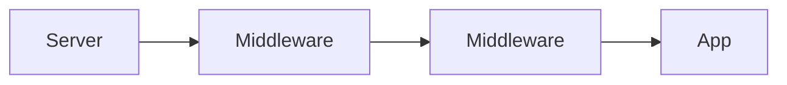

---
{"dg-publish":true,"permalink":"/software-engineering/01-programming/net/other/owin/","noteIcon":"1"}
---


# Intro

OWIN (Open Web Interface for .NET) is a specification that decouples web servers from .NET web applications via a simple request environment and a middleware pipeline.
It was most visible in the Katana stack and is important mainly for understanding legacy .NET web hosting.
Modern ASP.NET Core uses a similar middleware concept but is not OWIN.

## Deeper Explanation

### Mental Model

OWIN app is a chain of middleware that receives an environment and produces a response.



### Example

Classic OWIN startup:

```csharp
public sealed class Startup
{
    public void Configuration(IAppBuilder app)
    {
        app.Use(async (context, next) =>
        {
            await next();
        });

        app.Run(context =>
        {
            context.Response.ContentType = "text/plain";
            return context.Response.WriteAsync("Hello");
        });
    }
}
```

## Questions

> [!QUESTION]- What problem did OWIN solve?
> It standardized the boundary between server and app so you can swap servers and compose middleware.

> [!QUESTION]- Is ASP.NET Core OWIN?
> No.
> It has a similar pipeline model, but it uses different abstractions and hosting.

## Links

- [OWIN specification](https://owin.org/)
- [Microsoft OWIN and Katana overview](https://learn.microsoft.com/aspnet/aspnet/overview/owin-and-katana/)
- [ASP.NET Core middleware](https://learn.microsoft.com/aspnet/core/fundamentals/middleware/?view=aspnetcore-8.0)

<!-- whats-next:start -->

---

> [!note] Whats next
> **Parent**
>  [[Software Engineering/01 Programming/NET/NET\|NET]]
>
> **Pages**
> - [[Software Engineering/01 Programming/NET/Other/SignalR\|SignalR]]
<!-- whats-next:end -->
