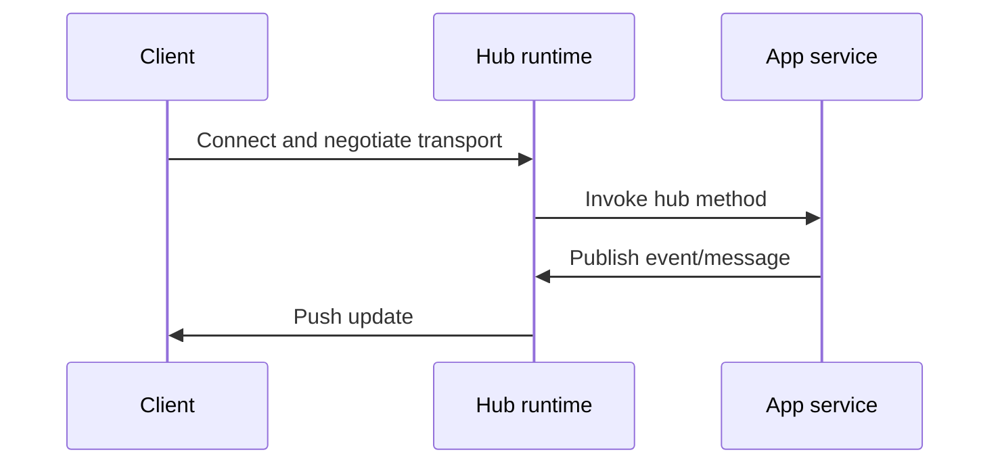

---
{"dg-publish":true,"permalink":"/software-engineering/01-programming/net/other/signal-r/"}
---


# Intro

SignalR is ASP.NET Core's real-time communication framework for bidirectional server/client messaging over persistent connections. It is the default choice when the server must push updates immediately (chat, live dashboards, collaborative workflows, notifications) without polling-heavy architectures. SignalR hides transport negotiation details behind hubs, but production success still depends on scaling, connection lifecycle handling, and clear authorization boundaries.

## How It Works

### Mental Model



SignalR negotiates the best available transport (WebSockets first, then fallback options). Hub methods are invoked per call on transient hub instances, and outbound messages are routed through `Clients.*` targets (`All`, `User`, `Group`, etc.).

### Example

Hub:

```csharp
public sealed class ChatHub : Hub
{
    public async Task Send(string message)
    {
        await Clients.All.SendAsync("message", message);
    }
}
```

Register in ASP.NET Core pipeline:

```csharp
builder.Services.AddSignalR();

var app = builder.Build();
app.MapHub<ChatHub>("/hubs/chat");
app.Run();
```

## Pitfalls

- Assuming hub instances are stateful leads to lost data because hubs are transient per invocation; keep connection/session state in `Context.Items` or external stores.
- Skipping `await` on `SendAsync` can drop messages when hub execution completes before send operations finish.
- Treating groups as authorization boundaries is unsafe: groups are routing constructs, not security policy enforcement.
- Multi-node deployments fail unpredictably without a scale-out plan (Azure SignalR Service or backplane) and correct session-affinity assumptions.

## Tradeoffs

- SignalR vs polling: SignalR gives lower latency and better network efficiency for frequent updates, while polling is simpler for low-frequency/eventually-consistent scenarios.
- Azure SignalR Service vs self-managed backplane: managed service reduces operational burden and sticky-session complexity, while self-managed options provide more infrastructure control.
- JSON vs MessagePack protocol: JSON is easier to debug and interoperate with, while MessagePack reduces payload size for high-throughput workloads.

## Questions

> [!QUESTION]- When is SignalR a good fit?
> - Use SignalR when clients need server-pushed updates with low latency (chat, collaboration, live telemetry).
> - It is most valuable when update frequency is high enough that polling wastes bandwidth or increases staleness.
> - If updates are rare and latency tolerance is high, simpler HTTP polling can be cheaper to operate.

> [!QUESTION]- What is the first scaling problem you will hit?
> - Cross-node message fan-out: messages sent on one server do not automatically reach clients connected to another node.
> - Plan scale-out early with Azure SignalR Service or a supported backplane, then validate routing under load tests.
> - Also validate sticky-session requirements for your chosen topology and transport strategy.

> [!QUESTION]- Why are SignalR groups not enough for authorization?
> - Groups control message routing, not permission checks.
> - Membership can change/rejoin over reconnect paths, so relying on groups alone risks privilege drift.
> - Enforce security with authentication and policy/role-based authorization on hub methods.

## Links

- [ASP.NET Core SignalR](https://learn.microsoft.com/aspnet/core/signalr/introduction?view=aspnetcore-10.0) - Official architecture and transport overview.
- [Use hubs in SignalR for ASP.NET Core](https://learn.microsoft.com/aspnet/core/signalr/hubs?view=aspnetcore-10.0) - Hub lifecycle, targeting APIs, and error handling.
- [Scale ASP.NET Core SignalR](https://learn.microsoft.com/aspnet/core/signalr/scale?view=aspnetcore-10.0) - Scale-out models, sticky sessions, and hosting constraints.
- [Authentication and authorization in SignalR](https://learn.microsoft.com/aspnet/core/signalr/authn-and-authz?view=aspnetcore-10.0) - Auth flows, token handling, and security rules.
- [Scaling SignalR at production scale (Ably)](https://ably.com/topic/scaling-signalr) - Practical scaling tradeoffs and operational pitfalls.

<!-- whats-next:start -->

---

> [!note] Whats next
> **Parent**
>  [[Software Engineering/01 Programming/NET/NET\|NET]]
>
> **Pages**
> - [[Software Engineering/01 Programming/NET/Other/OWIN\|OWIN]]
<!-- whats-next:end -->
