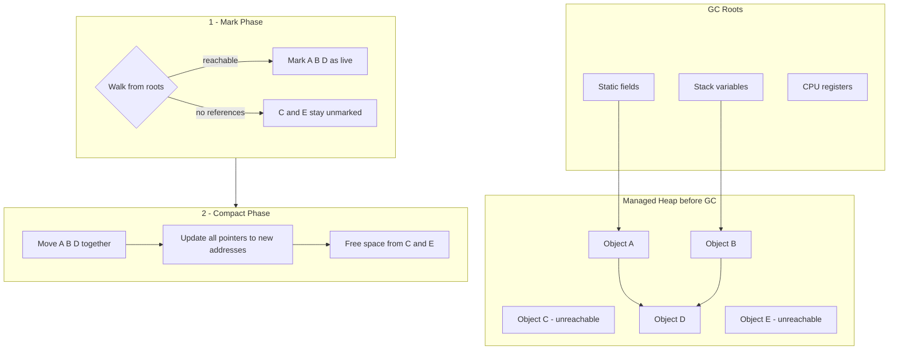
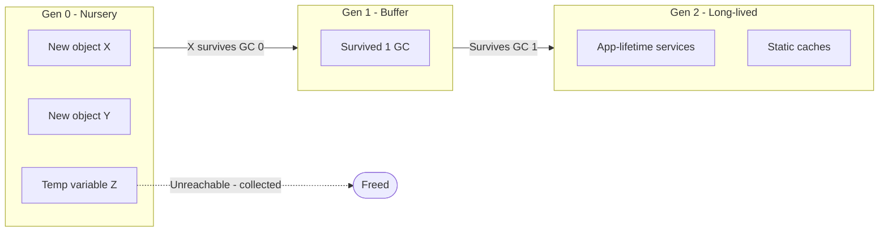

---
{"dg-publish":true,"permalink":"/software-engineering/01-programming/net/runtime/garbage-collector/"}
---

# Intro

The Garbage Collector (GC) in the Common Language Runtime (CLR) is an automatic memory manager that controls memory allocation and reclamation for your application. Each time a new object is created, the runtime allocates memory for it from the managed heap. As long as address space is available in the managed heap, the runtime continues allocating space for new objects.

However, memory is not infinite. Eventually, the garbage collector must perform a collection to free some memory. The GC's optimization engine determines the best time to run a collection based on allocation activity. When the GC runs, it examines objects on the managed heap that are no longer used by the application and performs the operations required to reclaim their memory.

The garbage collector provides the following benefits:

- Frees developers from having to manually free memory.
- Efficiently allocates objects on the managed heap.
- Reclaims objects that are no longer used, clears their memory, and keeps memory available for future allocations.
- Managed objects automatically start with zeroed memory, so constructors do not have to initialize every data field.
- Provides memory safety by ensuring that one object cannot use memory allocated for another object.

The .NET garbage collector does not allocate or free unmanaged memory. The pattern used to deterministically release resources is the `dispose` pattern. The `dispose` pattern is used for objects that implement the `IDisposable` interface.

## Managed heap

After the garbage collector is initialized, the CLR allocates a segment of memory for storing and managing objects. This memory is called the managed heap, as opposed to the operating system's native heap.

Each managed process has its own managed heap. All threads in the process allocate memory for objects from the same heap.

To reserve memory, the garbage collector calls the Windows function [VirtualAlloc](https://learn.microsoft.com/ru-ru/windows/desktop/api/memoryapi/nf-memoryapi-virtualalloc) and reserves one memory segment at a time for managed applications. The GC also reserves additional segments as needed and releases segments back to the operating system (after clearing any objects) by calling [Windows VirtualFree](https://learn.microsoft.com/ru-ru/windows/desktop/api/memoryapi/nf-memoryapi-virtualfree).

> [!TIP]
> 🚨 The size of segments allocated by the garbage collector is implementation-dependent and can change at any time, including in periodic updates. An application should not make assumptions about the size of a particular segment, rely on it, or attempt to tune the amount of memory available for segment allocations.

The fewer objects allocated on the heap, the less work the garbage collector has to do. When allocating objects, avoid rounded-up sizes that exceed actual needs; for example, do not allocate 32 bytes when you only need 15 bytes.

When a garbage collection is triggered, it reclaims memory occupied by unused objects. The reclamation process compacts live objects so they move together and dead space is removed, reducing the size of the heap. This process helps ensure that objects allocated together stay together on the managed heap, preserving locality.

The level of GC activity (frequency and duration of collections) depends on the number of allocations and the amount of memory that remains on the managed heap.

You can think of the heap as consisting of two heaps: the [Large Object Heap](https://learn.microsoft.com/ru-ru/dotnet/standard/garbage-collection/large-object-heap) (LOH) and the Small Object Heap (SOH). The LOH contains objects of size 85,000 bytes and larger, typically arrays. In rare cases, an instance object can also be very large.

> [!TIP]
> You can [**configure the threshold size**](https://learn.microsoft.com/ru-ru/dotnet/core/runtime-config/garbage-collector#large-object-heap-threshold) for objects placed on the Large Object Heap.

## Reclaiming memory

The GC optimization mechanism determines the best time to run a collection based on allocation activity. When the GC runs, it reclaims memory allocated for objects that are no longer used by the application. It determines which objects are no longer used by analyzing the application's *roots*. Application roots include static fields, local variables on thread stacks, CPU registers, GC handles, and the finalization queue. Each root either references an object on the managed heap or has a NULL value. The GC can ask the rest of the runtime for these roots. The GC uses this list to build a graph containing all objects reachable from the roots.

Objects that are not in the graph are unreachable from the application's roots. The GC considers unreachable objects to be garbage and reclaims the memory allocated for them. During a collection, the GC inspects the managed heap, looking for blocks of address space occupied by unreachable objects. When it finds unreachable objects, it uses memory copying to compact reachable objects in memory, freeing the address space previously occupied by unreachable objects. After compaction, the GC updates references so that application roots point to the new locations of objects. It also sets the managed heap pointer to the position after the last reachable object.

### Conditions that trigger garbage collection

Garbage collection occurs when one of the following conditions is met:

- There is not enough physical memory in the system. The available memory size is determined by a low-memory notification from the OS or by a low-memory condition as indicated by the host.
- The amount of memory used by objects allocated on the managed heap exceeds an acceptable threshold. This threshold is continuously adjusted during process execution.
- The [GC.Collect](https://learn.microsoft.com/ru-ru/dotnet/api/system.gc.collect) method is called. In almost all cases you should not call this method, because the GC runs automatically. It is primarily used for special scenarios and testing.

## GC execution model

### Generational Heap

Most objects die young in Gen 0 and never promote. Gen 2 collection is expensive and only runs under memory pressure.

1. **Mark phase - marking live objects**
    1. **Start of garbage collection:** The garbage collector starts from a set of references known as **roots**. These are memory locations that, for various reasons, must always be accessible and that contain references to objects created by the application. This can include CPU registers, thread call stacks, static variables, and other memory locations holding object references. The GC marks these objects as "live".
    2. **Graph walk and marking:** The GC walks all objects referenced by roots, marking them as "live". It then recursively repeats this process for objects referenced by already-marked objects until it has visited all objects reachable from the roots.
    3. **"Live" object criteria:** An object is considered "live" if it is referenced from the root set or from other "live" objects. The GC treats an object as a reference type if it has a field that contains a reference to another object.
2. **Move phase**
    1. **Updating references to compacted objects:** After the GC determines which objects are "live", the move phase begins. In this phase, the GC moves "live" objects so they occupy a contiguous region of memory. During this process, the GC updates all references to these objects so they point to the new memory addresses after the move.
3. **Compact phase**
    1. **Freeing space and compacting survivors:** After moving "live" objects into a contiguous memory block, the GC frees memory occupied by unused objects. The freed space can then be used for new objects. The GC also compacts surviving objects to reduce memory fragmentation.

## Root objects

To understand how the garbage collector decides when an object is no longer needed, you need to know what *application roots* are. Simply put, a *root* is a memory slot that contains a reference to an object located on the heap.

Strictly speaking, roots can include:

- References to global objects (although they are not allowed in C#, CIL code can place global objects
- References to any static objects or static fields.
- References to local objects within the application's codebase.
- References to object parameters passed to methods.
- References to an object awaiting *finalization*.
- Any CPU registers that reference an object.

## Object generations

When trying to find unreachable objects, the CLR does not literally inspect every object on the heap each time. Obviously, that would take a lot of time, especially in large projects.

To optimize the process, each object on the heap belongs to a specific *"generation"*.

The idea behind generations is fairly simple:

> The longer an object stays on the heap, the more likely it is to remain there.
> 

For example, a class defined in the main window of a desktop application may remain in memory until the program exits. On the other hand, an object that was allocated very recently (for example, one that is only in method scope) is likely to become unreachable fairly quickly. Based on these assumptions, each object on the heap belongs to:

- *Generation 0.* Identifies a new object that has just been allocated and has not yet survived a garbage collection.
- *Generation 1.* Identifies an object that has already survived one garbage collection.
- *Generation 2.* Identifies an object that has survived more than one garbage collection.

The GC first analyzes all objects that belong to generation 0. If, after collecting Gen 0, there is enough memory, all surviving objects are promoted to Gen 1. If Gen 0 has been collected but additional space is still required, the GC will also collect Gen 1. Objects that survive Gen 1 become Gen 2 objects. If the GC still needs memory, it will perform a Gen 2 collection. Since there are no generations above Gen 2, the generation of surviving objects does not increase further. From this, you can conclude that newer objects tend to be collected faster than older ones.

## Questions

> [!QUESTION]- What is the Garbage Collector? Why do we need it? How does it work (high level)?
> The GC is the .NET runtime's automatic memory manager for managed objects. It periodically finds objects that are no longer reachable from GC roots, reclaims their memory, and (on the SOH) typically compacts surviving objects to reduce fragmentation.
> The GC is generational (Gen 0/1/2): most collections are small and fast, while full collections are less frequent.

> [!QUESTION]- What are the Small Object Heap (SOH) and the Large Object Heap (LOH)?
> The SOH stores most objects (typically smaller than ~85,000 bytes) and is compacted regularly.
> The LOH stores large allocations (typically 85,000 bytes and above, often large arrays). It is collected with Gen 2 and can become fragmented; compaction behavior differs from the SOH and is more expensive.

> [!QUESTION]- What is a memory leak?
> Memory that is no longer needed but cannot be reclaimed. In .NET this can be caused by keeping objects reachable (managed leaks) or by not releasing unmanaged resources.
> See also the Memory Leaks note in this runtime section.

## Links

- [Fundamentals of garbage collection (Microsoft Learn)](https://learn.microsoft.com/en-us/dotnet/standard/garbage-collection/fundamentals) — official reference covering managed heap, generations, LOH, and collection triggers.
- [Garbage collection and performance (Microsoft Learn)](https://learn.microsoft.com/en-us/dotnet/standard/garbage-collection/performance) — guidance on reducing GC pressure: allocation patterns, LOH fragmentation, and server vs workstation GC modes.
- [.NET GC internals deep-dive (Maoni Stephens, habr.com)](https://habr.com/ru/articles/590475/) — practitioner deep-dive into GC internals, generation promotion, and tuning strategies from a .NET runtime engineer.

<!-- whats-next:start -->

---

> [!note] Whats next
> **Parent**
>  [[Software Engineering/01 Programming/NET/NET\|NET]]
>
> **Pages**
> - [[Software Engineering/01 Programming/NET/Runtime/Common Language Runtime\|Common Language Runtime]]
> - [[Software Engineering/01 Programming/NET/Runtime/Memory Leaks\|Memory Leaks]]
<!-- whats-next:end -->
