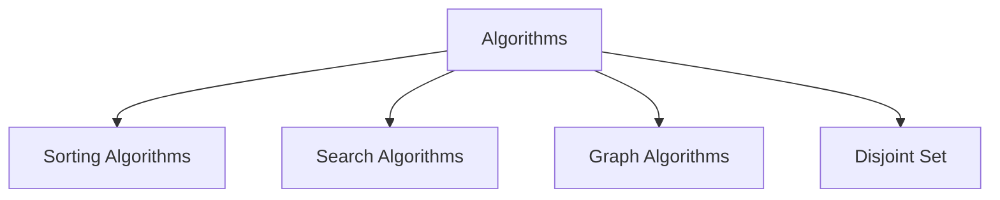

---
{"dg-publish":true,"permalink":"/software-engineering/02-computer-science/algorithms/algorithms/","tags":["FolderNote"],"noteIcon":"1"}
---

# Intro

Algorithms are step-by-step procedures for solving problems with predictable behavior as input grows. In practice, algorithm choice is a tradeoff between runtime, memory usage, implementation complexity, and failure modes under real workloads.

Concrete example: for repeated membership checks in a large list of ids, sorting once and using binary search gives fast lookups with low memory overhead. For one-off checks on unsorted data, a linear scan is usually simpler and can be faster overall because there is no preprocessing cost.

## Diagram

## Questions

> [!QUESTION]- What is an algorithm? How is its efficiency measured?
> - An algorithm is a finite, ordered set of steps that transforms input into the required output.
> - Time complexity describes how runtime grows as input size increases.
> - Space complexity describes extra memory needed as input grows.
> - Big O notation is used to compare growth classes independent of hardware details.
> - Why it matters: complexity awareness helps avoid implementations that fail under production scale.

## Links

- [Big O notation (Wikipedia)](https://en.wikipedia.org/wiki/Big_O_notation)
- [Algorithm design and analysis (MIT OpenCourseWare)](https://ocw.mit.edu/courses/6-006-introduction-to-algorithms-spring-2020/)
- [Nearly all binary searches and mergesorts are broken](https://research.google/blog/extra-extra-read-all-about-it-nearly-all-binary-searches-and-mergesorts-are-broken/)

<!-- whats-next:start -->

---

> [!note] Whats next
> **Parent**
>  [[Software Engineering/02 Computer Science/02 Computer Science\|02 Computer Science]]
>
> **Topics**
> - [[Software Engineering/02 Computer Science/Algorithms/Disjoint Set/Disjoint Set\|Disjoint Set]]
> - [[Software Engineering/02 Computer Science/Algorithms/Graph Algorithms/Graph Algorithms\|Graph Algorithms]]
> - [[Software Engineering/02 Computer Science/Algorithms/Search Algorithms/Search Algorithms\|Search Algorithms]]
> - [[Software Engineering/02 Computer Science/Algorithms/Sorting Algorithms/Sorting Algorithms\|Sorting Algorithms]]
<!-- whats-next:end -->
