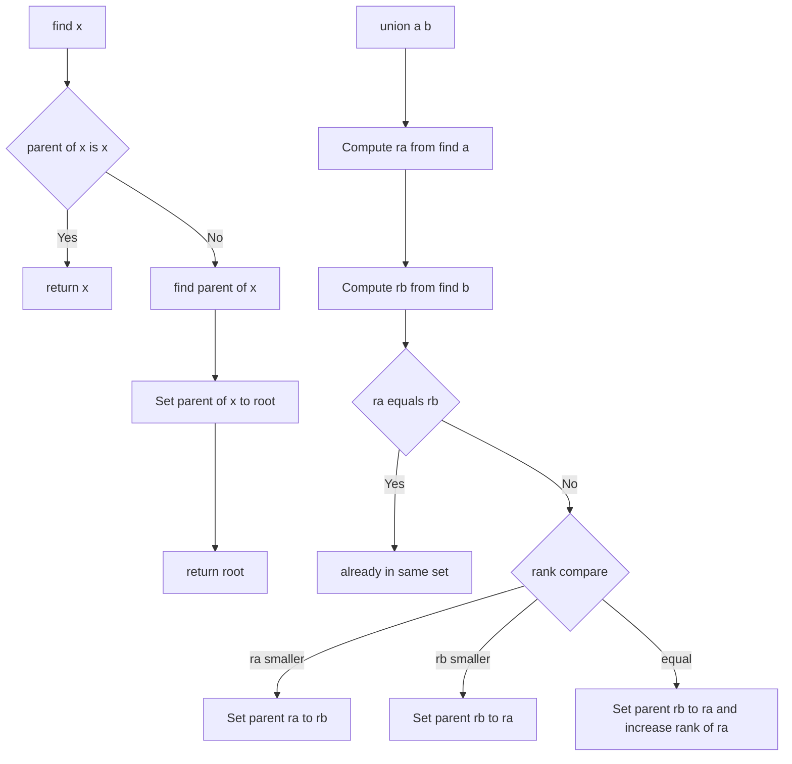

---
{"dg-publish":true,"permalink":"/software-engineering/02-computer-science/algorithms/disjoint-set/disjoint-set-union-find/"}
---

# Intro

Disjoint Set Union-Find (DSU) is a data structure that tracks a collection of elements partitioned into disjoint (non-overlapping) sets. It supports two operations efficiently: `find(x)` — which set does element x belong to? — and `union(a, b)` — merge the sets containing a and b. With two optimizations (union by rank + path compression), both operations run in near-constant amortized time O(α(n)), where α is the inverse Ackermann function — effectively O(1) for any practical input size.

DSU is the backbone of Kruskal's minimum spanning tree algorithm and appears in network connectivity, image segmentation, and cycle detection.

## How It Works

Each element starts as its own set, represented as a tree where each node points to its parent. The root of a tree is the representative (canonical element) of its set.

**`find(x)`** — walk up the parent chain until reaching the root. With path compression, rewire every visited node to point directly to the root, flattening the tree for future queries.

**`union(a, b)`** — find the roots of both elements. If different, attach one tree under the other. With union by rank, attach the shorter tree under the taller one to keep trees flat.



## C# Implementation

```csharp
public class DisjointSet
{
    private readonly int[] _parent;
    private readonly int[] _rank;

    public DisjointSet(int n)
    {
        _parent = Enumerable.Range(0, n).ToArray(); // each element is its own root
        _rank = new int[n];
    }

    public int Find(int x)
    {
        if (_parent[x] != x)
            _parent[x] = Find(_parent[x]); // path compression
        return _parent[x];
    }

    public bool Union(int a, int b)
    {
        int ra = Find(a), rb = Find(b);
        if (ra == rb) return false; // already in the same set

        // Union by rank: attach smaller tree under larger
        if (_rank[ra] < _rank[rb])      (ra, rb) = (rb, ra);
        _parent[rb] = ra;
        if (_rank[ra] == _rank[rb])     _rank[ra]++;
        return true;
    }

    public bool Connected(int a, int b) => Find(a) == Find(b);
}
```

## Application — Kruskal's MST

Kruskal's algorithm builds a minimum spanning tree by greedily adding the cheapest edge that does not form a cycle. DSU detects cycles in O(α(n)):

```csharp
public static List<(int u, int v, int w)> KruskalMST(
    int n,
    List<(int u, int v, int w)> edges)
{
    edges.Sort((a, b) => a.w.CompareTo(b.w)); // sort by weight
    var dsu = new DisjointSet(n);
    var mst = new List<(int, int, int)>();

    foreach (var (u, v, w) in edges)
    {
        if (dsu.Union(u, v)) // false if u and v are already connected
            mst.Add((u, v, w));
        if (mst.Count == n - 1) break; // MST complete
    }
    return mst;
}
```

## Complexity

| Operation | Without optimizations | With path compression + union by rank |
|-----------|----------------------|---------------------------------------|
| `find` | O(n) worst case | O(α(n)) amortized ≈ O(1) |
| `union` | O(n) worst case | O(α(n)) amortized ≈ O(1) |
| Space | O(n) | O(n) |

α(n) is the inverse Ackermann function — it grows so slowly that α(n) ≤ 4 for any n that fits in the observable universe.

## Questions

> [!QUESTION]- What is path compression and why does it matter?
> During `find(x)`, path compression rewires every node on the path from x to the root to point directly to the root. This flattens the tree over time, making future `find` calls on those nodes O(1). Without it, repeated `find` on a deep tree is O(n) per call.
> Cost: a small constant overhead per `find` call to update parent pointers — negligible in practice.

> [!QUESTION]- What is union by rank and how does it complement path compression?
> Union by rank attaches the tree with smaller rank (approximate height) under the tree with larger rank. This prevents the tree from growing tall, bounding the height at O(log n) before path compression kicks in. Together, the two optimizations achieve O(α(n)) amortized time.
> Without union by rank, path compression alone gives O(log n) amortized; without path compression, union by rank alone gives O(log n) worst case.

> [!QUESTION]- How does DSU detect cycles in a graph?
> Before adding an edge (u, v), call `find(u)` and `find(v)`. If they return the same root, u and v are already in the same connected component — adding the edge would create a cycle. If different, call `union(u, v)` to merge the components.

## References

- [Disjoint-set data structure (Wikipedia)](https://en.wikipedia.org/wiki/Disjoint-set_data_structure) — formal description, proof of O(α(n)) amortized complexity, and history.
- [DSU / Union-Find (cp-algorithms)](https://cp-algorithms.com/data_structures/disjoint_set_union.html) — practical implementation guide with path compression, union by rank, and applications including Kruskal's MST and offline LCA.
- [Kruskal's algorithm (cp-algorithms)](https://cp-algorithms.com/graph/mst_kruskal.html) — MST construction using DSU with worked examples.

<!-- whats-next:start -->

---

> [!note] Whats next
> **Parent**
>  [[Software Engineering/02 Computer Science/Algorithms/Algorithms\|Algorithms]]
>
<!-- whats-next:end -->
