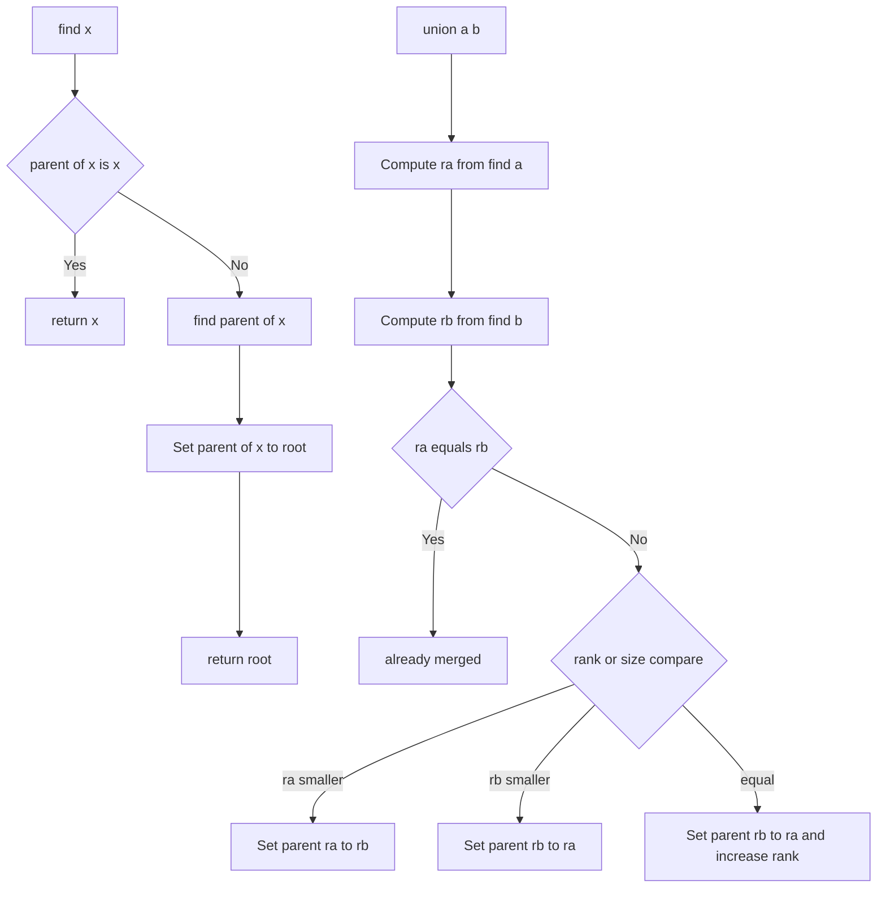

---
{"dg-publish":true,"permalink":"/software-engineering/02-computer-science/algorithms/disjoint-set/disjoint-set-union-find/","noteIcon":""}
---

# Intro

## Deeper Explanation

## Diagram

## Questions

> [!QUESTION]- What is path compression?
> During find(x), path compression rewires nodes on the path from x to the root to point directly to the root. This flattens the tree over time and makes future operations faster.

## Links

- [Disjoint-set data structure (Wikipedia)](https://en.wikipedia.org/wiki/Disjoint-set_data_structure)
- [DSU / Union-Find (cp-algorithms)](https://cp-algorithms.com/data_structures/disjoint_set_union.html)

<!-- whats-next:start -->

---

> [!note] Whats next
> **Parent**
>  [[Software Engineering/02 Computer Science/Algorithms/Algorithms\|Algorithms]]
>
<!-- whats-next:end -->
