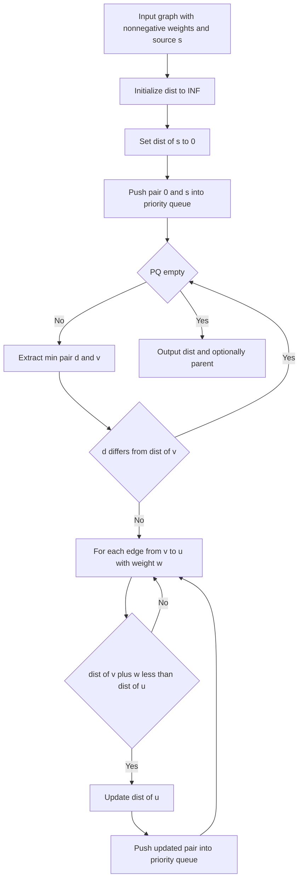

---
{"dg-publish":true,"permalink":"/software-engineering/02-computer-science/algorithms/graph-algorithms/dijkstra/","noteIcon":""}
---

# Intro

## Deeper Explanation

## Diagram

## Questions

> [!QUESTION]- Why does Dijkstra require non-negative weights?
> The algorithm is greedy: once a vertex is extracted as the current minimum, its distance is assumed final. Negative edges can later produce a shorter path to an already-finalized vertex, so the greedy step becomes incorrect (use Bellman-Ford for graphs with negative edges).

## Links

- [Dijkstra's algorithm (Wikipedia)](https://en.wikipedia.org/wiki/Dijkstra%27s_algorithm)
- [Dijkstra (cp-algorithms)](https://cp-algorithms.com/graph/dijkstra.html)

<!-- whats-next:start -->

---

> [!note] Whats next
> **Parent**
>  [[Software Engineering/02 Computer Science/Algorithms/Algorithms\|Algorithms]]
>
> **Pages**
> - [[Software Engineering/02 Computer Science/Algorithms/Graph Algorithms/DFS BFS\|DFS BFS]]
<!-- whats-next:end -->
