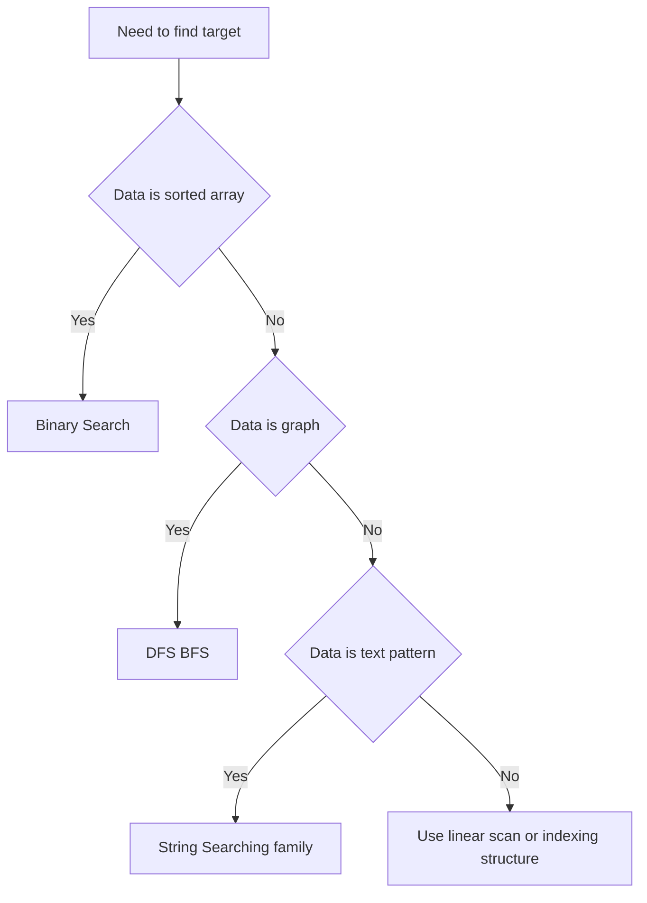

---
{"dg-publish":true,"permalink":"/software-engineering/02-computer-science/algorithms/search-algorithms/search-algorithms/","tags":["FolderNote"],"noteIcon":"3"}
---

# Intro

Search algorithms find target values in collections, trees, graphs, or text while minimizing work. Choosing the right search approach depends on data ordering, data shape, and whether you need worst-case guarantees or best average speed.

Concrete example: in a sorted list of product ids, Binary Search gives fast lookups with logarithmic time. In graph traversal, BFS finds the shortest path by edge count in unweighted graphs. In text processing, KMP and Rabin Karp avoid naive full rescans.

## Diagram

## Examples

- [[Software Engineering/02 Computer Science/Algorithms/Search Algorithms/Binary Search\|Binary Search]]
- [[Software Engineering/02 Computer Science/Algorithms/Search Algorithms/DFS BFS\|DFS BFS]]
- [[Software Engineering/02 Computer Science/Algorithms/Search Algorithms/KMP (Knuth-Morris-Pratt) Algorithm\|KMP (Knuth-Morris-Pratt) Algorithm]]
- [[Software Engineering/02 Computer Science/Algorithms/Search Algorithms/Rabin Karp Search\|Rabin Karp Search]]

## Questions

> [!QUESTION]- What is the first decision before picking a search algorithm?
> - Check whether data is sorted, because that immediately enables Binary Search.
> - Identify data shape: array, graph, or text stream, because each has specialized methods.
> - Decide whether worst-case guarantees or average speed matters more.
> - Why it matters: this quickly narrows the candidate algorithms and prevents wrong assumptions.

> [!QUESTION]- Why is one search algorithm never best for all cases?
> - Different algorithms optimize for different constraints such as ordering, memory, and preprocessing.
> - Workload shape changes the winner: single lookup, repeated queries, or many patterns.
> - Correctness constraints can force specific methods, for example sorted input for Binary Search.
> - Why it matters: senior-level decisions are tradeoffs, not memorized defaults.

## Links

- [Search algorithm (Wikipedia)](https://en.wikipedia.org/wiki/Search_algorithm)
- [Binary search (cp algorithms)](https://cp-algorithms.com/num_methods/binary_search.html)
- [Hyperscan high performance multiple regex matching](https://www.hyperscan.io/)

<!-- whats-next:start -->

---

> [!note] Whats next
> **Parent**
>  [[Software Engineering/02 Computer Science/Algorithms/Algorithms\|Algorithms]]
>
> **Pages**
> - [[Software Engineering/02 Computer Science/Algorithms/Search Algorithms/Binary Search\|Binary Search]]
> - [[Software Engineering/02 Computer Science/Algorithms/Search Algorithms/DFS BFS\|DFS BFS]]
> - [[Software Engineering/02 Computer Science/Algorithms/Search Algorithms/KMP (Knuth-Morris-Pratt) Algorithm\|KMP (Knuth-Morris-Pratt) Algorithm]]
> - [[Software Engineering/02 Computer Science/Algorithms/Search Algorithms/Rabin Karp Search\|Rabin Karp Search]]
<!-- whats-next:end -->
