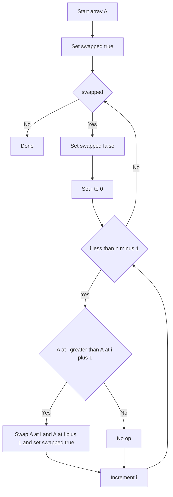

---
{"dg-publish":true,"permalink":"/software-engineering/02-computer-science/algorithms/sorting-algorithms/bubble-sort/"}
---

# Intro

Bubble sort repeatedly swaps adjacent out-of-order elements, pushing large values toward the end each pass. It is easy to understand but rarely used in production due to poor performance. Its main value is as a teaching tool and as a baseline to understand why better algorithms exist.

## Mechanism

Each pass scans left-to-right and swaps `a[i]` with `a[i+1]` when they are out of order. After one full pass, the largest element is in its final position. With an early-exit flag, the algorithm stops as soon as a pass makes zero swaps — giving O(n) best case on already-sorted input.



## Complexity

| Case | Time | Space |
|------|------|-------|
| Best (sorted input, early-exit) | O(n) | O(1) |
| Average | O(n²) | O(1) |
| Worst (reverse-sorted) | O(n²) | O(1) |

**Properties:** stable (adjacent swaps preserve equal-element order), in-place.

## C# Implementation

```csharp
public static void BubbleSort(int[] a)
{
    int n = a.Length;
    bool swapped;
    do
    {
        swapped = false;
        for (int i = 0; i < n - 1; i++)
        {
            if (a[i] > a[i + 1])
            {
                (a[i], a[i + 1]) = (a[i + 1], a[i]);
                swapped = true;
            }
        }
        n--; // last element is already in place
    } while (swapped);
}
```

## When to Use

Almost never in production. Prefer:
- **Insertion sort** for small arrays (n ≤ 20) or nearly-sorted data — better constant factors.
- **Array.Sort** (introsort) for general-purpose sorting in .NET.

Bubble sort is useful as a teaching example and for understanding stability and in-place constraints.

## Questions

> [!QUESTION]- Why is bubble sort never used in production?
> Bubble sort has O(n²) average and worst-case time with poor cache behavior — each swap touches two adjacent elements, causing many cache misses on large arrays. Insertion sort is strictly better for small arrays (same O(n²) but fewer comparisons and better cache access). For large arrays, introsort (Array.Sort in .NET) is O(n log n). Bubble sort has no scenario where it is the best choice.

> [!QUESTION]- What is bubble sort's one practical advantage?
> The early-exit optimization gives O(n) best case on already-sorted input — the same as insertion sort. However, insertion sort achieves this with fewer comparisons and better cache behavior, so even in this case insertion sort is preferred. Bubble sort's main value is pedagogical: it is easy to explain and visualize.


## References

- [Bubble sort (Wikipedia)](https://en.wikipedia.org/wiki/Bubble_sort) — algorithm description, variants (cocktail shaker sort), and stability proof.
- [Sorting visualizations (VisuAlgo)](https://visualgo.net/en/sorting) — step-by-step animation to build intuition for all comparison sorts.

<!-- whats-next:start -->

---

> [!note] Whats next
> **Parent**
>  [[Software Engineering/02 Computer Science/Algorithms/Algorithms\|Algorithms]]
>
> **Pages**
> - [[Software Engineering/02 Computer Science/Algorithms/Sorting Algorithms/Insertion Sort\|Insertion Sort]]
> - [[Software Engineering/02 Computer Science/Algorithms/Sorting Algorithms/Merge Sort\|Merge Sort]]
> - [[Software Engineering/02 Computer Science/Algorithms/Sorting Algorithms/Quick Sort\|Quick Sort]]
> - [[Software Engineering/02 Computer Science/Algorithms/Sorting Algorithms/Selection Sort\|Selection Sort]]
<!-- whats-next:end -->
