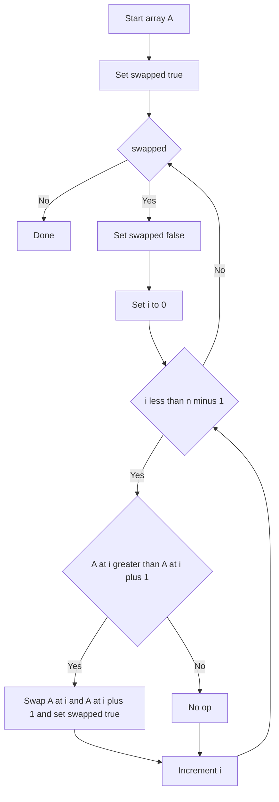

---
{"dg-publish":true,"permalink":"/software-engineering/02-computer-science/algorithms/sorting-algorithms/bubble-sort/","noteIcon":""}
---

# Intro

Bubble sort repeatedly swaps adjacent out-of-order elements, pushing large values toward the end each pass. It is easy to understand but rarely used in production due to poor performance.

## Deeper Explanation

- Mechanism: scan left-to-right, swap (a[i], a[i+1]) when out of order; after one full pass, the max element is in its final place.
- Early-exit optimization: if a pass makes zero swaps, the array is already sorted.
- Complexity: average/worst O(n^2); best O(n) with early-exit on already-sorted input.
- Properties: stable (with adjacent swaps), in-place, simple.

## Diagram

## Questions

> [!QUESTION]- What is Bubble Sort?
> Bubble sort repeatedly swaps adjacent out-of-order elements, pushing large values toward the end each pass. It is easy to understand but rarely used in production due to poor performance.

## Links

- https://en.wikipedia.org/wiki/Bubble_sort - Overview and variants
- https://visualgo.net/en/sorting - Animation to build intuition

# Whats next

:LiArrowUpLeft: [[Software Engineering/02 Computer Science/Algorithms/Algorithms\|Algorithms]]

<h2>Pages</h2>
<ul class="dataview list-view-ul"><li><a data-tooltip-position="top" aria-label="Software Engineering/02 Computer Science/Algorithms/Sorting Algorithms/Insertion Sort.md" data-href="Software Engineering/02 Computer Science/Algorithms/Sorting Algorithms/Insertion Sort.md" href="Software Engineering/02 Computer Science/Algorithms/Sorting Algorithms/Insertion Sort.md" class="internal-link" target="_blank" rel="noopener nofollow">Insertion Sort</a></li><li><a data-tooltip-position="top" aria-label="Software Engineering/02 Computer Science/Algorithms/Sorting Algorithms/Merge Sort.md" data-href="Software Engineering/02 Computer Science/Algorithms/Sorting Algorithms/Merge Sort.md" href="Software Engineering/02 Computer Science/Algorithms/Sorting Algorithms/Merge Sort.md" class="internal-link" target="_blank" rel="noopener nofollow">Merge Sort</a></li><li><a data-tooltip-position="top" aria-label="Software Engineering/02 Computer Science/Algorithms/Sorting Algorithms/Quick Sort.md" data-href="Software Engineering/02 Computer Science/Algorithms/Sorting Algorithms/Quick Sort.md" href="Software Engineering/02 Computer Science/Algorithms/Sorting Algorithms/Quick Sort.md" class="internal-link" target="_blank" rel="noopener nofollow">Quick Sort</a></li><li><a data-tooltip-position="top" aria-label="Software Engineering/02 Computer Science/Algorithms/Sorting Algorithms/Selection Sort.md" data-href="Software Engineering/02 Computer Science/Algorithms/Sorting Algorithms/Selection Sort.md" href="Software Engineering/02 Computer Science/Algorithms/Sorting Algorithms/Selection Sort.md" class="internal-link" target="_blank" rel="noopener nofollow">Selection Sort</a></li></ul>

