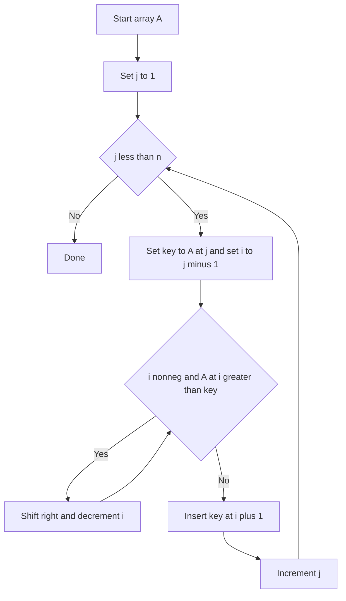

---
{"dg-publish":true,"permalink":"/software-engineering/02-computer-science/algorithms/sorting-algorithms/insertion-sort/"}
---

# Intro

Insertion sort grows a sorted prefix by inserting each next element into its correct position within that prefix. It is fast for small inputs and nearly-sorted data, and it is a common building block inside hybrid sorts like Timsort and introsort.

## Mechanism

Iterate left-to-right. For each element at index `j` (the "key"), shift all larger elements in the sorted prefix one position right, then insert the key into the gap. The sorted prefix grows by one element per iteration.



## Complexity

| Case | Time | Space |
|------|------|-------|
| Best (sorted input) | O(n) | O(1) |
| Average | O(n²) | O(1) |
| Worst (reverse-sorted) | O(n²) | O(1) |

**Properties:** stable, in-place, excellent constant factors for small n.

## C# Implementation

```csharp
public static void InsertionSort(int[] a)
{
    for (int j = 1; j < a.Length; j++)
    {
        int key = a[j];
        int i = j - 1;
        while (i >= 0 && a[i] > key)
        {
            a[i + 1] = a[i];
            i--;
        }
        a[i + 1] = key;
    }
}
```

## When to Use

- **Small arrays (n ≤ 20–50):** better constant factors than merge/quick sort due to no recursion overhead.
- **Nearly-sorted data:** O(n) best case makes it ideal when only a few elements are out of place.
- **Base case in hybrid sorts:** Timsort and introsort switch to insertion sort for small partitions.
- **Online sorting:** can sort a stream of elements as they arrive, one at a time.

## Questions

> [!QUESTION]- When is insertion sort faster than O(n log n) algorithms?
> For small arrays (n ≤ 20–50), insertion sort outperforms merge sort and quick sort because it has no recursion overhead, no auxiliary memory allocation, and excellent cache locality. This is why Timsort and introsort switch to insertion sort for small partitions — the constant factor advantage outweighs the asymptotic disadvantage.

> [!QUESTION]- Why is insertion sort used as the base case in Timsort?
> Timsort (Python's and Java's default sort) uses insertion sort for runs shorter than ~64 elements. At that size, insertion sort's O(n²) worst case is bounded (64² = 4096 operations), its cache-friendly sequential access beats merge sort's random access pattern, and it requires no extra memory. The combination of O(n) best case on nearly-sorted data and low constant factors makes it ideal for the small-partition base case.


## References

- [Insertion sort (Wikipedia)](https://en.wikipedia.org/wiki/Insertion_sort) — algorithm description, binary insertion sort variant, and complexity analysis.
- [Insertion sort (cp-algorithms)](https://cp-algorithms.com/sorting/insertion_sort.html) — competitive programming perspective with implementation notes.

<!-- whats-next:start -->

---

> [!note] Whats next
> **Parent**
>  [[Software Engineering/02 Computer Science/Algorithms/Algorithms\|Algorithms]]
>
> **Pages**
> - [[Software Engineering/02 Computer Science/Algorithms/Sorting Algorithms/Bubble Sort\|Bubble Sort]]
> - [[Software Engineering/02 Computer Science/Algorithms/Sorting Algorithms/Merge Sort\|Merge Sort]]
> - [[Software Engineering/02 Computer Science/Algorithms/Sorting Algorithms/Quick Sort\|Quick Sort]]
> - [[Software Engineering/02 Computer Science/Algorithms/Sorting Algorithms/Selection Sort\|Selection Sort]]
<!-- whats-next:end -->
