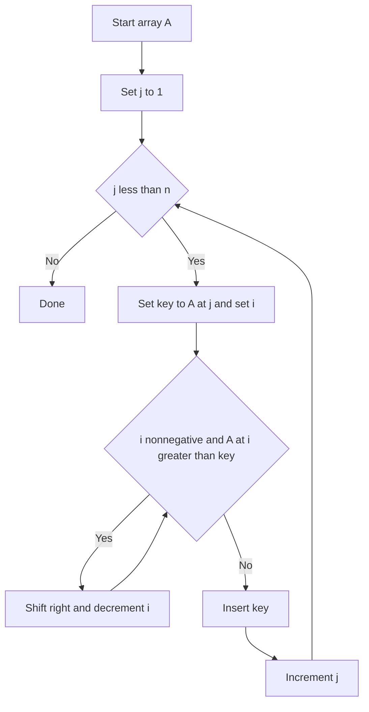

---
{"dg-publish":true,"permalink":"/software-engineering/02-computer-science/algorithms/sorting-algorithms/insertion-sort/","noteIcon":""}
---

# Intro

Insertion sort grows a sorted prefix by inserting each next element into its correct position. It is fast for small inputs and nearly-sorted data, and it is a common building block inside hybrid sorts.

## Deeper Explanation

- Mechanism: iterate left-to-right; for each key, shift larger elements right until the insertion spot is found.
- Complexity: average/worst O(n^2); best O(n) when already sorted.
- Properties: stable, in-place (aside from the key temp), good constant factors.
- Rule of thumb: use for n <= ~20-50 or as the base case inside merge/quick/introsort.

## Diagram

## Questions

> [!QUESTION]- What is Insertion Sort?
> Insertion sort grows a sorted prefix by inserting each next element into its correct position. It is fast for small inputs and nearly-sorted data, and it is a common building block inside hybrid sorts.

## Links

- https://en.wikipedia.org/wiki/Insertion_sort - Algorithm and complexity
- https://cp-algorithms.com/sorting/insertion_sort.html - Competitive programming perspective

# Whats next

:LiArrowUpLeft: [[Software Engineering/02 Computer Science/Algorithms/Algorithms\|Algorithms]]

<h2>Pages</h2>
<ul class="dataview list-view-ul"><li><a data-tooltip-position="top" aria-label="Software Engineering/02 Computer Science/Algorithms/Sorting Algorithms/Bubble Sort.md" data-href="Software Engineering/02 Computer Science/Algorithms/Sorting Algorithms/Bubble Sort.md" href="Software Engineering/02 Computer Science/Algorithms/Sorting Algorithms/Bubble Sort.md" class="internal-link" target="_blank" rel="noopener nofollow">Bubble Sort</a></li><li><a data-tooltip-position="top" aria-label="Software Engineering/02 Computer Science/Algorithms/Sorting Algorithms/Merge Sort.md" data-href="Software Engineering/02 Computer Science/Algorithms/Sorting Algorithms/Merge Sort.md" href="Software Engineering/02 Computer Science/Algorithms/Sorting Algorithms/Merge Sort.md" class="internal-link" target="_blank" rel="noopener nofollow">Merge Sort</a></li><li><a data-tooltip-position="top" aria-label="Software Engineering/02 Computer Science/Algorithms/Sorting Algorithms/Quick Sort.md" data-href="Software Engineering/02 Computer Science/Algorithms/Sorting Algorithms/Quick Sort.md" href="Software Engineering/02 Computer Science/Algorithms/Sorting Algorithms/Quick Sort.md" class="internal-link" target="_blank" rel="noopener nofollow">Quick Sort</a></li><li><a data-tooltip-position="top" aria-label="Software Engineering/02 Computer Science/Algorithms/Sorting Algorithms/Selection Sort.md" data-href="Software Engineering/02 Computer Science/Algorithms/Sorting Algorithms/Selection Sort.md" href="Software Engineering/02 Computer Science/Algorithms/Sorting Algorithms/Selection Sort.md" class="internal-link" target="_blank" rel="noopener nofollow">Selection Sort</a></li></ul>

