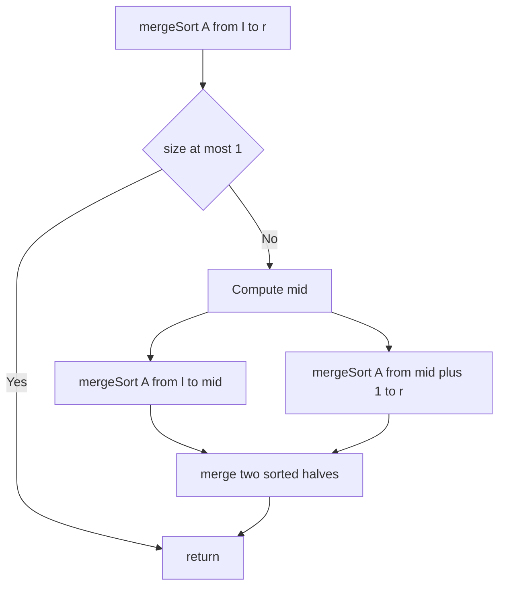

---
{"dg-publish":true,"permalink":"/software-engineering/02-computer-science/algorithms/sorting-algorithms/merge-sort/","noteIcon":""}
---

# Intro

Merge sort is a divide-and-conquer algorithm: split the array, sort each half, then merge the two sorted halves. It has reliable O(n log n) time and is stable, at the cost of extra memory.

## Deeper Explanation

- Mechanism: recursively split until size 1, then merge by repeatedly taking the smaller front element from the two halves.
- Complexity: O(n log n) time in all cases; O(n) extra space for the merge buffer (array implementation).
- Properties: stable (with careful merge), not in-place in typical array form.
- Practical notes: great for linked lists and external sorting (sorting data that does not fit in memory).

## Diagram

## Questions

> [!QUESTION]- What is Merge Sort?
> Merge sort is a divide-and-conquer algorithm: split the array, sort each half, then merge the two sorted halves. It has reliable O(n log n) time and is stable, at the cost of extra memory.

## Links

- https://en.wikipedia.org/wiki/Merge_sort - Core idea + variants
- https://cp-algorithms.com/sorting/merge_sort.html - Implementation details

# Whats next

:LiArrowUpLeft: [[Software Engineering/02 Computer Science/Algorithms/Algorithms\|Algorithms]]

<h2>Pages</h2>
<ul class="dataview list-view-ul"><li><a data-tooltip-position="top" aria-label="Software Engineering/02 Computer Science/Algorithms/Sorting Algorithms/Bubble Sort.md" data-href="Software Engineering/02 Computer Science/Algorithms/Sorting Algorithms/Bubble Sort.md" href="Software Engineering/02 Computer Science/Algorithms/Sorting Algorithms/Bubble Sort.md" class="internal-link" target="_blank" rel="noopener nofollow">Bubble Sort</a></li><li><a data-tooltip-position="top" aria-label="Software Engineering/02 Computer Science/Algorithms/Sorting Algorithms/Insertion Sort.md" data-href="Software Engineering/02 Computer Science/Algorithms/Sorting Algorithms/Insertion Sort.md" href="Software Engineering/02 Computer Science/Algorithms/Sorting Algorithms/Insertion Sort.md" class="internal-link" target="_blank" rel="noopener nofollow">Insertion Sort</a></li><li><a data-tooltip-position="top" aria-label="Software Engineering/02 Computer Science/Algorithms/Sorting Algorithms/Quick Sort.md" data-href="Software Engineering/02 Computer Science/Algorithms/Sorting Algorithms/Quick Sort.md" href="Software Engineering/02 Computer Science/Algorithms/Sorting Algorithms/Quick Sort.md" class="internal-link" target="_blank" rel="noopener nofollow">Quick Sort</a></li><li><a data-tooltip-position="top" aria-label="Software Engineering/02 Computer Science/Algorithms/Sorting Algorithms/Selection Sort.md" data-href="Software Engineering/02 Computer Science/Algorithms/Sorting Algorithms/Selection Sort.md" href="Software Engineering/02 Computer Science/Algorithms/Sorting Algorithms/Selection Sort.md" class="internal-link" target="_blank" rel="noopener nofollow">Selection Sort</a></li></ul>

