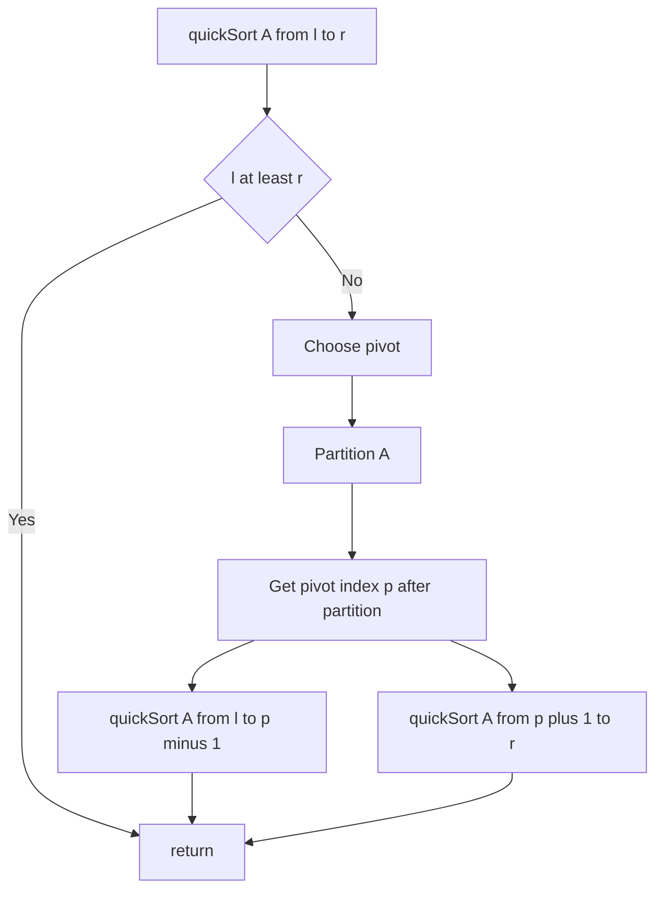

---
{"dg-publish":true,"permalink":"/software-engineering/02-computer-science/algorithms/sorting-algorithms/quick-sort/","noteIcon":""}
---

# Intro

Quick sort partitions the array around a pivot so smaller elements go left and larger go right, then recursively sorts the partitions. It is often very fast in practice but has a worst-case O(n^2) if pivots are consistently bad.

## Deeper Explanation

- Mechanism: choose pivot, partition in-place (Lomuto/Hoare), then recurse on left/right partitions.
- Complexity: average O(n log n); worst O(n^2) without protections.
- Properties: in-place (typical), not stable.
- How to make it robust: randomized pivot or median-of-three; switch to insertion sort on small partitions; consider introsort (fallback to heapsort) for worst-case bounds.

## Diagram

## Questions

> [!QUESTION]- What is Quick Sort?
> Quick sort partitions the array around a pivot so smaller elements go left and larger go right, then recursively sorts the partitions. It is often very fast in practice but has a worst-case O(n^2) if pivots are consistently bad.

## Links

- https://en.wikipedia.org/wiki/Quicksort - Partition schemes and analysis
- https://cp-algorithms.com/sorting/quick_sort.html - Practical implementation tips

# Whats next

:LiArrowUpLeft: [[Software Engineering/02 Computer Science/Algorithms/Algorithms\|Algorithms]]

<h2>Pages</h2>
<ul class="dataview list-view-ul"><li><a data-tooltip-position="top" aria-label="Software Engineering/02 Computer Science/Algorithms/Sorting Algorithms/Bubble Sort.md" data-href="Software Engineering/02 Computer Science/Algorithms/Sorting Algorithms/Bubble Sort.md" href="Software Engineering/02 Computer Science/Algorithms/Sorting Algorithms/Bubble Sort.md" class="internal-link" target="_blank" rel="noopener nofollow">Bubble Sort</a></li><li><a data-tooltip-position="top" aria-label="Software Engineering/02 Computer Science/Algorithms/Sorting Algorithms/Insertion Sort.md" data-href="Software Engineering/02 Computer Science/Algorithms/Sorting Algorithms/Insertion Sort.md" href="Software Engineering/02 Computer Science/Algorithms/Sorting Algorithms/Insertion Sort.md" class="internal-link" target="_blank" rel="noopener nofollow">Insertion Sort</a></li><li><a data-tooltip-position="top" aria-label="Software Engineering/02 Computer Science/Algorithms/Sorting Algorithms/Merge Sort.md" data-href="Software Engineering/02 Computer Science/Algorithms/Sorting Algorithms/Merge Sort.md" href="Software Engineering/02 Computer Science/Algorithms/Sorting Algorithms/Merge Sort.md" class="internal-link" target="_blank" rel="noopener nofollow">Merge Sort</a></li><li><a data-tooltip-position="top" aria-label="Software Engineering/02 Computer Science/Algorithms/Sorting Algorithms/Selection Sort.md" data-href="Software Engineering/02 Computer Science/Algorithms/Sorting Algorithms/Selection Sort.md" href="Software Engineering/02 Computer Science/Algorithms/Sorting Algorithms/Selection Sort.md" class="internal-link" target="_blank" rel="noopener nofollow">Selection Sort</a></li></ul>

