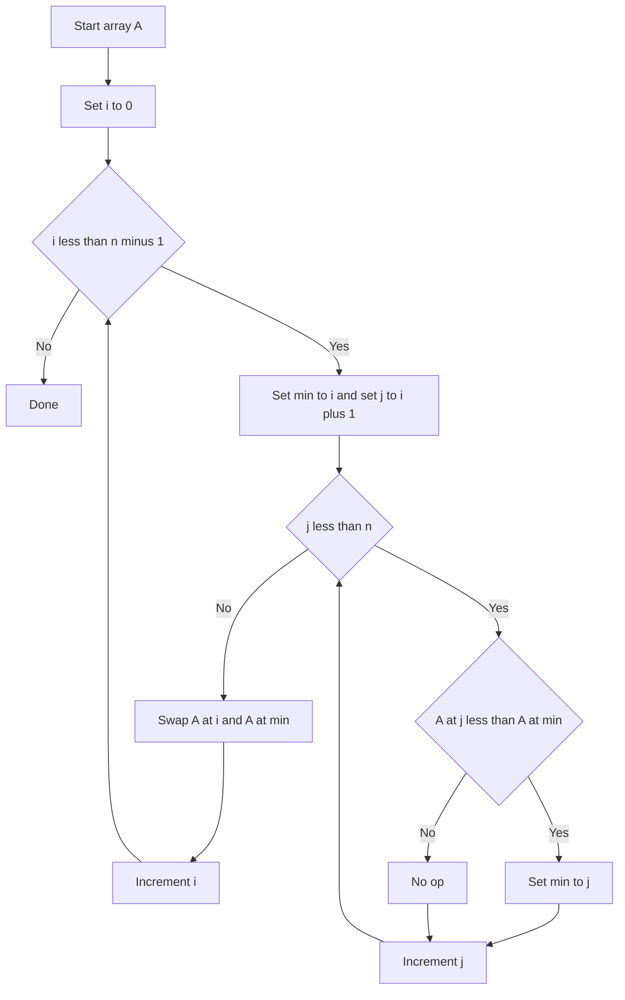

---
{"dg-publish":true,"permalink":"/software-engineering/02-computer-science/algorithms/sorting-algorithms/selection-sort/"}
---

# Intro

Selection sort builds a sorted prefix by repeatedly finding the minimum element in the unsorted suffix and swapping it into place. It always performs exactly O(n²) comparisons regardless of input order, but only O(n) swaps — making it useful in the rare case where writes are expensive but comparisons are cheap.

## Mechanism

For each position `i`, scan `a[i..n-1]` to find the minimum, then swap it with `a[i]`. After each iteration, the sorted prefix grows by one element.



## Complexity

| Case | Time | Space | Swaps |
|------|------|-------|-------|
| Best | O(n²) | O(1) | O(n) |
| Average | O(n²) | O(1) | O(n) |
| Worst | O(n²) | O(1) | O(n) |

**Properties:** in-place, typically not stable (a swap can reorder equal keys), exactly n−1 swaps in the worst case.

## C# Implementation

```csharp
public static void SelectionSort(int[] a)
{
    int n = a.Length;
    for (int i = 0; i < n - 1; i++)
    {
        int minIdx = i;
        for (int j = i + 1; j < n; j++)
        {
            if (a[j] < a[minIdx])
                minIdx = j;
        }
        if (minIdx != i)
            (a[i], a[minIdx]) = (a[minIdx], a[i]);
    }
}
```

## When to Use

Rarely in production. The O(n) swap count is its only advantage over bubble sort. Consider it when:
- Writes are significantly more expensive than reads (e.g., flash memory with limited write cycles).
- You need a simple, predictable algorithm with no extra memory.

For general use, prefer insertion sort (better on nearly-sorted data) or `Array.Sort` (introsort).

## Questions

> [!QUESTION]- Why does selection sort make exactly O(n) swaps, and when does that matter?
> Selection sort scans the entire unsorted suffix to find the minimum, then performs exactly one swap per iteration — n−1 swaps total. This matters when writes are significantly more expensive than reads, such as flash memory with limited write cycles or EEPROM. In those cases, minimizing swaps is worth the O(n²) comparison cost. For RAM-based sorting, the swap count advantage is irrelevant — use insertion sort or Array.Sort instead.

> [!QUESTION]- Why is selection sort not stable, and how can it be made stable?
> Selection sort swaps the minimum element into position, which can move an equal element past another equal element. For example, sorting [3a, 3b, 1] by value: the 1 swaps with 3a, giving [1, 3b, 3a] — the relative order of the two 3s is reversed. To make it stable, replace the swap with a shift (like insertion sort does), but that eliminates the O(n) swap advantage. In practice, if stability is needed, use merge sort.


## References

- [Selection sort (Wikipedia)](https://en.wikipedia.org/wiki/Selection_sort) — algorithm description, stability discussion, and comparison with insertion sort.
- [Sorting visualizations (VisuAlgo)](https://visualgo.net/en/sorting) — step-by-step animation comparing all basic sorting algorithms.

<!-- whats-next:start -->

---

> [!note] Whats next
> **Parent**
>  [[Software Engineering/02 Computer Science/Algorithms/Algorithms\|Algorithms]]
>
> **Pages**
> - [[Software Engineering/02 Computer Science/Algorithms/Sorting Algorithms/Bubble Sort\|Bubble Sort]]
> - [[Software Engineering/02 Computer Science/Algorithms/Sorting Algorithms/Insertion Sort\|Insertion Sort]]
> - [[Software Engineering/02 Computer Science/Algorithms/Sorting Algorithms/Merge Sort\|Merge Sort]]
> - [[Software Engineering/02 Computer Science/Algorithms/Sorting Algorithms/Quick Sort\|Quick Sort]]
<!-- whats-next:end -->
