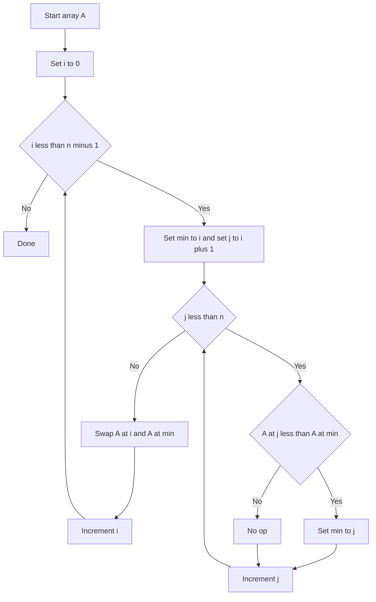

---
{"dg-publish":true,"permalink":"/software-engineering/02-computer-science/algorithms/sorting-algorithms/selection-sort/","noteIcon":""}
---

# Intro

Selection sort builds a sorted prefix by repeatedly selecting the minimum remaining element and swapping it into place. It does a predictable number of comparisons but is still quadratic time.

## Deeper Explanation

- Mechanism: for each position i, find the smallest element in a[i..n-1], then swap it with a[i].
- Complexity: always O(n^2) comparisons; O(n) swaps.
- Properties: in-place; typically not stable (a swap can reorder equal keys).
- When it can make sense: when writes are expensive but comparisons are cheap (still uncommon).

## Diagram

## Questions

> [!QUESTION]- What is Selection Sort?
> Selection sort builds a sorted prefix by repeatedly selecting the minimum remaining element and swapping it into place. It does a predictable number of comparisons but is still quadratic time.

## Links

- https://en.wikipedia.org/wiki/Selection_sort - Details + stability discussion
- https://visualgo.net/en/sorting - Step-by-step visualization

# Whats next

:LiArrowUpLeft: [[Software Engineering/02 Computer Science/Algorithms/Algorithms\|Algorithms]]

<h2>Pages</h2>
<ul class="dataview list-view-ul"><li><a data-tooltip-position="top" aria-label="Software Engineering/02 Computer Science/Algorithms/Sorting Algorithms/Bubble Sort.md" data-href="Software Engineering/02 Computer Science/Algorithms/Sorting Algorithms/Bubble Sort.md" href="Software Engineering/02 Computer Science/Algorithms/Sorting Algorithms/Bubble Sort.md" class="internal-link" target="_blank" rel="noopener nofollow">Bubble Sort</a></li><li><a data-tooltip-position="top" aria-label="Software Engineering/02 Computer Science/Algorithms/Sorting Algorithms/Insertion Sort.md" data-href="Software Engineering/02 Computer Science/Algorithms/Sorting Algorithms/Insertion Sort.md" href="Software Engineering/02 Computer Science/Algorithms/Sorting Algorithms/Insertion Sort.md" class="internal-link" target="_blank" rel="noopener nofollow">Insertion Sort</a></li><li><a data-tooltip-position="top" aria-label="Software Engineering/02 Computer Science/Algorithms/Sorting Algorithms/Merge Sort.md" data-href="Software Engineering/02 Computer Science/Algorithms/Sorting Algorithms/Merge Sort.md" href="Software Engineering/02 Computer Science/Algorithms/Sorting Algorithms/Merge Sort.md" class="internal-link" target="_blank" rel="noopener nofollow">Merge Sort</a></li><li><a data-tooltip-position="top" aria-label="Software Engineering/02 Computer Science/Algorithms/Sorting Algorithms/Quick Sort.md" data-href="Software Engineering/02 Computer Science/Algorithms/Sorting Algorithms/Quick Sort.md" href="Software Engineering/02 Computer Science/Algorithms/Sorting Algorithms/Quick Sort.md" class="internal-link" target="_blank" rel="noopener nofollow">Quick Sort</a></li></ul>

