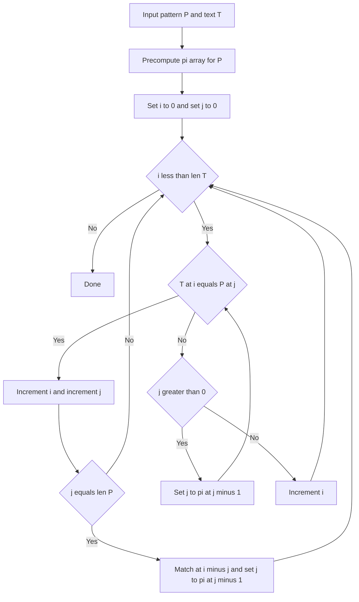

---
{"dg-publish":true,"permalink":"/software-engineering/02-computer-science/algorithms/string-searching/kmp-knuth-morris-pratt-algorithm/","noteIcon":""}
---

# Intro

## Deeper Explanation

## Diagram

## Questions

> [!QUESTION]- What does the prefix function (LPS) represent?
> For each position in the pattern, it stores the length of the longest proper prefix that is also a suffix ending at that position. This lets KMP shift the pattern without losing valid partial matches.

## Links

- [Knuth-Morris-Pratt algorithm (Wikipedia)](https://en.wikipedia.org/wiki/Knuth%E2%80%93Morris%E2%80%93Pratt_algorithm)
- [Prefix function / KMP (cp-algorithms)](https://cp-algorithms.com/string/prefix-function.html)

# Whats next

:LiArrowUpLeft: [[Software Engineering/02 Computer Science/Algorithms/Algorithms\|Algorithms]]

<h2>Pages</h2>
<ul class="dataview list-view-ul"><li><a data-tooltip-position="top" aria-label="Software Engineering/02 Computer Science/Algorithms/String Searching/Rabit Karp Search.md" data-href="Software Engineering/02 Computer Science/Algorithms/String Searching/Rabit Karp Search.md" href="Software Engineering/02 Computer Science/Algorithms/String Searching/Rabit Karp Search.md" class="internal-link" target="_blank" rel="noopener nofollow">Rabit Karp Search</a></li></ul>

