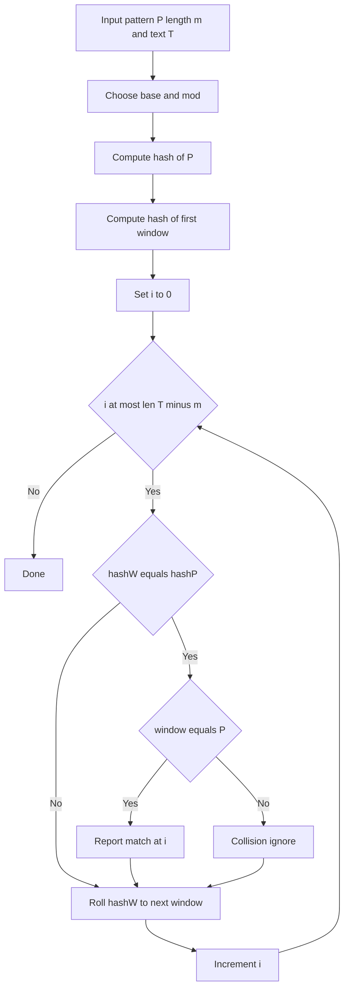

---
{"dg-publish":true,"permalink":"/software-engineering/02-computer-science/algorithms/string-searching/rabit-karp-search/","noteIcon":"1"}
---

# Intro

## Deeper Explanation

## Diagram

## Questions

> [!QUESTION]- What are hash collisions and how do we handle them?
> A collision is when two different strings produce the same hash. Rabin-Karp handles this by verifying the actual substring when a hash match occurs, and collisions can be made very unlikely with good moduli/base choices (or double hashing).

## Links

- [Rabin-Karp algorithm (Wikipedia)](https://en.wikipedia.org/wiki/Rabin%E2%80%93Karp_algorithm)
- [String hashing (cp-algorithms)](https://cp-algorithms.com/string/string-hashing.html)

<!-- whats-next:start -->

---

> [!note] Whats next
> **Parent**
>  [[Software Engineering/02 Computer Science/Algorithms/Algorithms\|Algorithms]]
>
> **Pages**
> - [[Software Engineering/02 Computer Science/Algorithms/String Searching/KMP (Knuth-Morris-Pratt) Algorithm\|KMP (Knuth-Morris-Pratt) Algorithm]]
<!-- whats-next:end -->
