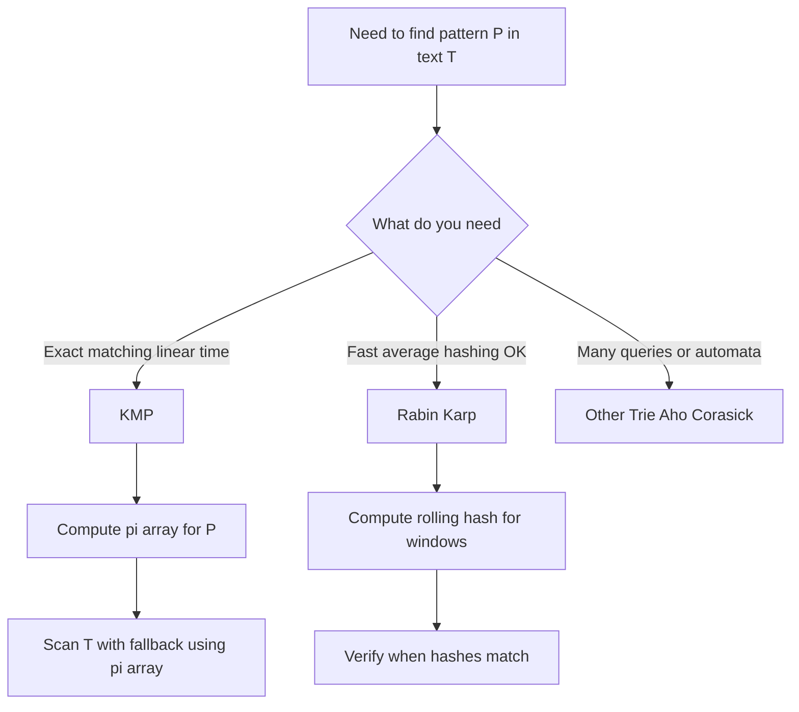

---
{"dg-publish":true,"permalink":"/software-engineering/02-computer-science/algorithms/string-searching/string-searching/","tags":["FolderNote"],"noteIcon":""}
---

# Intro

## Deeper Explanation

## Diagram

## Questions

## Links

## Deeper Explanation

## Questions

## Links

# Whats next

:LiArrowUpLeft: [[Software Engineering/02 Computer Science/Algorithms/Algorithms\|Algorithms]]

<h2>Pages</h2>
<ul class="dataview list-view-ul"><li><a data-tooltip-position="top" aria-label="Software Engineering/02 Computer Science/Algorithms/String Searching/KMP (Knuth-Morris-Pratt) Algorithm.md" data-href="Software Engineering/02 Computer Science/Algorithms/String Searching/KMP (Knuth-Morris-Pratt) Algorithm.md" href="Software Engineering/02 Computer Science/Algorithms/String Searching/KMP (Knuth-Morris-Pratt) Algorithm.md" class="internal-link" target="_blank" rel="noopener nofollow">KMP (Knuth-Morris-Pratt) Algorithm</a></li><li><a data-tooltip-position="top" aria-label="Software Engineering/02 Computer Science/Algorithms/String Searching/Rabit Karp Search.md" data-href="Software Engineering/02 Computer Science/Algorithms/String Searching/Rabit Karp Search.md" href="Software Engineering/02 Computer Science/Algorithms/String Searching/Rabit Karp Search.md" class="internal-link" target="_blank" rel="noopener nofollow">Rabit Karp Search</a></li></ul>

