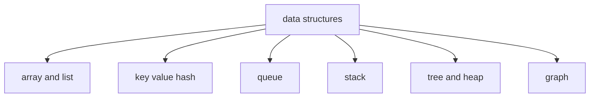

---
{"dg-publish":true,"permalink":"/software-engineering/02-computer-science/data-structures/data-structures/","tags":["FolderNote"],"noteIcon":"1"}
---


# Intro

A data structure is a way to organize data for efficient access and updates. In .NET, choosing the right collection usually has a bigger impact than micro-optimizing syntax.

## Structure



## Example

```csharp
var byId = new Dictionary<int, string>
{
    [42] = "Ann"
};

var ordered = new List<string> { "Ann", "Bob" };

Console.WriteLine(byId[42]); // Fast lookup by key
Console.WriteLine(ordered[0]); // Fast lookup by index
```

## Questions

> [!QUESTION]- What is a data structure? Which ones do you know? Which of them exist in .NET?
> A data structure is a way to organize related data into a collection-like object. Examples include arrays, lists, queues, stacks, linked lists, dictionaries/hash tables, hash sets, graphs, and trees. .NET provides built-in implementations for many of these (for example `Array`, `List<T>`, `Queue<T>`, `Stack<T>`, `LinkedList<T>`, `Dictionary<TKey, TValue>`, `HashSet<T>`).

## Links

- [System.Collections.Generic namespace](https://learn.microsoft.com/en-us/dotnet/api/system.collections.generic)
- [Collections and data structures](https://learn.microsoft.com/en-us/dotnet/standard/collections/)
- [Anatomy of the .NET dictionary](https://dunnhq.com/posts/2024/anatomy-of-the-dotnet-dictionary/)

<!-- whats-next:start -->

---

> [!note] Whats next
> **Parent**
>  [[Software Engineering/02 Computer Science/02 Computer Science\|02 Computer Science]]
>
> **Pages**
> - [[Software Engineering/02 Computer Science/Data Structures/Dictionary\|Dictionary]]
> - [[Software Engineering/02 Computer Science/Data Structures/Graph\|Graph]]
> - [[Software Engineering/02 Computer Science/Data Structures/HashMap\|HashMap]]
> - [[Software Engineering/02 Computer Science/Data Structures/HashSet\|HashSet]]
> - [[Software Engineering/02 Computer Science/Data Structures/Hashtable\|Hashtable]]
> - [[Software Engineering/02 Computer Science/Data Structures/Heap\|Heap]]
> - [[Software Engineering/02 Computer Science/Data Structures/LinkedList\|LinkedList]]
> - [[Software Engineering/02 Computer Science/Data Structures/List\|List]]
> - [[Software Engineering/02 Computer Science/Data Structures/Queue\|Queue]]
> - [[Software Engineering/02 Computer Science/Data Structures/Span\|Span]]
> - [[Software Engineering/02 Computer Science/Data Structures/Stack\|Stack]]
> - [[Software Engineering/02 Computer Science/Data Structures/Trees\|Trees]]
<!-- whats-next:end -->
