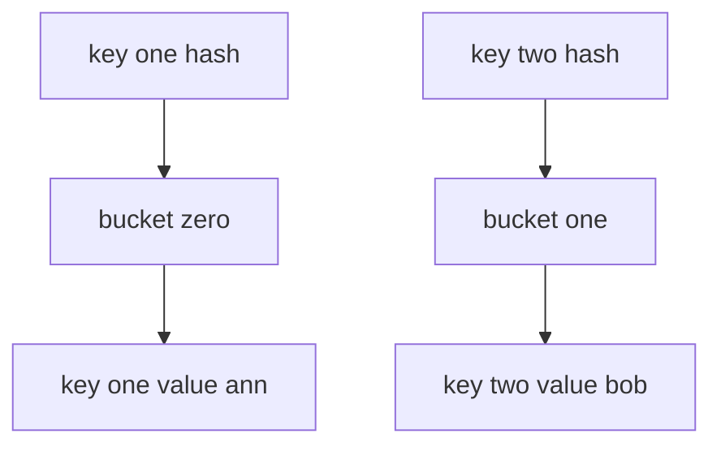

---
{"dg-publish":true,"permalink":"/software-engineering/02-computer-science/data-structures/dictionary/","dg-note-properties":{"topic":["Computer Science"],"subtopic":["Data Structures"],"level":["4"],"priority":"Medium","status":"Done"}}
---


# Intro

`Dictionary<TKey, TValue>` is the primary key-value collection in .NET and the default choice for fast lookups by key in single-threaded or externally synchronized code. Internally it is a hash table: keys are mapped to buckets by hash code, then equality checks resolve collisions within each bucket. Average lookup/add/remove is O(1); worst case (all keys in one bucket) degrades to O(n). A production example: an ASP.NET Core middleware that resolves tenant configuration by hostname uses `FrozenDictionary<string, TenantConfig>` (a read-optimized variant introduced in .NET 8) to serve 200K req/s with sub-microsecond lookup per request.

Entries live in a flat array with collision chaining by index, so iteration order roughly tracks insertion but is **not** guaranteed — never depend on it.

## Structure



## Example

```csharp
var byId = new Dictionary<int, string>
{
    [1] = "Ann",
    [2] = "Bob"
};

if (byId.TryGetValue(2, out var user))
{
    Console.WriteLine(user);
}
```

## Pitfalls

- **`GetHashCode`/`Equals` contract violation** — if `Equals` says two keys are equal but `GetHashCode` returns different values, the dictionary stores both as separate entries. Later lookups find one but not the other, causing silent data duplication. Always ensure: if `a.Equals(b)` then `a.GetHashCode() == b.GetHashCode()`.
- **Mutable keys become unfindable** — mutating a field that participates in `GetHashCode` after insertion orphans the entry in the wrong bucket. The key still exists but `TryGetValue` returns `false`. Use immutable keys (`string`, `int`, `record` types).
- **Concurrent writes corrupt state** — `Dictionary` is not thread-safe. Two threads calling `Add` simultaneously can corrupt the internal bucket array, causing infinite loops in `FindValue` (a real production incident pattern). Use `ConcurrentDictionary` for concurrent writes, or externally synchronize with `lock`.

## Tradeoffs

| Choice | `Dictionary<TKey,TValue>` | Alternative | Decision criteria |
| --- | --- | --- | --- |
| vs linear search in a [[Software Engineering/02 Computer Science/Data Structures/List\|List]] | O(1) average lookup | O(n) scan, no hashing overhead | For very small N a list scan can win (no hashing, better locality); use the dictionary as N grows. |
| vs `SortedDictionary` | Unordered, O(1) average | Ordered keys, O(log n) | Pick the sorted variant only when you need ordered iteration or range queries. |
| vs `FrozenDictionary` | Cheap writes, mutable | Read-optimized, build cost | Use `FrozenDictionary` for build-once/read-many hot paths; never for collections that keep changing. |

## Questions

> [!QUESTION]- What data structure is behind `Dictionary<TKey, TValue>` and why does it matter?
> - A hash table: keys map to buckets by hash code, with equality checks resolving collisions inside a bucket.
> - This is what gives O(1) average lookup instead of the O(n) scan a list would need.
> - It also explains the obligations: keys need a good `GetHashCode` and a consistent `Equals`.
> - **Tradeoff**: hashing buys average O(1) at the cost of unordered iteration and a correctness dependency on the hash contract — accept both, or use a sorted/ordered structure instead.

> [!QUESTION]- Why is `Dictionary` usually faster than `List` for lookups?
> - It computes a hash and jumps straight to one bucket instead of scanning every element.
> - Lookup cost is roughly constant regardless of size, while a list is linear in count.
> - The win grows with N — negligible at 5 elements, enormous at 5 million.
> - The dictionary spends extra memory on buckets and loses ordering and locality, so for tiny or order-sensitive data a list can still win.

> [!QUESTION]- How do hash collisions affect performance, and what makes them worse?
> - Colliding keys share a bucket and must be compared one by one, pushing that bucket toward O(n).
> - Poor `GetHashCode` distribution (or an attacker choosing colliding keys) concentrates entries and degrades the whole table.
> - .NET mitigates this by resizing/rehashing as load grows, and with randomized string hashing.
> - **Tradeoff**: a stronger hash spreads keys better but costs more per call — for adversarial input prefer collision-resistant hashing even at that cost.

## Hash-Based Collections Comparison

| Type | Key type | Thread-safe | Ordering | When to use |
|---|---|---|---|---|
| `Dictionary<TKey,TValue>` | Generic | No | Insertion (not guaranteed) | Default key-value map in modern .NET |
| [[Software Engineering/02 Computer Science/Data Structures/Hashtable\|Hashtable]] | `object` | No (Synchronized wrapper only) | None | Legacy interop only |
| [[Software Engineering/02 Computer Science/Data Structures/HashSet\|HashSet]] | N/A (values only) | No | None | Unique value membership checks |
| `ConcurrentDictionary<TKey,TValue>` | Generic | Yes | None | Concurrent read/write without external locks |

**Decision rule**: start with `Dictionary<TKey,TValue>`. Switch to `ConcurrentDictionary` for concurrent writes, `FrozenDictionary` for read-only hot paths, `SortedDictionary` for ordered iteration.

## References

- [Dictionary<TKey, TValue> class](https://learn.microsoft.com/en-us/dotnet/api/system.collections.generic.dictionary-2) — API reference with remarks on hash contract requirements and capacity.
- [Selecting a collection class](https://learn.microsoft.com/en-us/dotnet/standard/collections/selecting-a-collection-class) — Microsoft decision guide for choosing between Dictionary, Hashtable, SortedDictionary, and concurrent variants.
- [Anatomy of the .NET dictionary](https://dunnhq.com/posts/2024/anatomy-of-the-dotnet-dictionary/) — practitioner deep-dive into internal bucket layout, collision handling, and resize behavior.

<!-- whats-next:start -->

---

> [!note] Whats next
> **Parent**
>  [[Software Engineering/02 Computer Science/02 Computer Science\|02 Computer Science]]
>
> **Pages**
> - [[Software Engineering/02 Computer Science/Data Structures/Graph\|Graph]]
> - [[Software Engineering/02 Computer Science/Data Structures/HashMap\|HashMap]]
> - [[Software Engineering/02 Computer Science/Data Structures/HashSet\|HashSet]]
> - [[Software Engineering/02 Computer Science/Data Structures/Hashtable\|Hashtable]]
> - [[Software Engineering/02 Computer Science/Data Structures/Heap\|Heap]]
> - [[Software Engineering/02 Computer Science/Data Structures/LinkedList\|LinkedList]]
> - [[Software Engineering/02 Computer Science/Data Structures/List\|List]]
> - [[Software Engineering/02 Computer Science/Data Structures/Queue\|Queue]]
> - [[Software Engineering/02 Computer Science/Data Structures/Span\|Span]]
> - [[Software Engineering/02 Computer Science/Data Structures/Stack\|Stack]]
> - [[Software Engineering/02 Computer Science/Data Structures/Trees\|Trees]]
<!-- whats-next:end -->
