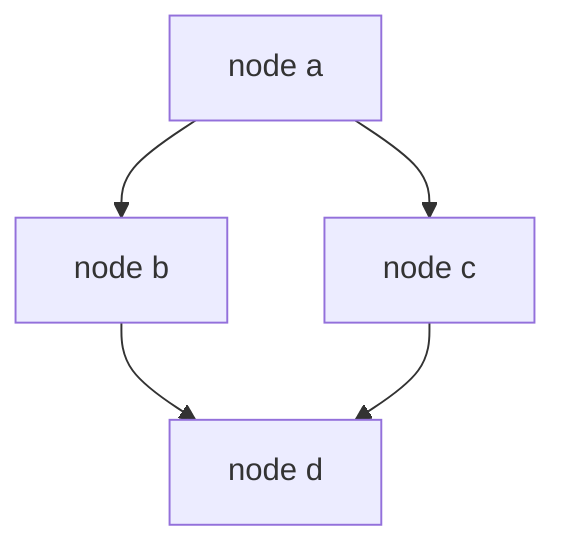

---
{"dg-publish":true,"permalink":"/software-engineering/02-computer-science/data-structures/graph/"}
---


# Intro

Graphs model relationships between entities using vertices (nodes) and edges. Unlike trees, graphs can have cycles, multiple paths between nodes, and no single root. In .NET, there is no built-in `Graph<T>` type — you compose graphs from `Dictionary<TNode, List<TNode>>` for adjacency lists, `bool[,]` for adjacency matrices, and `PriorityQueue<TElement, int>` for weighted shortest-path algorithms. A production example: a microservice dependency graph with 200 services uses BFS from a failing service node to identify all downstream services affected by the outage, generating an automated blast radius report in under 50 ms.

## Deeper Explanation

The most common representation is an adjacency list: each node maps to its neighbors. Adjacency lists cost O(V + E) space and are efficient for sparse graphs where E ≪ V².

**Adjacency matrix** costs O(V²) space and offers O(1) edge-existence checks, but wastes memory on sparse graphs. In .NET, a `bool[,]` or `int[,]` can serve as a matrix.

**Weighted graphs** extend either representation: an adjacency list becomes `Dictionary<int, List<(int neighbor, int weight)>>`, while a matrix stores `int[,]` with a sentinel (0 or `int.MaxValue`) for absent edges. Dijkstra's algorithm requires weights and pairs naturally with `PriorityQueue<TElement, int>` in .NET for O((V + E) log V) performance.

**Directed vs undirected**: Directed graphs (digraphs) model one-way relationships — `A → B` does not imply `B → A` — and require asymmetric adjacency structures. Undirected graphs store each edge in both directions. Most shortest-path algorithms (Dijkstra, Bellman-Ford) operate on directed graphs; connectivity checks work on either.

## Structure



### Example

```csharp
var graph = new Dictionary<string, List<string>>
{
    ["A"] = new() { "B", "C" },
    ["B"] = new() { "D" },
    ["C"] = new(),
    ["D"] = new()
};
```

### Pitfalls

- **Infinite loops without cycle detection** — a DFS or BFS that does not track visited nodes will loop forever on cyclic graphs. Always maintain a `HashSet<TNode>` of visited nodes. In production, a service health checker without cycle detection caused a CPU spike to 100% when a circular dependency was introduced between services.
- **Stack overflow on recursive DFS** — graphs with 10K+ nodes and deep chains blow the default 1 MB .NET stack. Use iterative DFS with an explicit `Stack<TNode>` for unknown-depth graphs.
- **Adjacency matrix on sparse graphs** — a matrix for 10K nodes costs 100M entries (400 MB for `int[,]`), even if only 50K edges exist. An adjacency list for the same graph costs O(V + E) = roughly 60K entries. Always match representation to graph density.

### Tradeoffs

- Adjacency list is better for sparse graphs.
- Adjacency matrix can be useful for dense graphs with fixed node sets.
- `PriorityQueue<TElement, TPriority>` is useful for weighted shortest-path algorithms.

## Questions

> [!QUESTION]- Does .NET provide a built-in `Graph<T>` type?
> No. You usually build graphs using `Dictionary`, `List`, `HashSet`, and `Queue`/`Stack`.

> [!QUESTION]- Which collections are typically used for BFS?
> `Queue<T>` for frontier and `HashSet<T>` for visited tracking.

## Links

- [Collections and data structures overview](https://learn.microsoft.com/en-us/dotnet/standard/collections/) — Microsoft overview of built-in collection types; graphs are typically composed from these primitives.
- [PriorityQueue<TElement, TPriority> class](https://learn.microsoft.com/en-us/dotnet/api/system.collections.generic.priorityqueue-2) — API reference for the priority queue used in weighted graph algorithms like Dijkstra.
- [.NET libraries update with Dijkstra example](https://learn.microsoft.com/en-us/dotnet/core/whats-new/dotnet-9/libraries#collections) — .NET 9 release notes showing PriorityQueue usage in a real Dijkstra implementation.
- [Dijkstra test implementation in dotnet runtime](https://github.com/dotnet/runtime/blob/main/src/libraries/System.Collections/tests/Generic/PriorityQueue/PriorityQueue.Tests.Dijkstra.cs) — reference implementation of Dijkstra using .NET collections.

<!-- whats-next:start -->

---

> [!note] Whats next
> **Parent**
>  [[Software Engineering/02 Computer Science/02 Computer Science\|02 Computer Science]]
>
> **Pages**
> - [[Software Engineering/02 Computer Science/Data Structures/Dictionary\|Dictionary]]
> - [[Software Engineering/02 Computer Science/Data Structures/HashMap\|HashMap]]
> - [[Software Engineering/02 Computer Science/Data Structures/HashSet\|HashSet]]
> - [[Software Engineering/02 Computer Science/Data Structures/Hashtable\|Hashtable]]
> - [[Software Engineering/02 Computer Science/Data Structures/Heap\|Heap]]
> - [[Software Engineering/02 Computer Science/Data Structures/LinkedList\|LinkedList]]
> - [[Software Engineering/02 Computer Science/Data Structures/List\|List]]
> - [[Software Engineering/02 Computer Science/Data Structures/Queue\|Queue]]
> - [[Software Engineering/02 Computer Science/Data Structures/Span\|Span]]
> - [[Software Engineering/02 Computer Science/Data Structures/Stack\|Stack]]
> - [[Software Engineering/02 Computer Science/Data Structures/Trees\|Trees]]
<!-- whats-next:end -->
