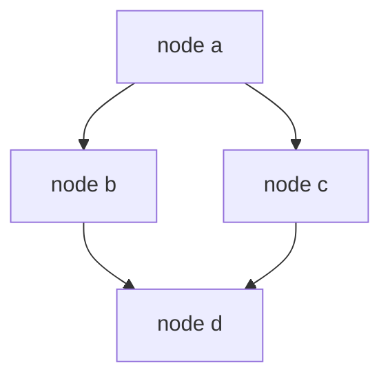

---
{"dg-publish":true,"permalink":"/software-engineering/02-computer-science/data-structures/graph/","noteIcon":"3"}
---


# Intro

Graphs model relationships between entities using vertices and edges. In .NET, graph structures are commonly implemented with collection primitives like `Dictionary<TNode, List<TNode>>`.

## Deeper Explanation

The most common representation is an adjacency list: each node maps to neighbors.
This is space efficient for sparse graphs and works well with BFS/DFS traversals.

## Structure



### Example

```csharp
var graph = new Dictionary<string, List<string>>
{
    ["A"] = new() { "B", "C" },
    ["B"] = new() { "D" },
    ["C"] = new(),
    ["D"] = new()
};
```

### Pitfalls

- Missing cycle detection can cause infinite traversal loops.
- Recursive DFS can overflow stack for deep graphs.
- Choosing matrix representation for sparse graphs wastes memory.

### Tradeoffs

- Adjacency list is better for sparse graphs.
- Adjacency matrix can be useful for dense graphs with fixed node sets.
- `PriorityQueue<TElement, TPriority>` is useful for weighted shortest-path algorithms.

## Questions

> [!QUESTION]- Does .NET provide a built-in `Graph<T>` type?
> No. You usually build graphs using `Dictionary`, `List`, `HashSet`, and `Queue`/`Stack`.

> [!QUESTION]- Which collections are typically used for BFS?
> `Queue<T>` for frontier and `HashSet<T>` for visited tracking.

## Links

- [Collections and data structures overview](https://learn.microsoft.com/en-us/dotnet/standard/collections/)
- [PriorityQueue<TElement, TPriority> class](https://learn.microsoft.com/en-us/dotnet/api/system.collections.generic.priorityqueue-2)
- [.NET libraries update with Dijkstra example](https://learn.microsoft.com/en-us/dotnet/core/whats-new/dotnet-9/libraries#collections)
- [Dijkstra test implementation in dotnet runtime](https://github.com/dotnet/runtime/blob/main/src/libraries/System.Collections/tests/Generic/PriorityQueue/PriorityQueue.Tests.Dijkstra.cs)

<!-- whats-next:start -->

---

> [!note] Whats next
> **Parent**
>  [[Software Engineering/02 Computer Science/02 Computer Science\|02 Computer Science]]
>
> **Pages**
> - [[Software Engineering/02 Computer Science/Data Structures/Dictionary\|Dictionary]]
> - [[Software Engineering/02 Computer Science/Data Structures/HashMap\|HashMap]]
> - [[Software Engineering/02 Computer Science/Data Structures/HashSet\|HashSet]]
> - [[Software Engineering/02 Computer Science/Data Structures/Hashtable\|Hashtable]]
> - [[Software Engineering/02 Computer Science/Data Structures/Heap\|Heap]]
> - [[Software Engineering/02 Computer Science/Data Structures/LinkedList\|LinkedList]]
> - [[Software Engineering/02 Computer Science/Data Structures/List\|List]]
> - [[Software Engineering/02 Computer Science/Data Structures/Queue\|Queue]]
> - [[Software Engineering/02 Computer Science/Data Structures/Span\|Span]]
> - [[Software Engineering/02 Computer Science/Data Structures/Stack\|Stack]]
> - [[Software Engineering/02 Computer Science/Data Structures/Trees\|Trees]]
<!-- whats-next:end -->
