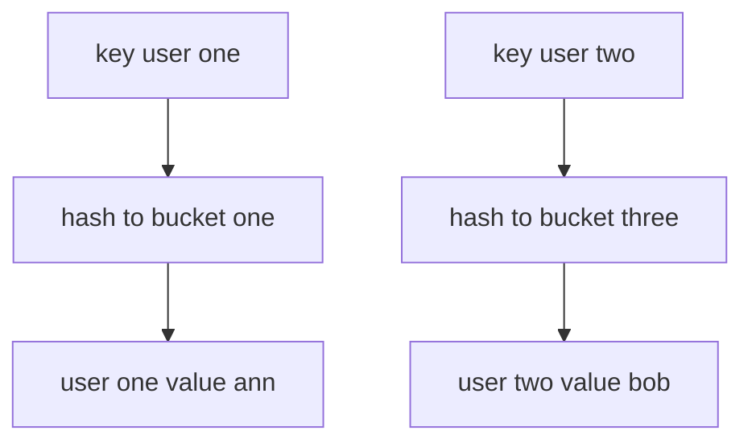

---
{"dg-publish":true,"permalink":"/software-engineering/02-computer-science/data-structures/hash-map/"}
---


# Intro

A hash map stores key value pairs and uses hashing to find a bucket quickly. The goal is fast insert, lookup, and delete by key, usually O(1) on average. In .NET, the primary hash map implementation is `Dictionary<TKey, TValue>`, while `Hashtable` is the older non generic version.

## Deeper Explanation

Hash maps use two rules together: hash distribution and equality checks.

- The key hash chooses an index or bucket.
- If multiple keys land in the same bucket, equality checks resolve collisions.
- Good hash distribution keeps buckets short and operations fast.

## Structure



### Example

```csharp
var usersById = new Dictionary<int, string>
{
    [1001] = "Ann",
    [1002] = "Bob"
};

if (usersById.TryGetValue(1002, out var name))
{
    Console.WriteLine(name);
}
```

### Pitfalls

- Mutable key fields can break lookups after insertion because the hash or equality result changes. Use immutable key types or avoid mutating key fields.
- Poor `GetHashCode` implementations create heavy collisions and degrade toward O(n). Keep hash code logic stable and well distributed.
- Using a hash map when sorted iteration is required adds extra sorting work later. Use a sorted collection if order is part of the requirement.

### Tradeoffs

- Hash map vs sorted map: hash map favors fast point lookups, sorted map favors ordered iteration.
- Hash map vs list scan: hash map wins for repeated lookups by key, list scan can be simpler for very small fixed data sets.

## Questions

> [!QUESTION]- Why can hash map performance degrade from O(1) to O(n)?
> Excessive collisions put many keys in the same bucket, so operations must compare more entries.

> [!QUESTION]- Why does a bad `GetHashCode` implementation create correctness and performance risk?
> Hash maps rely on hash and equality contracts. If equal keys do not produce equal hashes, lookups can fail. If hashes are poorly distributed, bucket chains grow and performance drops.

> [!QUESTION]- Which .NET type is the standard hash map in modern code?
> `Dictionary<TKey, TValue>` is the default hash map in modern .NET.

## Links

- [Dictionary TKey TValue class](https://learn.microsoft.com/en-us/dotnet/api/system.collections.generic.dictionary-2)
- [Selecting a collection class](https://learn.microsoft.com/en-us/dotnet/standard/collections/selecting-a-collection-class)
- [Anatomy of the .NET dictionary](https://dunnhq.com/posts/2024/anatomy-of-the-dotnet-dictionary/)

<!-- whats-next:start -->

---

> [!note] Whats next
> **Parent**
>  [[Software Engineering/02 Computer Science/02 Computer Science\|02 Computer Science]]
>
> **Pages**
> - [[Software Engineering/02 Computer Science/Data Structures/Dictionary\|Dictionary]]
> - [[Software Engineering/02 Computer Science/Data Structures/Graph\|Graph]]
> - [[Software Engineering/02 Computer Science/Data Structures/HashSet\|HashSet]]
> - [[Software Engineering/02 Computer Science/Data Structures/Hashtable\|Hashtable]]
> - [[Software Engineering/02 Computer Science/Data Structures/Heap\|Heap]]
> - [[Software Engineering/02 Computer Science/Data Structures/LinkedList\|LinkedList]]
> - [[Software Engineering/02 Computer Science/Data Structures/List\|List]]
> - [[Software Engineering/02 Computer Science/Data Structures/Queue\|Queue]]
> - [[Software Engineering/02 Computer Science/Data Structures/Span\|Span]]
> - [[Software Engineering/02 Computer Science/Data Structures/Stack\|Stack]]
> - [[Software Engineering/02 Computer Science/Data Structures/Trees\|Trees]]
<!-- whats-next:end -->
